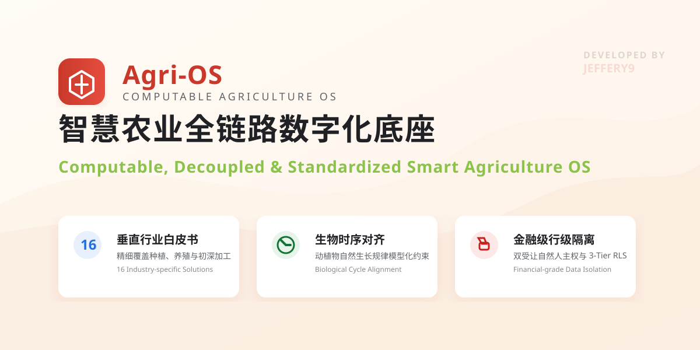
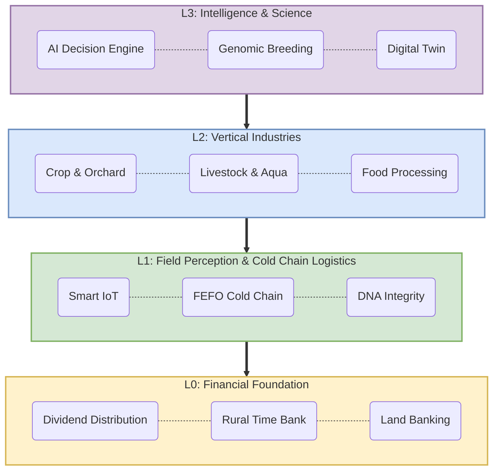
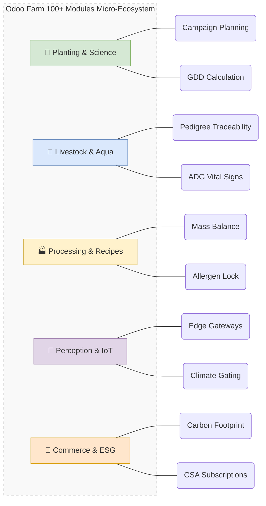

# Odoo Farm: 智慧农业开源系统与全链路农业ERP数字化底座 (Smart Agriculture OS &amp; ERP Platform)

  

[Chinese](#chinese) | [English](#english)

---

## 🇨🇳 中文版 (Chinese)

### 1. 我们的愿景：为什么我们需要 Odoo Farm 开源农业系统？
在数字化的浪潮中，传统农业面临着生产过程“黑盒”、管理术语“过度工业化”以及合规追溯成本高昂的三大绝境。传统 ERP 试图用管螺丝钉的生产逻辑来生硬管理富有生命力的农作物与畜禽谱系，结果往往严重水土不服。

**Odoo Farm (Agri-OS)** 彻底拒绝这种粗暴移植。我们基于全球顶尖的开源 ERP 框架 **Odoo 19**，在系统架构、生物资产时序管理与商业闭环等层面上全面超越了欧洲领先农业系统 (如 Ekylibre)，致力于打造一套**专为中国乃至全球精准农业设计的开源操作系统 (OS) 与全链路农业ERP数字化底座**。在这里，土地是会呼吸的车间，作物是具备生命周期的在制资产 (WIP Assets)，而智能农业 IoT 则是系统实时感知的神经元。

> **💡 UX 设计哲学: "工具箱, 而非百科全书" (Tools, Not Trees)**
> 本系统彻底摒弃了传统 ERP 庞大深邃、让农民感到畏惧的“巨石型树状菜单”。我们采用现代 SaaS 的“独立工具化”设计：需要操作温室，就打开【温室应用】；需要分析病虫害，就打开【AI 视觉应用】。所有的 App 层级不超过 3 层，真正做到了“开箱即用，降低认知负荷”。

### 💎 核心传播价值 (Why Odoo Farm?)

*   👨‍🌾 **对农场主**：**生物资产的数据化与金融化。** 系统将作物的生长周期和农资投入实时转化为可视化的资产估值图谱，打通供应链融资与农业信贷。
*   🛠️ **对农技人员**：**由数据驱动的精准农业。** 借助 AI 视觉诊断、养分平衡计算与气象联动，每一滴水、每一把肥都有据可依。
*   🛒 **对零售与消费者**：**品牌溢价与区块链级信任。** 每一颗果实都有其独特的“履历”。扫码即可看到该批次所历经的生长基点、干预清单甚至 DNA 诚信评分。
*   💻 **对开发者**：**极速构建、开箱即用。** 遵循 "Tools, not Trees" 哲学，将 100+ 模块切割为独立微生态，拥有扁平的 4 层拓扑架构。

### 🏛️ 颠覆性的系统设计思想
1.  **全站去工业化 UX (De-industrialized UX)**：系统自动将工业术语隐式映射为“农事干预 (Interventions)”、“生产配方 (Recipes)”、“批次繁育”。
2.  **MTO 生长周期校验 (Biological Cycle Alignment)**：将自然规律写入代码。内置动植物生长模型，确认订单时自动倒推并校验生长周期。
3.  **100+ 模块微生态 (Micro-Ecosystem)**：通过高度解耦的矩阵设计，按需热插拔（种植、畜牧、无人机 IoT、CSA 认养营销等）。

### 🚀 核心功能矩阵 (Feature Matrix)

## 🌟 核心亮点：降维打击的商业能力 (The 3-Tier Edge)

### 📈 1. 智慧农业商业与市场推广白皮书 (Business & Marketing Suite)
我们为您准备了全套的商业化变现与市场推广白皮书，助力开源项目向产业界与资本市场的高效路演：
*   📢 **[Odoo Farm 商业路演核心简报 (Odoo Farm Pitch Deck)](Odoo_Farm_Pitch.md)**：项目核心定位、商业痛点及投资价值路演 PPT 叙事。
*   ⚖️ **[传统工业 ERP 判定 vs Odoo Farm 农业 OS 对比 (Traditional ERP vs Agri-OS)](docs/business/marketing/TRADITIONAL_ERP_VS_ODOO_FARM.md)**：深度剖析为什么用管工业零件的 ERP 无法管理会呼吸的生物资产。
*   🚀 **[精选 49 大农业商业闭环场景 (Scenarios Showcase)](docs/business/marketing/SCENARIOS_SHOWCASE.md)**：从制药级物理防线、多叉树基因到无抵押微贷等 49 个震撼真实业务场景。
*   ⭐ **[金牌销售核心：八大降维打击业务路演 (Top 8 Showcase Pitch)](docs/business/marketing/TOP_8_SHOWCASE_PITCH.md)**：精准提炼最打动农场主与地方合作社的 8 大王牌业务场景路演。
*   💴 **[八大商业盈利模式与合作分配机制 (Commercial Revenue Models)](docs/business/marketing/COMMERCIAL_REVENUE_MODELS.md)**：合作社与平台运营商如何通过 SaaS 统购统销、碳汇交易、金融分成等多道合规渠道盈利。
*   🍒 **[C2M 消费者直连基地代币化认养愿景 (C2M Ecosystem Vision)](docs/business/marketing/C2M_ECOSYSTEM_VISION.md)**：打通一二三产业，实现地块认养、作物期权、视频直连与 Web3 消费生态。
*   ⛩️ **[日本农协 (JA) 数字化运营白皮书 (The JA Model Playbook)](docs/business/marketing/THE_JA_MODEL_PLAYBOOK.md)**：复刻全球最成熟的日本农业合作社模式，集统购统销、金融、保险于一体。
*   🌾 **[浙江“统分结合”双层经营数字化范式 (The Zhejiang Model Playbook)](docs/business/marketing/THE_ZHEJIANG_MODEL_PLAYBOOK.md)**：剖析村集体经济、承包大户与农户的高效统筹协同，落地中国特色乡村振兴底层架构。
*   🔒 **[金融级底层数据隐私与行级隔离设计 (3-Tier RLS Design)](docs/business/analysis/DATA_ISOLATION_RLS_DESIGN.md)**：针对“村集体 -> 大户 -> 散户”结构设计的 row-level security，农户间数据平行绝密隔离。

### 📚 2. Agri-OS 十六大垂直行业计算智能学术白皮书 (The 16 Computable Agri-OS Whitepapers Catalog)
   提供 16 篇聚焦现代农业垂直领域的行业白皮书，涵盖计算模型与解决方案架构：
   *   🌿 **种植与大田植物科学 (Planting & Science)**
       - [精准大田作物端到端解决方案白皮书 (Precision Field Crops)](docs/whitepapers/agri_os_whitepaper_field_crops.md)
       - [果园林木周期与产量预测白皮书 (Orchard & Horticulture)](docs/whitepapers/agri_os_whitepaper_orchard_horticulture.md)
       - [温室花卉环境优化白皮书 (Greenhouse Floriculture)](docs/whitepapers/agri_os_whitepaper_floriculture.md)
       - [智能食用菌环境控制白皮书 (Mushroom Cultivation)](docs/whitepapers/agri_os_whitepaper_mushroom_cultivation.md)
       - [珍稀中药材与药用植物白皮书 (Medicinal Plants)](docs/whitepapers/agri_os_whitepaper_medicinal_plants.md)
       - [种子繁育与系谱杂交繁育白皮书 (Advanced Seed & Breeding)](docs/whitepapers/agri_os_whitepaper_seed_breeding.md)
   *   🐄 **动物驯养与高密度水产 (Livestock & Aquaculture)**
       - [智慧奶牛与乳业管理解决方案白皮书 (Cattle & Dairy)](docs/whitepapers/agri_os_whitepaper_cattle_dairy.md)
       - [智慧家禽与蛋鸡精准养殖白皮书 (Poultry Farming)](docs/whitepapers/agri_os_whitepaper_poultry_farming.md)
       - [智能蜂业养殖与采蜜解决方案白皮书 (Precision Apiculture)](docs/whitepapers/agri_os_whitepaper_apiculture.md)
       - [循环水水产养殖与溶解氧优化白皮书 (RAS Aquaculture)](docs/whitepapers/agri_os_whitepaper_ras_aquaculture.md)
       - [多营养级生态载荷特色水产白皮书 (Specialty Aquaculture)](docs/whitepapers/agri_os_whitepaper_specialty_aquaculture.md)
   *   🏭 **收获后加工与生态循环 (Processing & Composting)**
       - [生物发酵与智慧酒庄管理白皮书 (Winery & Fermentation)](docs/whitepapers/agri_os_whitepaper_fermentation_winery.md)
       - [好氧堆肥与有机废弃物循环白皮书 (Aerobic Composting)](docs/whitepapers/agri_os_whitepaper_aerobic_composting.md)
       - [食品加工质量守恒与过敏原控制白皮书 (Precision Food Processing)](docs/whitepapers/agri_os_whitepaper_agricultural_processing.md)
   *   🏪 **Web3 社区零售与协同农机 (Commerce & Cooperative)**
       - [CSA 地块代币化与智能托管释放白皮书 (Tokenized CSA)](docs/whitepapers/agri_os_whitepaper_csa_tokenization.md)
       - [合作社共享农机与多地块计费白皮书 (Shared Machinery)](docs/whitepapers/agri_os_whitepaper_cooperative_machinery.md)

---

## 🇬🇧 English Version

### 1. Vision: Why Odoo Farm (Open-Source Smart Agriculture ERP)?
Traditional agriculture suffers from "black box" production and mismatched industrialized ERP terminologies. **Odoo Farm (Agri-OS)** rejects this approach. Built on the world's leading ERP framework **Odoo 19**, we provide a professional **Open-Source Smart Agriculture Operating System (OS) and a comprehensive Agriculture ERP Platform specifically designed for global precision farming**. Here, fields are breathing workshops, crops and livestock are living WIP assets, and intelligent IoT sensors act as the ecosystem's nervous system.

> **💡 UX Philosophy: "A Toolbox, Not an Encyclopedia" (Tools, Not Trees)**
> We have abandoned the massive, intimidating "monolithic tree menus." We adopt modern SaaS "independent tool" design: need to operate a greenhouse? Open the [Greenhouse App]. All App depths are capped at 3 levels to minimize cognitive load for agricultural workers.

### 💎 The Viral Value (Why Odoo Farm?)

*   👨‍🌾 **For Farm Owners**: **Data-driven Bankable Assets.** The system transforms crop cycles into real-time biological asset valuations, bridging the gap for agricultural credit.
*   🛠️ **For Agronomists**: **Precision Agriculture Powered by Code.** With built-in AI vision, automated N/P/K balancing, and climate-triggered interventions, marginal costs drop exponentially.
*   🛒 **For Retail & Consumers**: **Unshakable Trust & Brand Premium.** A simple QR scan reveals the soil temperature, intervention logs, and DNA integrity score of the exact batch.
*   💻 **For Developers**: **Rapid Scaling & Plug-and-Play.** Embracing the "Tools, not Trees" philosophy with a flat 4-layer topology.

## 🌟 3-Tier Edge: Business & Market Opportunities

### 📈 1. Business & Marketing Suite
We provide a comprehensive collection of business roadmaps, financial blueprints, and market-entry whitepapers for commercial pitches and roadshows:
*   📢 **[Odoo Farm Core Pitch Deck (Odoo_Farm_Pitch.md)](Odoo_Farm_Pitch.md)**: Main pitch narrative covering pain points, solutions, market opportunities, and core financials.
*   ⚖️ **[Traditional Industrial ERP vs Agri-OS (TRADITIONAL_ERP_VS_ODOO_FARM.md)](docs/business/marketing/TRADITIONAL_ERP_VS_ODOO_FARM.md)**: Detailed analysis explaining why industrial-focused ERPs fail to manage biological living assets.
*   🚀 **[Precision Agriculture Scenarios Showcase (SCENARIOS_SHOWCASE.md)](docs/business/marketing/SCENARIOS_SHOWCASE.md)**: Curated list of 49 high-impact business scenarios spanning genetic pedigree, GxP trace, and credit micro-finance.
*   ⭐ **[Top 8 Business Roadshows (TOP_8_SHOWCASE_PITCH.md)](docs/business/marketing/TOP_8_SHOWCASE_PITCH.md)**: Highly focused pitch material highlighting the 8 most requested and bankable scenarios for farming co-ops.
*   💴 **[Commercial Revenue & Distribution Models (COMMERCIAL_REVENUE_MODELS.md)](docs/business/marketing/COMMERCIAL_REVENUE_MODELS.md)**: Breakdown of 8 core monetizable channels, cooperative rebates, SaaS subscriptions, and ESG carbon credit mechanisms.
*   🍒 **[C2M Tokenized Subscription Vision (C2M_ECOSYSTEM_VISION.md)](docs/business/marketing/C2M_ECOSYSTEM_VISION.md)**: Visionary framework connecting urban subscribers directly to designated land plots using Web3 crop options and live streaming.
*   ⛩️ **[Digital Japan Agricultural Cooperative (THE_JA_MODEL_PLAYBOOK.md)](docs/business/marketing/THE_JA_MODEL_PLAYBOOK.md)**: Digitized playbook of the world-class JA co-op model, integrating bulk purchasing, crop trading, banking, and mutual insurance.
*   🌾 **[The Zhejiang Rural Cooperative Playbook (THE_ZHEJIANG_MODEL_PLAYBOOK.md)](docs/business/marketing/THE_ZHEJIANG_MODEL_PLAYBOOK.md)**: Comprehensive blueprint for collective economic bodies, dual-tier operations, and local rural revitalization models.
*   🔒 **[Enterprise 3-Tier RLS Data Privacy (DATA_ISOLATION_RLS_DESIGN.md)](docs/business/analysis/DATA_ISOLATION_RLS_DESIGN.md)**: Deep engineering design on tenant-level and farm-level strict data isolation for high-security commercial consortiums.

### 📚 2. The 16 Computable Agri-OS Whitepapers Catalog
We provide 16 strategic and academic whitepapers focusing on industry pain points, biological models, and computational mathematics:
*   🌿 **Planting & Science**: [Field Crops](docs/whitepapers/agri_os_whitepaper_field_crops.md) | [Orchard & Horticulture](docs/whitepapers/agri_os_whitepaper_orchard_horticulture.md) | [Greenhouse Floriculture](docs/whitepapers/agri_os_whitepaper_floriculture.md) | [Mushroom Cultivation](docs/whitepapers/agri_os_whitepaper_mushroom_cultivation.md) | [Medicinal Plants](docs/whitepapers/agri_os_whitepaper_medicinal_plants.md) | [Advanced Breeding](docs/whitepapers/agri_os_whitepaper_seed_breeding.md)
*   🐄 **Livestock & Aquaculture**: [Cattle & Dairy](docs/whitepapers/agri_os_whitepaper_cattle_dairy.md) | [Poultry Farming](docs/whitepapers/agri_os_whitepaper_poultry_farming.md) | [Precision Apiculture](docs/whitepapers/agri_os_whitepaper_apiculture.md) | [RAS Aquaculture](docs/whitepapers/agri_os_whitepaper_ras_aquaculture.md) | [Specialty Aquaculture](docs/whitepapers/agri_os_whitepaper_specialty_aquaculture.md)
*   🏭 **Processing & Composting**: [Winery & Fermentation](docs/whitepapers/agri_os_whitepaper_fermentation_winery.md) | [Aerobic Composting](docs/whitepapers/agri_os_whitepaper_aerobic_composting.md) | [Precision Food Processing](docs/whitepapers/agri_os_whitepaper_agricultural_processing.md)
*   🏪 **Commerce & Cooperative**: [Tokenized CSA](docs/whitepapers/agri_os_whitepaper_csa_tokenization.md) | [Shared Machinery](docs/whitepapers/agri_os_whitepaper_cooperative_machinery.md)

---

## 🛠️ Deployment & Installation / 部署与安装

### 1. Requirements (环境要求)
*   **OS**: Linux (Ubuntu 22.04+) or macOS.
*   **Engine**: Odoo 19.0 Community Edition.
*   **Python**: 3.12+ / **PostgreSQL**: 16+.

### 2. Installation Steps (安装步骤)
1.  **Clone code**: `git clone https://github.com/jeffery9/odoo-farm`
2.  **Configure Addons Path**: Add the repository root to your `odoo.conf`.
3.  **Install Dependencies**: `pip install requests lxml jsonpath-ng jinja2 paho-mqtt shapely numpy`
4.  **Initialize**: Update apps list in Odoo and install **farm_core**.

---

## ⚖️ License
Licensed under **GNU Affero General Public License v3 (AGPLv3)**. SaaS providers **must** disclose source code. See [LICENSE](LICENSE).

## 📜 Contributor License Agreement (CLA)
We welcome contributions! Please read the full [CLA Document](CLA.md) before submitting Pull Requests.

## 📩 Contact
**genin IT, 亘盈信息技术**, jeffery <jeffery9@gmail.com>  
Website: [http://www.geninit.cn](http://www.geninit.cn)
