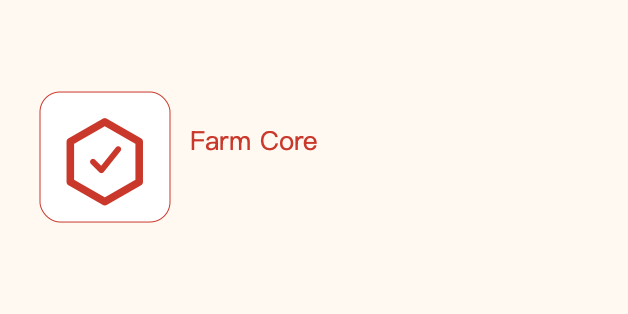
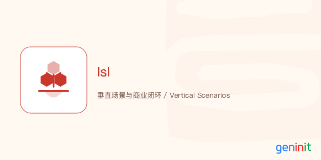
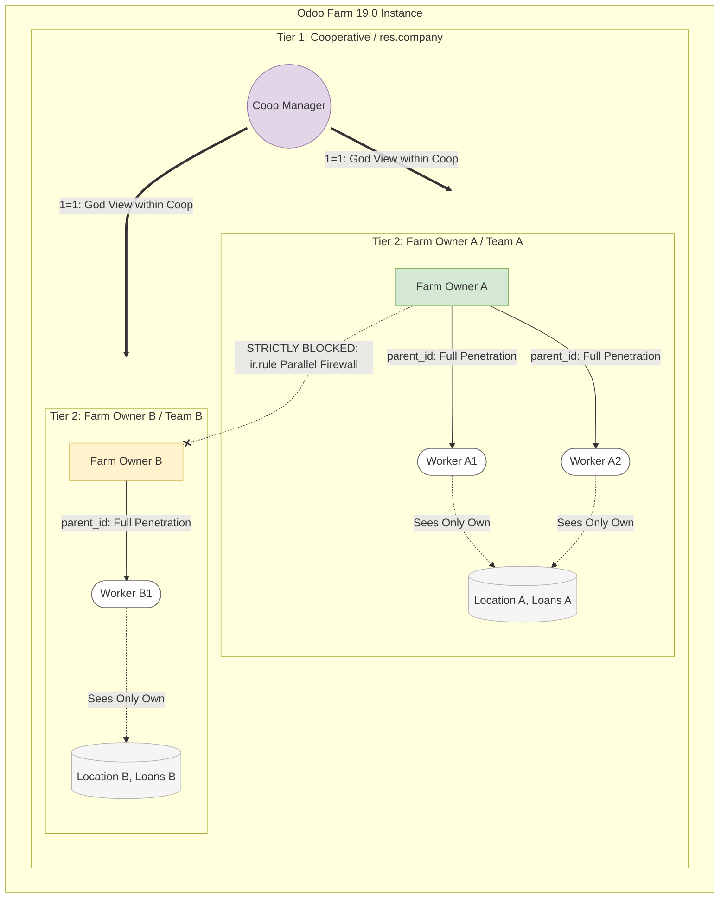
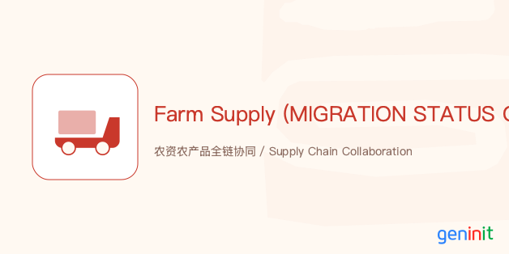

# Odoo Farm


: 智慧农业全链路数字化底座 / Full-Chain Smart Agriculture OS

<div align="center">
  
  <p><b>From Seed to Sale, Code to Farm — Empowering Modern Agriculture with Digital Certainty.</b></p>
</div>

[Chinese](#chinese) | [English](#english)

---

<a name="chinese"></a>
## 🇨🇳 中文版 (Chinese)

### 1. 我们的愿景：为什么我们需要 Odoo Farm？
在数字化的浪潮中，传统农业面临着生产过程“黑盒”、管理术语“过度工业化”以及合规追溯成本高昂的三大绝境。传统 ERP 试图用管螺丝钉的逻辑来管农作物，结果往往水土不服。

**Odoo Farm** 拒绝这种粗暴移植。我们基于全球顶尖的开源 ERP 框架 **Odoo 19**，深度复刻并全面超越了欧洲领先农业系统 (如 Ekylibre) 的架构能力。我们不仅仅是在记录数据，我们打造的是一套**专为中国乃至全球农业设计的开源操作系统 (OS)**。在这里，土地是会呼吸的车间，作物是具备生命周期的在制资产，而 IoT 则是系统的神经末梢。

### 💎 核心传播价值 (Why Odoo Farm?)

对于不同的角色，Odoo Farm 传递着完全不同的核心商业价值：

*   👨‍🌾 **对农场主 (Farm Owners)**：**生物资产的数据化与金融化。** 告别糊涂账。系统将作物的生长周期和农资投入实时转化为可视化的资产估值图谱，打通供应链融资与农业信贷的“最后一公里”。
*   🛠️ **对农技人员 (Agronomists)**：**由数据驱动的精准农业。** 借助 AI 视觉病害诊断、养分平衡计算与气象联动干预，每一滴水、每一把肥都有据可依，实现边际成本的指数级下降。
*   🛒 **对零售与消费者 (Consumers & Retail)**：**品牌溢价与区块链级信任。** 每一颗果实都有其独特的“履历”。扫码即可看到该批次所历经的土壤温度、干预清单甚至农工的合规资质，让农产品轻松跨越高端市场的门槛。
*   💻 **对开发者 (Developers)**：**极速构建、开箱即用。** 遵循 "Tools, not Trees" 哲学，将 100+ 模块切割为 13 个独立微生态。拥有极其扁平的 5 层拓扑架构和基于多态 ISL 代理中枢的行业定制能力。

### 🏛️ 颠覆性的系统设计思想
不同于传统的 ERP 堆砌，Odoo Farm 遵循三大底层设计原则：
1.  **全站去工业化 UX (De-industrialized UX)**：系统自动将工业术语 (如 BOM / 生产工单) 隐式映射为“农事干预”、“生产配方”、“批次繁育”。操作员只需点击简单的卡片，而非面对恐惧的树状表单。
2.  **MTO 生长周期校验 (Biological Cycle Alignment)**：将自然规律写入代码。内置动植物生长模型，确认订单时自动倒推并校验生长周期，防范违约风险。
3.  **100+ 模块微生态 (Micro-Ecosystem)**：通过高度解耦的矩阵设计，按需热插拔（种植、畜牧、无人机 IoT、CSA 认养营销等）。

### 🚀 核心生态矩阵 (The App Ecosystem)



Odoo Farm 将庞杂的农业切割为极易部署的工具链：
*   **🌿 种植引擎 (Planting)**：生产季规划 -> 农事干预 -> 农机调度 -> 收获分级 -> N/P/K 自动养分平衡核算。
*   **🐄 畜牧与水产 (Livestock/Aqua)**：耳标溯源 -> 系谱繁育树 -> ADG 预测 -> 饲料自动核销 -> 异常体征预警。
*   **🏭 农产品加工 (Processing)**：单料进多料出 (One-in-Multi-out) 体系 -> 物料平衡 (Mass Balance) 校验 -> 能源消耗精细分摊。
*   **📡 智慧物联 (Smart IoT)**：原生对接底层网关 -> 数字孪生看板 -> 阈值自动触发干预任务。
*   **🏪 ESG 与商业闭环 (Commerce & ESG)**：碳汇追踪记录 -> 直播带货订单融合 -> CSA 社区认养模式 -> 农旅票务。

## 🌟 核心亮点：降维打击的商业能力 (The 3-Tier Edge)

除了 Odoo 原生的进销存财能力，Odoo Farm 在以下三个维度实现了对传统农业 ERP 的降维打击：

1. **[精选 Top 8 农业商业闭环场景 (The Top 8 Showcases)](docs/business/marketing/TOP_8_SHOWCASE_PITCH.md)**
   从制药级 CIP 物理防线、多叉树基因溯源，到无抵押数据微贷与按交易量返还分红，为您精选 8 个极具震撼力的真实业务场景。
   👉 *[深度阅读：Odoo Farm 与日本农协 (JA) 模式落地指南](docs/business/marketing/THE_JA_MODEL_PLAYBOOK.md)*

2. **[金融级三层数据隔离 (3-Tier Row-Level Security)](docs/business/analysis/DATA_ISOLATION_RLS_DESIGN.md)**
   针对中国及亚洲“大村集体 -> 承包大户 -> 临时散工”的嵌套型农业组织架构，我们首创了基于 ir.rule 的 3 级动态 RLS 防火墙。
   **农场主能够向下穿透监控下属散工的产出与贷款，但各农场之间平行绝密隔离。** 这彻底扫清了多个农户共用一个系统时的“露富”和“隐私泄漏”痛点。
   
👉 *[图解：RLS 数据隔离架构]*



---

<a name="english"></a>
## 🇬🇧 English Version

### 1. Vision: Why Odoo Farm?
In the wave of digitalization, traditional agriculture suffers from "black box" production, mismatched industrialized ERP terminologies, and prohibitive traceability costs. Managing living crops with the same logic used for manufacturing bolts fundamentally fails.

**Odoo Farm** rejects this brute-force approach. Built on **Odoo 19**, we have reverse-engineered and profoundly upgraded the architecture of top-tier European Agri-ERPs (like Ekylibre). We are not just recording data; we are building an **Open-Source Operating System (OS) specifically designed for global agriculture**. Here, fields are breathing workshops, crops are living WIP assets, and IoT sensors are the nervous system.

### 💎 The Viral Value (Why Odoo Farm?)

Odoo Farm delivers hard-hitting commercial value to every stakeholder:

*   👨‍🌾 **For Farm Owners**: **Data-driven Bankable Assets.** Say goodbye to vague accounting. The system transforms crop cycles and ecological inputs into real-time biological asset valuations, bridging the gap for agricultural credit and supply chain financing.
*   🛠️ **For Agronomists**: **Precision Agriculture Powered by Code.** With built-in AI vision diagnostics, automated N/P/K nutrient balancing, and weather-triggered interventions, marginal costs drop exponentially. Every drop of water and ounce of fertilizer is calculated and justified.
*   🛒 **For Retail & Consumers**: **Unshakable Trust & Brand Premium.** Every fruit has a resume. A simple QR scan reveals the soil temperature, intervention logs, and compliance certificates of the exact batch, effortlessly elevating produce into premium retail markets.
*   💻 **For Developers**: **Rapid Scaling & Plug-and-Play.** Embracing the "Tools, not Trees" philosophy. 100+ modules are broken down into 13 independent micro-ecosystems featuring a flat 5-layer topology and an ISL proxy hub for limitless customization.

### 🏛️ Disruptive Architectural Principles
1.  **De-industrialized UX**: We mask rigid ERP terms. "BOMs and Work Orders" are gracefully replaced with "Interventions and Recipes." Farmers interact with friendly cards, not intimidating tree menus.
2.  **Biological Cycle Alignment (MTO)**: Nature written in code. Built-in growth models validate if the remaining delivery time covers the biological growth period upon order confirmation, actively mitigating contract risks.
3.  **100+ Module Micro-Ecosystem**: Highly decoupled matrix design allows hot-plugging of domains (Crop, Livestock, Drone IoT, CSA Marketing, etc.) exactly when needed.

### 🚀 The App Ecosystem Matrix



*   **🌿 Crop Engine**: Campaign Planning -> Interventions -> Machinery Dispatch -> Harvest Grading -> Auto N/P/K Balance.
*   **🐄 Livestock & Aqua**: Ear-tag Traceability -> Pedigree Trees -> ADG Prediction -> Automated Feed Depletion -> Vitals Alert.
*   **🏭 Processing**: One-in-Multi-out capabilities -> Mass Balance validation -> Granular utility/energy cost allocation.
*   **📡 Smart IoT**: Native Edge Gateway Integration -> Digital Twin Dashboards -> Automated Intervention Triggers.
*   **🏪 ESG & Commerce**: Carbon Footprint Tracking -> E-commerce Sync -> CSA Subscription -> Agritourism Ticketing.

---

## 🛠️ Deployment & Installation / 部署与安装

### 1. Requirements (环境要求)
*   **OS**: Linux (Ubuntu 22.04+) or macOS.
*   **Engine**: Odoo 19.0 Community Edition.
*   **Python**: 3.12+ / **PostgreSQL**: 16+.

### 2. Installation Steps (安装步骤)
1.  **Clone code**: 
    ```bash
    git clone https://github.com/jeffery9/odoo-farm.git
    ```
2.  **Configure Addons Path**:
    Add the repository root to your `odoo.conf`:
    ```text
    addons_path = /path/to/odoo/addons, /your/path/odoo-farm
    ```
3.  **Install Dependencies**:
    ```bash
    pip install requests lxml jsonpath-ng jinja2
    ```
4.  **Initialize**:
    Update apps list in Odoo and install **farm_core**.

---

## ⚖️ License
Licensed under **GNU Affero General Public License v3 (AGPLv3)**. SaaS providers **must** disclose source code. See [LICENSE](LICENSE).

## 📜 Contributor License Agreement (CLA)

We welcome contributions to the **Odoo Farm** project! To protect both the project and our contributors, we require all contributors to sign our Contributor License Agreement (CLA) before we can merge any Pull Requests.

Please read the full [CLA Document](CLA.md).

**How to sign:**
1. Submit a Pull Request.
2. Our CLA Assistant bot will automatically comment on your PR.
3. Simply reply to the PR thread with: `I have read the CLA Document and I hereby sign the CLA`.
4. Your signature will be automatically recorded in `CONTRIBUTORS.txt`.

## 📩 Contact
**genin IT, 亘盈信息技术**, jeffery <jeffery9@gmail.com>  
Website: [http://www.geninit.cn](http://www.geninit.cn)

技术交流


