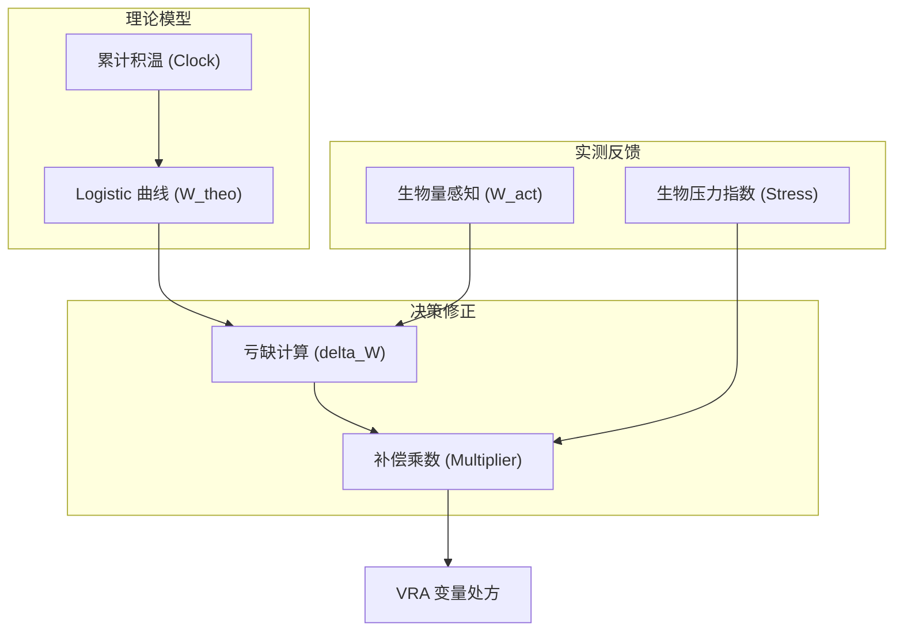

# 🌱 生物数字孪生 (Bio-Digital Twin) 架构规格

## 1. 核心概念：数字化的生长生命周期
我们不只记录操作，我们模拟生命。通过 **Logistic 生长模型** 和 **GDD 积温模型**，系统能够感知作物的“生物年龄”而非物理日期。

## 2. 生物量亏缺补偿架构 [US-78-06]

## 3. 商业价值：可预测的产出
- **成熟期预测**：通过 GDD 模型提前 7-14 天锁定采收窗口。
- **产量风险预警**：当实际生物量严重偏离理论曲线时，自动触发“干预警报”。
