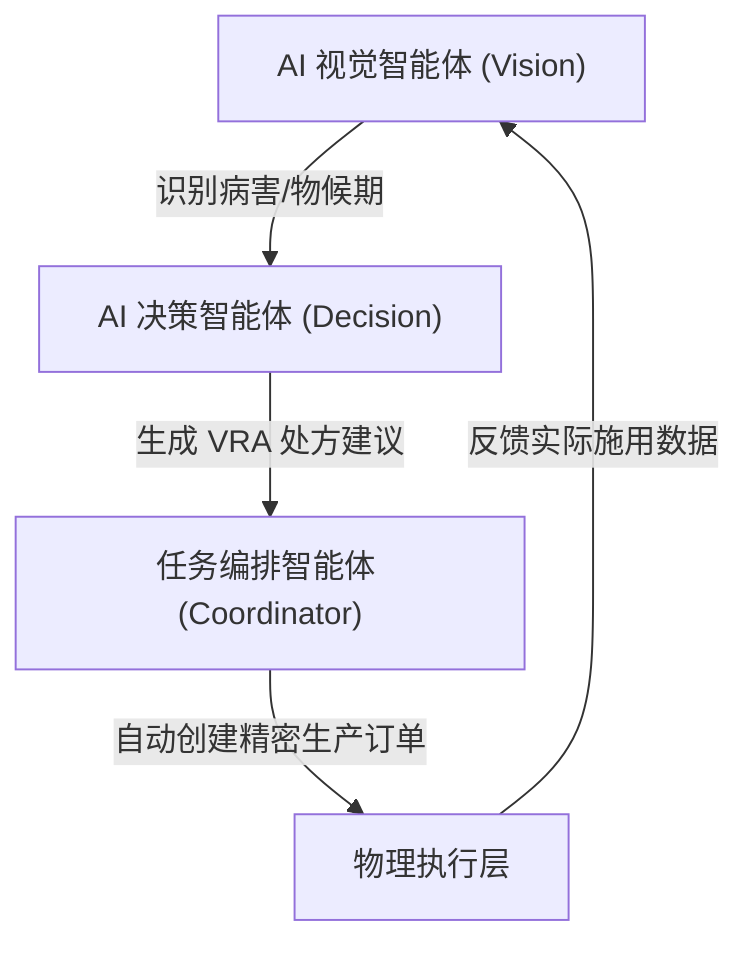

# 🧠 AI 协同指挥中枢 (AI Orchestration)

## 1. 架构目标：从“人工录入”到“智能体决策”
我们不只是在系统里嵌入一个 Chatbot，而是构建了一个具备感知、判断、执行能力的 **多智能体集群 (Multi-Agent System)**。

## 2. 智能体协作流 (Level 4 Collaboration)

## 3. 核心优势：基于证据的自主闭环
- **真值校准**：通过视觉识别到的 LAI (叶面积指数) 自动修正卫星 NDVI 的偏差。
- **自动对冲**：当 AI 发现未来 3 小时有强降雨时，自动拦截并挂起 (Hold) 正在执行的精密喷洒订单。
