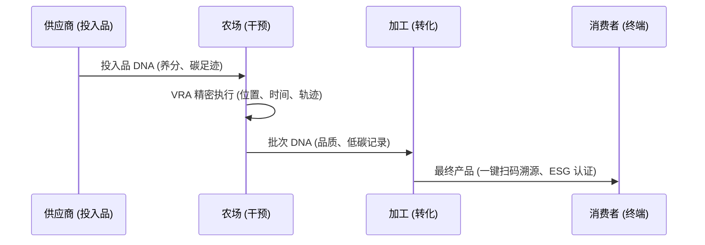

# 💎 全链路溯源与 ESG 价值架构 (Data-DNA Traceability)

## 1. 核心概念：数据 DNA 链条
我们将每一个投入品（种子、化肥）的物理特性，通过“干预”动作，转化为产出物（谷物、水果）的属性。这种属性的传递被称为 **DNA 继承**。

## 2. 价值转化路径 (Value-DNA Chain)

## 3. 商业优势：让每一克碳都有价值
- **自动化碳核算**：基于精密执行层的流量计数据，自动计算每一批次产品的碳排放。
- **品质溢价**：通过全链路的传感器存证（而非人工填报），为有机/绿色认证提供不可篡改的“物理真值”证明。
