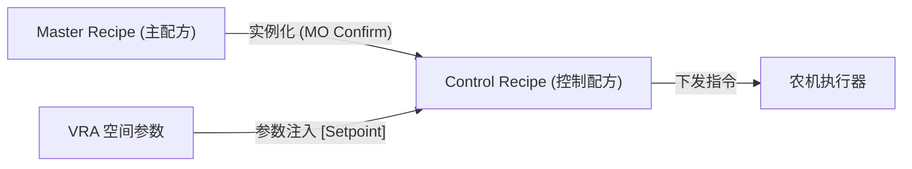

# ⚙️ ISA-88 农业批量控制适配架构 (Agri-Batch Control)

## 1. 核心理念：生物生产的“工业化执行”
虽然农业环境多变，但执行动作必须精确。我们采用国际标准的 **ISA-88 (S88)** 模型，将复杂的农事过程解构为可重复、可度量的单元。

## 2. 农业 ISA-88 层级映射

| S88 标准层级 | 农业对应概念 | 职责 |
| :--- | :--- | :--- |
| **Procedure (过程)** | Cultural Itinerary (农事全历) | 生产季的总体逻辑（整地 -> 播种 -> 采收）。 |
| **Unit Procedure (单元过程)** | Intervention Block (干预批次) | 地块级的阶段性目标（如：苗期追肥）。 |
| **Operation (工序)** | Task (任务) | 具体的农事操作（如：喷洒作业）。 |
| **Phase (相位)** | Precision Instruction (精密指令) | 最小执行单元（如：调压、变频、开启阀门）。 |

## 3. 动态配方注入逻辑 (Recipe Injection)

## 4. 优势：硬件无关的精确性
通过相位 (Phase) 抽象，我们实现了逻辑与硬件的解耦。无论农机是 John Deere 还是大疆无人机，只要适配了相位的 MQTT 契约，即可实现相同的精准作业。
