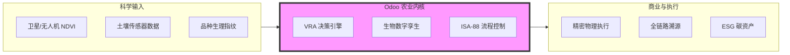

# 🚀 Odoo AgriTech：超越 ERP 的精准农业操作系统

> **核心主张**：不仅仅是记录，而是驱动生长。

## 1. 我们的独特优势 (Unique Selling Propositions)

### 优势 A：去工业化语义引擎 (The De-industrialized Engine)
传统 ERP（如 SAP, Oracle）强行将制造业逻辑（BOM, MO）灌输给农场，导致用户体验割裂。
- **创新点**：我们通过 `farm_ux` 实现了 **语义重映射**。系统后台运行的是工业级强大的引擎，前台呈现的是“干预 (Intervention)”、“植保配方 (Recipe)”和“生长阶段 (Stage)”。
- **价值**：降低农技员学习成本，提升 40% 的一线数据采集准确率。

### 优势 B：空间第一原则 (Spatial-First DNA)
我们将 PostGIS 深度集成在 Odoo 内核中，每一个业务动作都具备“地理坐标”。
- **创新点**：**11m/5m/1m 高精度网格化管理**。每一平米土地都是一个独立的数据资产。
- **价值**：实现“按需分配”的精准投入，化肥/农药使用效率提升 15-25%。

### 优势 C：科学驱动的 VRA 闭环 (Scientific Closed-Loop)
大多数系统只能做“事后记录”，我们实现了“实时干预”。
- **创新点**：**SD-Loop (空间动态反馈环)**。系统融合了 GDD 积温模型、Logistic 生长曲线和品种响应指纹，并直接驱动物理设备。
- **价值**：将农业专家的经验转化为自动化的物理动作。

---

## 2. 核心框架图：全链路价值转换

