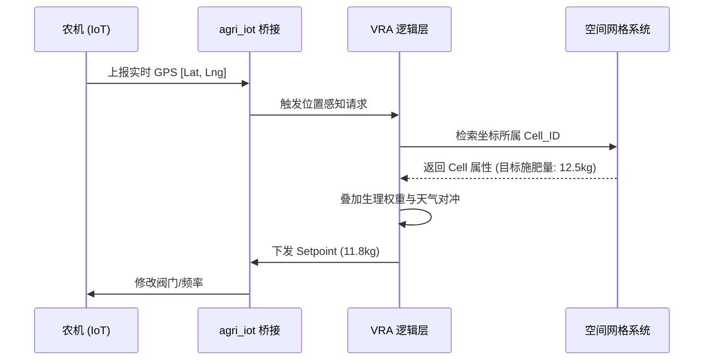

# 🗺️ 空间智能 (Spatial Intelligence) 架构规格

## 1. 原子空间单元：网格化 (The Grid)
在我们的架构中，地块不再是一个多边形，而是一个**动态 Raster 网格集合**。

- **模型**：`agri.geospatial.grid.cell`
- **逻辑**：每个单元格持有 NDVI、pH、水分、养分等多维属性。
- **优势**：支持空间插值（Kriging/IDW），从有限的采样点推导出全田图谱。

## 2. 空间-物理映射 (Spatial-Physical Mapping)

## 3. 技术壁垒
- **性能优化**：通过向量化计算（NumPy）处理万级网格的实时计算。
- **空间索引**：GIST 索引支持毫秒级的邻域发现与碰撞判定。
