# Odoo 19 农场管理系统 (FMS) 架构蓝图

本项目采用"内核+可配置能力插件"的微模块架构，通过 `res.config.settings` 实现行业模块的动态启用/禁用，确保了在 Odoo 19 社区版环境下的极高灵活性。

## 1. 模块依赖拓扑 (Module Dependency Map)

```mermaid
graph TD
    %% 系统配置层
    subgraph Layer_Config [0. 配置管理层]
        farm_core["farm_core<br/>(资产/属性/RBAC/<br/>行业配置)"]
    end

    %% 核心底座层
    subgraph Layer_Base [1. 核心底座]
        farm_operation["farm_operation<br/>(通用作业/干预引擎)"]
        farm_iot["farm_iot<br/>(通用IoT管理)"]
        farm_mobile["farm_mobile<br/>(通用移动端)"]
        farm_quality["farm_quality<br/>(通用质量)"]
        farm_safety["farm_safety<br/>(通用安全)"]
    end

    %% 行业专用层
    subgraph Layer_Industry [2. 行业专用]
        farm_field_crops["farm_field_crops<br/>(大田作物)"]
        farm_protected_cultivation["farm_protected_cultivation<br/>(设施农业)"]
        farm_orchard_horticulture["farm_orchard_horticulture<br/>(果树园艺)"]
        farm_livestock["farm_livestock<br/>(畜牧养殖)"]
        farm_aquaculture["farm_aquaculture<br/>(水产养殖)"]
        farm_medicinal_plants["farm_medicinal_plants<br/>(中药材)"]
        farm_mushroom["farm_mushroom<br/>(食用菌)"]
        farm_apiculture["farm_apiculture<br/>(蜂业)"]
        farm_agricultural_processing["farm_agricultural_processing<br/>(农产品加工)"]
        farm_agritourism["farm_agritourism<br/>(观光农业)"]
    end

    %% 外部服务层
    subgraph Layer_External [3. 外部服务]
        industrial_iot["industrial_iot<br/>(MQTT 桥接器)"]
        farm_pos["farm_pos<br/>(POS销售)"]
        farm_marketing["farm_marketing<br/>(溯源门户/营销)"]
        farm_supply["farm_supply<br/>(供应链)"]
        farm_logistics["farm_logistics<br/>(物流)"]
    end

    %% 配置依赖
    farm_core --> farm_operation
    farm_core --> farm_iot
    farm_core --> farm_mobile

    %% 行业模块依赖通用层
    farm_operation --> farm_field_crops
    farm_operation --> farm_protected_cultivation
    farm_operation --> farm_orchard_horticulture
    farm_operation --> farm_livestock
    farm_operation --> farm_aquaculture
    farm_operation --> farm_medicinal_plants
    farm_operation --> farm_mushroom
    farm_operation --> farm_apiculture
    farm_operation --> farm_agricultural_processing
    farm_operation --> farm_agritourism

    %% 通用层依赖IoT
    farm_iot --> farm_mobile
    farm_iot --> farm_field_crops
    farm_iot --> farm_livestock
    farm_iot --> farm_aquaculture
    farm_iot --> farm_protected_cultivation

    %% 业务流程依赖
    farm_agritourism --> farm_pos
    farm_agritourism --> farm_marketing
    farm_agricultural_processing --> farm_marketing
    farm_agricultural_processing --> farm_supply
    farm_supply --> farm_logistics
    farm_operation --> farm_quality
    farm_operation --> farm_safety
    farm_operation --> farm_financial
    farm_operation --> farm_sustainability
    farm_operation --> farm_hr
```



## 2. 配置管理模式 (Configuration Management Pattern)

通过 `res.config.settings` 实现行业模块的动态启用/禁用：

### 2.1 配置选项
```python
class ResConfigSettings(models.TransientModel):
    _inherit = 'res.config.settings'

    # 行业模块配置选项
    module_farm_field_crops = fields.Boolean(string='大田作物管理')
    module_farm_protected_cultivation = fields.Boolean(string='设施农业管理')
    module_farm_orchard_horticulture = fields.Boolean(string='果树园艺管理')
    module_farm_livestock = fields.Boolean(string='畜牧养殖管理')
    module_farm_aquaculture = fields.Boolean(string='水产养殖管理')
    module_farm_medicinal_plants = fields.Boolean(string='中药材管理')
    module_farm_mushroom = fields.Boolean(string='食用菌管理')
    module_farm_apiculture = fields.Boolean(string='蜂业管理')
    module_farm_agricultural_processing = fields.Boolean(string='农产品加工管理')
    module_farm_agritourism = fields.Boolean(string='观光农业管理')
```

### 2.2 复合行业支持
- **农旅结合**: `field_crops` + `agritourism`
- **设施农旅**: `protected_cultivation` + `agritourism`
- **生态养殖**: `aquaculture` + `apiculture`
- **加工农旅**: `field_crops` + `agricultural_processing` + `agritourism`

## 3. 业务流向定义
1. **供应流**：`farm_supply` -> `farm_operation` -> 各行业专用模块 (投入品准入与消耗)
2. **生产流**：各行业专用模块 -> `farm_operation` -> `farm_agricultural_processing` (从生产到加工)
3. **数据流**：`industrial_iot` -> `farm_iot` -> 各行业专用模块 (遥测与作业关联)
4. **价值流**：各行业生产数据 -> `farm_marketing` (生产数据转化为溯源背书)
5. **复合流**：多个行业模块 -> `farm_agritourism` (多业务融合体验)
