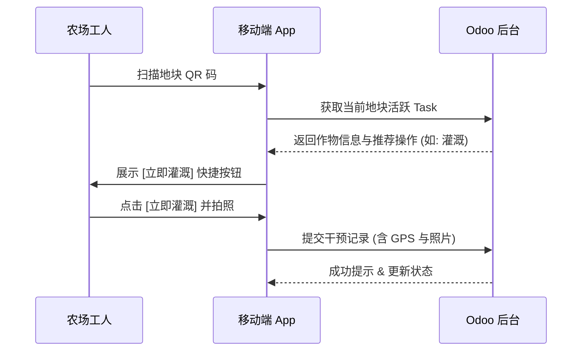

# 农场管理系统：移动端现场作业 UI/UX 规格 (Mobile UI/UX Spec)

## 1. 设计原则 (Design Principles)
- **大按钮原则**：所有核心操作按钮高度不低于 48px，便于戴手套或单手操作。
- **3 次点击原则**：从扫码到完成一次常规干预（如：施肥确认）的总交互次数不超过 3 次。
- **高对比度**：采用高对比度配色方案，确保在户外阳光直射下屏幕内容清晰可见。
- **语音优先**：在备注和描述字段提供语音转文字入口，减少现场打字需求。

## 2. 核心页面布局 (Core Layouts)

### 2.1 扫码结果聚合页 (Scanner Dashboard)
当工人扫描地块二维码或动物耳标后进入此页。
- **顶部**：资产名称与当前状态（如：[地块-01] 处于 移栽后第 15 天）。
- **中部**：关键遥测指标（如：当前土壤湿度 25%，溶氧 6.5mg/L）。
- **底部 (Action Bar)**：
    - [快速干预] 按钮：跳转至当前阶段推荐的操作列表。
    - [拍照巡检] 按钮：立即启动相机。
    - [异常上报] 按钮：一键触发预警流程。

### 2.2 极简干预录入页 (Micro-Intervention Form)
- **预填项**：默认选择当前地块关联的生产任务及当前时间。
- **投入品选择**：通过网格布局展示常用的种子/化肥/饲料图标，支持扫码录入批次。
- **滑动确认**：采用“左右滑动”替代传统的“保存”按钮，防止误触。

## 3. 扫码闭环逻辑 (Scan-to-Action Flow)

## 4. 离线模式规格 (Offline Sync)
- **数据包缓存**：每日晨会期间自动下载当天指派的生产任务及关联的产品/品种信息。
- **本地存储**：离线状态下的干预记录存储在浏览器的 IndexedDB 或 LocalStorage 中。
- **智能同步**：检测到网络恢复后，静默上传离线数据，冲突时以“本地最新”为准并记录审计日志。

## 5. 观光农业现场交互
- **游客自助采摘**：游客扫描果树二维码 -> 看到采摘指南与价格 -> 采摘完成后点击“采摘完毕” -> 生成待付账单发送至 POS 终端。
