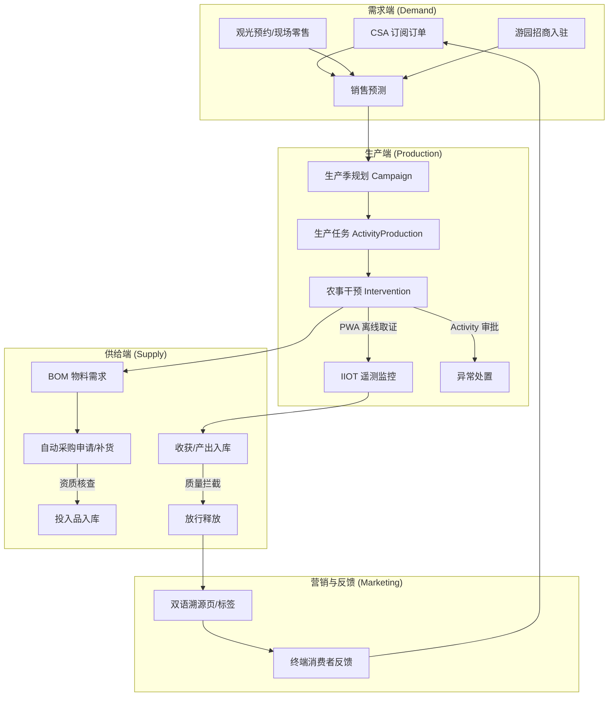
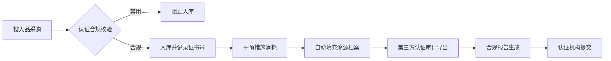

# 农场管理系统：全链路业务流程规格 (Business Process Spec)

本规格书详细描述了从前端营销需求到后端生产供给的全链路集成流程。

## 1. 全链路集成概览 (Demand-to-Supply)

## 2. 细分行业业务规则 (Domain Specific Rules)

### 2.1 养鱼 (Aquaculture)
- **水体管理**：地块（Land Parcel）属性需扩展"水体体积"、"流速"及"最大承载密度"。
- **动态饲喂**：饲料 BOM 需支持按"存塘量（当前存活总重）"百分比计算投喂量。
- **环境触发**：溶氧量低于阈值时，自动触发"增氧机开启"干预任务。

### 2.2 观光农业 (Agritourism)
- **资源独占**：烧烤位、钓位在预订时需检查"时间重叠性"，防止超卖。
- **采摘即生产**：游客采摘行为被视为一种特殊的"收获干预（Intervention）"，自动核减作物库存并转化为 POS 销售记录。

## 3. 核心经营硬约束流程 (Core ERP Hard-Blocks)

### 3.1 繁育代次销售拦截 (Breeding Generation Block)
- **触发点**：`sale.order` 确认动作。
- **逻辑**：扫描所有明细行批次，若代次属于 G0/G1/G2，系统立即抛出 ValidationError。
- **工作流**：自动为"合规主管"生成一条"违规销售审计"Activity。

### 3.2 死亡成本自动重分配 (Mortality Amortization)
- **触发点**：`stock.scrap` 执行生物资产报废。
- **逻辑**：系统汇总死亡批次的已发生生产成本，通过 `account.analytic.line` 自动均摊至同组存活个体。
- **审计**：在"批次成本明细表"中以"死亡摊销 / Mortality Absorption"项列出。

### 3.3 关键质量门硬拦截 (Quality Gate Block)
- **触发点**：`mrp.production` 完工确认。
- **逻辑**：强制校验 pH 值（发酵）或 杀菌温度。若不达标，系统禁止入库并自动锁定批次。
- **工作流**：触发"异常处理审批"Activity，流程闭环前禁止执行任何下游动作。

## 4. 多业态共享资源与供应链联动 (Cross-Sector Integration)

### 4.1 共享资源池 (Shared Resource Pool)

- **人力共享**：农场工人在种植淡季可被动态指派至观光区（如：维护研学基地）或养鱼区，所有工时统一通过 `analytic` 模块进行分摊。

- **设备共享**：拖拉机可用于地块深耕，也可作为观光区的载客车辆。系统需根据 `maintenance.equipment` 状态决定其可用性。

- **土地共享**：通过 `stock.location` 扩展属性，地块可标记支持的用途类型（种植、观光、水产等），避免资源冲突。

- **仓储共享**：建立统一库存管理机制，不同业态的产出品可在内部调配使用，减少库存积压。

### 4.2 供应链协同 (Supply Chain Synergy)

- **产出即原料**：
    - 种植产出的玉米可自动转化为畜牧业的饲料原料（通过内部移库调拨）。
    - 畜牧业产生的有机肥经过处理后，可作为种植业的绿色投入品。
    - 水产养殖的循环水系统产生的富营养水体，经过处理后可作为水培蔬菜的营养液。

- **供给驱动生产 (Push vs Pull)**：
    - **推式生产**：根据收获期预测自动启动营销预热（如：西瓜即将采摘，自动在会员群发布抢购链接）。
    - **拉式供给**：根据 CSA 订阅用户数，反向驱动采购部提前 3 个月预订特定的有机种苗。

- **库存优化**：
    - 基于历史消费模式和预测算法，动态调整各业态的库存水平。
    - 设置安全库存阈值，当库存低于阈值时自动触发补货流程。

### 4.3 财务流程整合 (Integrated Financial Flows)

- **成本分摊**：
    - 通过 `account.analytic.account` 实现跨业态成本分摊，准确核算各业务线的盈亏。
    - 共享资源（如设备、人员）成本按使用时间、产量等维度进行分摊。

- **收入确认**：
    - CSA 订阅、观光门票、现场零售等多渠道收入自动归集和分类。
    - 支持按项目、客户、产品类型进行收入分析。

- **定价机制**：
    - 动态定价算法，根据季节性、库存水平、市场需求调整产品价格。
    - 会员价、批量采购价等差异化定价策略。

## 5. 绿色与有机合规审计流 (Certification Audit Trail)

### 5.1 合规验证流程 (Compliance Verification Process)

- **投入品合规**：
    - 采购环节自动校验投入品是否符合有机/绿色认证标准。
    - 维护禁用物质清单，系统自动拦截违规采购申请。

- **生产过程监控**：
    - 实时监控生产过程是否符合认证标准要求。
    - 记录所有农事操作的合规性数据。

- **追溯档案**：
    - 自动收集生产全链路数据，形成完整的追溯档案。
    - 支持多维度查询和报告生成。

### 5.2 风险预警与管控 (Risk Early Warning & Control)

- **天气风险**：
    - 集成天气API，对极端天气发布预警，自动触发应急预案。
    - 建立作物保险与理赔流程。

- **市场价格波动**：
    - 监控市场价格变化，为销售决策提供支持。
    - 建立价格风险对冲机制。

- **病虫害预警**：
    - 基于IoT传感器数据和AI算法，预测病虫害发生概率。
    - 自动生成预防性干预任务。

## 6. 劳动与设备管理 (Labor & Equipment Management)

### 6.1 劳动力调度 (Labor Scheduling)

- **技能矩阵**：
    - 建立工人技能档案，支持跨业态作业能力管理。
    - 根据任务类型和工人技能自动匹配。

- **工时管理**：
    - 通过PWA移动端实时记录工时，支持离线操作。
    - 自动计算工人工资和绩效。

### 6.2 设备生命周期管理 (Equipment Lifecycle Management)

- **设备档案**：
    - 建立完整的设备档案，记录采购、使用、维护历史。
    - 支持设备折旧计算和残值评估。

- **预防性维护**：
    - 基于使用时长和运行状态，自动生成维护计划。
    - 维护任务与生产计划协调，避免影响生产。

## 7. 数据分析与决策支持 (Data Analytics & Decision Support)

### 7.1 生产分析 (Production Analytics)

- **产量预测**：
    - 基于历史数据和环境因素，预测作物产量。
    - 为销售计划和库存管理提供数据支持。

- **成本效益分析**：
    - 分析不同作物、不同生产方式的成本效益。
    - 优化资源配置，提高整体盈利能力。

### 7.2 市场分析 (Market Analytics)

- **消费者行为分析**：
    - 分析CSA订阅用户、观光客的消费行为。
    - 优化产品组合和营销策略。

- **供应链优化**：
    - 分析供应链各环节的成本和效率。
    - 识别瓶颈和改进机会。