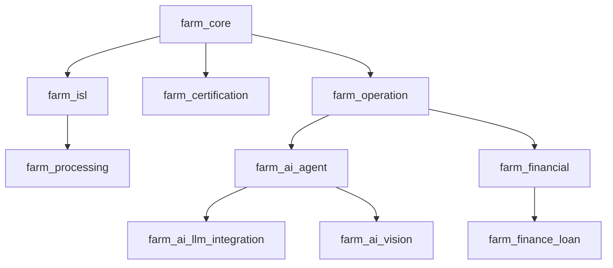

# Odoo 19 农场管理系统：模块规范与进度看板 (V2.1)

本项目采用高度模块化的架构，将复杂的农业业务拆分为原子化模块，以确保系统的灵活性和 Odoo 19 社区版的兼容性。

## 原子模块组合解决方案 (Atomic Module Composition Solution)

### 核心原则 (Core Principles)
- **模块原子性 (Modular Atomicity)**: 每个模块实现单一职责，专注于特定业务领域
- **组合灵活性 (Compositional Flexibility)**: 通过配置实现模块的灵活组合，支持不同业务场景
- **业务隔离 (Business Isolation)**: 模块间业务逻辑相互独立，避免耦合干扰
- **可插拔性 (Pluggability)**: 模块可独立安装、启用、停用和卸载

### 组合模式 (Composition Patterns)
- **垂直行业组合**: 同一产业链上下游模块组合（如：`farm_field_crops` + `farm_agricultural_processing`）
- **功能增强组合**: 基础业务模块与功能增强模块组合（如：`farm_operation` + `farm_iot`）
- **服务集成组合**: 业务模块与服务模块组合（如：`farm_livestock` + `farm_mobile`）
- **复合业务组合**: 多个行业模块组合支持复合型农业经营（如：`farm_apiculture` + `farm_agritourism` + `farm_marketing`）

### 配置管理 (Configuration Management)
- **res.config.settings**: 通过配置界面实现模块的启用/禁用
- **依赖解析**: 自动处理模块间的依赖关系
- **权限聚合**: 模块启用时自动聚合相应权限
- **界面调整**: 根据启用模块动态调整用户界面

### 实施约束 (Implementation Constraints)
- **接口标准化**: 模块间通过标准化接口进行交互
- **数据模型扩展**: 通过继承机制扩展现有数据模型
- **事件驱动通信**: 模块间通过事件系统进行松耦合通信
- **权限控制独立**: 每个模块维护自己的权限体系

## 2. 产品治理与规范文档

### 2.1 核心规范文档
- **产品方向规范**: `docs/business/PRODUCT_DIRECTION_SPEC.md` - 定义产品发展方向、治理机制和战略规划
- **史诗-插件实施规范**: `docs/business/EPIC_ADDON_MAPPING_SPEC.md` - 定义史诗和用户故事在 Odoo 插件中的实施标准
- **规划维护管理规范**: `docs/business/EPIC_US_MODULE_PLAN_MAINTENANCE_SPEC.md` - 定义史诗、用户故事、模块规划的维护管理流程
- **模块规范与进度看板**: 本文档 - 定义模块矩阵、职责和开发计划

### 模块矩阵与职责定义

### 模块职责边界说明
- **Base Modules**: 核心数据和基础服务，为其他模块提供基础支撑
- **Operation Modules**: 核心业务操作，处理农业生产具体活动
- **Technology Modules**: 技术支撑模块，处理设备、通信、移动等技术功能
- **Business Modules**: 商业功能模块，处理销售、营销、服务等业务流程
- **Compliance Modules**: 合规和质量模块，确保生产过程符合规范要求

| 分类 | 模块目录名 | 核心职责 | 状态 |
| :--- | :--- | :--- | :--- |
| **底座** | `farm_core` | 农场基础主数据、地理信息 (GIS)、土质分析、动态属性定义。 | ✅ 完成 |
| | `farm_isl` | ISL 行业标准层：模型重定向、透明代理继承、行业逻辑物理隔离。 | ✅ 完成 |
| | `farm_certification` | 有机/绿色认证状态、转换期管理、证书审计。 | ✅ 完成 |
| **作业** | `farm_operation` | 生产季、干预任务、收获分级、养分平衡。 | ✅ 完成 |
| | `farm_planning` | 技术路线 (Cultural Itinerary)、模拟情景、资源预测。 | ✅ 完成 |
| | `farm_livestock` | 畜牧业管理：个体动物追踪、群体变动、健康记录、繁殖周期管理。 | 💡 待规划 |
| | `farm_breeding` | 育种管理：系谱记录、遗传追踪、繁育计划、近交系数计算。 | 💡 待规划 |
| | `farm_processing` | 产后加工：分拣、包装、质量检验、成品入库。 | 💡 待规划 |
| **物联** | `industrial_iot` | 底层 MQTT 通信桥接（FastAPI + Odoo）。 | ✅ 完成 |
| | `farm_iot` | 遥测采集、下控指令、自动化联动、视频流。 | ✅ 完成 |
| | `farm_weather` | 外部天气预报集成、基于天气的作业预警。 | ✅ 完成 |
| **安全** | `farm_safety` | 防疫排期、休药期提醒、隔离拦截、合规校验。 | ✅ 完成 |
| | `farm_quality` | QCP 控制点、质量检查、不合格品告警。 | ✅ 完成 |
| **供应** | `farm_supply` | 投入品准入目录、采购合规拦截。 | ✅ 完成 |
| | `farm_logistics` | 冷链运输、温控标记、多级包装。 | ✅ 完成 |
| **商务** | `farm_agritourism` | 活动预约、资源日历、亲子项目管理。 | ✅ 完成 |
| | `farm_pos` | 采摘即销售，POS 订单关联地块。 | ✅ 完成 |
| | `farm_marketing` | 消费者溯源门户、产品生长故事。 | ✅ 完成 |
| | `farm_label` | 打印标签、批次牌、地块标牌、动物耳标。 | ✅ 完成 |
| | `farm_csa` | CSA 会员订阅引擎、周期性配送单生成。 | ✅ 完成 |
| | `farm_live_streaming` | 直播与抖音平台对接 [US-21-01 至 US-21-11]。 | ✅ 完成 |
| **后台** | `farm_hr` | 农场角色、计件工时记录、季节性用工。 | ✅ 完成 |
| | `farm_financial` | 自动辅助核算看板、任务成本分摊。 | ✅ 完成 |
| | `farm_sustainability` | 可持续指标、养分减量化趋势分析。 | ✅ 完成 |
| | `farm_exchange` | 行业数据交换 (DAPLOS, EDI)。 | ✅ 完成 |
| | `farm_dashboard` | 经营驾驶舱、跨模块运营指标看板。 | ✅ 完成 |
| **智能** | `farm_ai_agent` | AI 协调层、决策执行闭环、结果聚合引擎。 | ✅ 完成 |
| | `farm_ai_llm_integration` | LLM 农业知识增强、智能报告生成、RAG。 | ✅ 完成 |
| | `farm_ai_vision` | 计算机视觉病害诊断、边缘端离线识别。 | ✅ 完成 |
| **Epic 17: 行业深度与合规** | | | |
| **合规** | `farm_subsidy` | 补贴申报与合规追踪。 | ✅ 完成 |
| | `farm_ecology` | 生物多样性与生态指标。 | ✅ 完成 |
| | `farm_sale_ch` | 跨境合规与出口校验 (中国) [US-17-06]。 | ✅ 完成 |
| **风险** | `farm_crisis` | 应急预案与危机响应。 | ✅ 完成 |
| | `farm_disaster_risk` | 气象灾害预警与损失评估。 | ✅ 完成 |
| **金融** | `farm_finance_loan` | 活体资产抵押、农业保险精算。 | ✅ 完成 |
| **知识** | `farm_knowledge` | 农业知识库与病害图谱。 | ✅ 完成 |
| **设备** | `farm_equipment` | 农机管理、作业工时与油耗记录。 | ✅ 完成 |
| | `farm_training` | 农民培训与技能认证。 | ✅ 完成 |
| | `farm_multi_farm` | 多实体协同与合作社管理 [US-19-01 至 US-19-23]。 | ✅ 完成 |
| **Epic 22: 无人机作业集成** | `farm_equipment` | 无人机机队管理、载荷与电池循环记录。 | ✅ 完成 |
| | `farm_operation` | 航线 KML 导出、喷洒作业自动核销算法。 | ✅ 完成 |
| | `farm_iot` | 无人机实时位置遥测（MQTT）。 | ✅ 完成 |
| **Epic 23: 地理围栏安全** | `farm_core` | 虚拟围栏多边形定义与地块类型集成。 | ✅ 完成 |
| | `farm_iot` | 实时越界坐标判定算法（Point-in-Polygon）。 | ✅ 完成 |
| | `farm_livestock` | 动物越界移动端即时告警推送。 | ✅ 完成 |
| **Epic 24: 移动端现场打卡** | `farm_mobile` | 现场地理打卡、自动地块匹配、工时记录同步。 | ✅ 完成 |
| **Epic 25: 通用证据存证** | `farm_mobile` | 万物皆可取证、自动化地理水印、证据看板。 | ✅ 完成 |
| **Epic 26: 高级现场服务** | `farm_mobile` | 农业语音输入、离线卫星地图、远程专家连线。 | ✅ 完成 (2026-01-14) |
| | `farm_core` | GIS 地图化任务派发、电子围栏增强。 | ✅ 完成 (2026-01-14) |
| **Epic 27: 农业循环经济** | `farm_waste_mgmt` | 废弃物还田、内部投入品转化换算。 | 🚧 正在进行 (2026-01-14) |
| **Epic 28: AI 预测与视觉** | `farm_ai_vision` | 计算机视觉病害诊断、产量动态预测。 | ✅ 完成 |
| **Epic 29: 农业金融风险** | `farm_financial`, `farm_iot` | 气象指数保险联动、市场价预警。 | 💡 待规划 |
| **Epic 30: 碳足迹与 ESG** | `farm_ecology`, `farm_financial` | 碳排放核算、碳汇资产化。 | ✅ 完成 (2026-01-14) |
| **Epic 31: 逆向召回** | `farm_quality`, `farm_logistics` | 一键批次阻断、逆向追溯审计。 | ✅ 完成 (2026-01-14) |
| **Epic 32: 品牌与有机诚信** | `farm_marketing`, `farm_core` | 产地风土建模、GI 防伪、有机诚信评分。 | ✅ 完成 (2026-01-14) |
| **Epic 33: 温室与植物工厂** | `farm_iot`, `farm_core` | 立体库位管理、水肥光联动控制。 | ✅ 完成 (2026-01-14) |
| **Epic 34: 林果与多年生作物** | `farm_core`, `farm_operation` | 单株资产管理、历年产量趋势、成熟度监控。 | ✅ 完成 (2026-01-14) |
| **Epic 35: 特种养殖与高密度养殖** | `farm_safety`, `farm_iot` | 生物安全门禁、高密度精准饲喂逻辑。 | ✅ 完成 (2026-01-14) |
| **Epic 36: 城市农业与共享认养** | `farm_mobile`, `farm_csa` | 认养流程、共享工具管理、微型传感器接入。 | 💡 待规划 |
| **Epic 18: 中国合规与政策适配** | | | |
| **中国合规** | `farm_land_mgmt` | 土地承包权、用途管制与耕地保护。 | ✅ 完成 (2026-01-14) |
| | `farm_input_reg` | 农药/兽药实名制与监管对接。 | ✅ 完成 |
| | `farm_cert_ch` | 食用农产品合格证生成。 | ✅ 完成 |
| | `farm_subsidy_ch` | 耕地地力/种粮补贴申报。 | ✅ 完成 |
| | `farm_waste_mgmt` | 畜禽粪污资源化利用台账。 | ✅ 完成 |
| | `farm_green_monitor` | 化肥农药减量考核与趋势监控。 | ✅ 完成 |
| | `farm_machinery_ch` | 农机购置补贴信息预填。 | ✅ 完成 |
| | `farm_entity_reg` | 家庭农场/合作社备案管理。 | ✅ 完成 |
| | `farm_finance_gov` | 乡村振兴项目资金专项核算。 | ✅ 完成 |
| | `farm_data_security` | 数据本地化与等保合规配置。 | ✅ 完成 |
| **前端** | `farm_mobile` | 移动工作台、离线同步缓冲区。 | ✅ 完成 |
| **战略升级 (2026)** | | | |
| **Epic 52: 高级溯源系统** | `farm_processing` | 批次父子继承、Mock Recall 仪表盘。 | ✅ 完成 |
| **Epic 54: ISL 行业架构** | `farm_isl` | 透明重定向、_inherits 代理继承、性能优化。 | ✅ 完成 |
| **Epic 58: AI 决策平台** | `farm_ai_agent` | 决策聚合、活体抵押、保险精算分析。 | ✅ 完成 |
| **Epic 59: AI LLM 集成** | `farm_ai_llm_integration` | RAG 知识问答、速率限制与解析。 | ✅ 完成 |
| **Epic 60: AI 金融分析** | `farm_financial` | 金融风险预警、理赔流程 AI 增强。 | ✅ 完成 |
| **Epic 62: AI 协调工作流** | `farm_ai_agent` | 多 AI 服务协调执行、工作流编排。 | ✅ 完成 |
| **Epic 63: 数字孪生农业** | `farm_iot`, `farm_dashboard` | 3D 可视化、实时数据同步与仿真。 | 💡 待规划 |

## 2. 模块职责详细定义

### Base Modules
- **`farm_core`**: 系统最基础的数据层，负责农场、地块、品种等核心实体管理；集成 GIS 地理位置服务；提供动态属性扩展机制。
- **`farm_isl`**: 行业标准层核心，提供基础模型到 ISL 模型的透明重定向机制，支持 `_inherits` 代理继承，实现行业逻辑隔离。
- **`farm_certification`**: 认证管理体系，处理有机、绿色等各种认证标准；管理认证转换期；维护证书审计链路。

### Operation Modules
- **`farm_operation`**: 核心农业生产活动管理，包括农事干预、作物生长阶段、收获作业等；与其他操作模块形成业务闭环。
- **`farm_planning`**: 生产规划与调度，基于品种特性和环境条件制定生产计划；提供模拟功能评估不同方案。
- **`farm_livestock`**: 畜牧业专业管理，跟踪个体动物生命周期；管理群体变动记录；监控健康和繁殖状态。
- **`farm_breeding`**: 育种和遗传管理，建立系谱关系；计算近交系数；规划繁育方案。
- **`farm_processing`**: 产后加工处理，管理分拣包装流程；执行质量检验；处理成品入库。

### Technology Modules
- **`industrial_iot`**: 底层物联网通信层，基于 MQTT 协议栈；提供设备接入服务；处理通信协议转换。
- **`farm_iot`**: 应用层物联网服务，处理遥测数据；执行远程控制；管理自动化规则引擎。
- **`farm_weather`**: 天气数据服务，集成第三方天气 API；提供天气预警；计算环境影响因子。
- **`farm_mobile`**: 移动端解决方案，支持离线作业；提供现场数据采集；集成地理位置服务。

### Business Modules
- **`farm_agritourism`**: 农旅业务管理，处理活动预订；管理资源日历；跟踪服务质量。
- **`farm_pos`**: 现场销售终端，处理 POS 交易；关联地块信息；同步库存变化。
- **`farm_marketing`**: 营销推广系统，构建消费者门户；展示产品故事；管理用户互动。
- **`farm_csa`**: CSA 订阅服务，处理会员管理；生成配送计划；跟踪满意度。
- **`farm_supply`**: 供应链上游管理，维护供应商目录；处理采购订单；管理库存水平。
- **`farm_logistics`**: 供应链下游管理，规划运输路线；监控冷链条件；处理包装管理。

### Compliance Modules
- **`farm_safety`**: 安全管理体系，执行防疫排程；管理休药期；设置风险拦截点。
- **`farm_quality`**: 质量控制体系，定义检测标准；执行质量检验；处理不合格品。
- **`farm_sustainability`**: 可持续发展管理，监测环境指标；评估资源利用效率；跟踪减排效果。

### Intelligence Modules
- **`farm_ai_agent`**: AI 决策核心模块，提供协调层聚合来自不同 AI 服务的结果，支持智能工作流。
- **`farm_ai_llm_integration`**: LLM 集成模块，提供农业专业提示词工程、RAG 问答与智能报告生成。
- **`farm_ai_vision`**: 计算机视觉模块，支持植保图像识别、病虫害诊断与边缘端推理。

## 3. 跨模块交互协议

### 标准 API 契约
- 所有模块通过标准 API 接口暴露服务。
- 统一认证和权限验证机制。
- 标准化的数据格式（JSON Schema）。
- 统一的错误处理和响应格式。

### 事件驱动通信
- 基于 Odoo 的内置事件系统进行模块间异步通信。
- 支持订阅/发布模式处理跨模块依赖。
- 定义标准事件格式和处理模式。

### 数据共享原则
- 核心实体数据由所属模块负责创建和更新。
- 其他模块只可读取数据或通过标准接口发起修改请求。
- 维护数据一致性和完整性约束。

## 4. 用户故事 (User Story) 分配矩阵

| 史诗 (Epic) | 包含的 US ID | 承载模块 |
| :--- | :--- | :--- |
| **Epic 1: 基础数据** | US-01-01, US-01-02, US-01-03, US-01-04, US-01-08 | `farm_core` |
| **Epic 2: 种植管理** | US-02-01, US-02-02, US-02-03, US-02-04, US-02-07, US-02-09, US-02-10 | `farm_operation` |
| **Epic 3: 养殖管理** | US-03-01, US-03-02, US-03-03, US-03-04 | `farm_livestock`, `farm_iot` |
| **Epic 4: 供应链 BOM** | US-04-01, US-04-02, US-04-04, US-04-05 | `farm_operation`, `farm_supply` |
| **Epic 5: 农旅体验** | US-05-01, US-05-02, US-05-03, US-05-04 | `farm_agritourism`, `farm_pos` |
| **Epic 6: 物联控制** | US-06-01, US-06-02, US-06-03, US-06-04, US-06-05, US-06-06, US-06-07 | `farm_iot` |
| **Epic 7: 移动端友好与现场作业** | US-07-01 至 US-07-17 | `farm_mobile`, `farm_ux`, `farm_core`, `farm_supply` |
| **Epic 8: 营销参与** | US-08-01 至 US-08-05 | `farm_marketing`, `farm_csa` |
| **Epic 9: 集成供应链** | US-09-01 至 US-09-17 | `farm_supply`, `farm_logistics` |
| **Epic 10: 育苗育种** | US-10-01, US-10-02, US-10-03 | `farm_breeding`, `farm_quality` |
| **Epic 11: 安全防疫** | US-11-01 至 US-11-07 | `farm_safety` |
| **Epic 12: 认证合规** | US-12-01 至 US-12-09 | `farm_certification`, `farm_sustainability` |
| **Epic 13: 劳动力管理** | US-13-01, US-13-02, US-13-03, US-13-04 | `farm_hr` |
| **Epic 14: 产品加工** | US-14-01 至 US-14-23 | `farm_processing`, `farm_operation`, `farm_iot`, `farm_financial`, `farm_label`, `farm_logistics`, `farm_waste_mgmt`, `farm_marketing` |
| **Epic 15: 质量控制** | US-15-01 至 US-15-10 | `farm_quality` |
| **Epic 16: UX 与术语去工业化** | US-16-01 至 US-16-25 | `farm_ux`, `farm_dashboard`, `farm_mobile`, `farm_iot` | ✅ 完成 |
| **Epic 19: 多实体协同与合作社管理** | US-19-01 至 US-19-23 | `farm_multi_farm`, `farm_financial`, `farm_equipment` | ✅ 完成 |
| **Epic 21: 直播与抖音对接** | US-21-01 至 US-21-11 | `farm_live_streaming`, `farm_marketing`, `farm_financial` | ✅ 完成 |
| **Epic 26: 高级现场智能** | US-26-01 至 US-26-08 | `farm_core`, `farm_mobile`, `farm_operation` | ✅ 完成 |
| **Epic 28: AI 预测与智能视觉** | US-28-01 至 US-28-04 | `farm_ai_vision`, `farm_iot`, `farm_mobile` | ✅ 完成 |
| **Epic 30: 碳足迹与 ESG 账座** | US-30-01 至 US-30-14 | `farm_ecology`, `farm_financial`, `farm_sustainability` | ✅ 完成 |
| **Epic 37: 农业综合生产效能 (OPE)** | US-37-01 至 US-37-05 | `farm_dashboard`, `farm_financial`, `farm_operation` | ✅ 完成 |
| **Epic 46: 精准生产与变量作业** | US-46-01 至 US-46-05 | `farm_iot`, `farm_mobile`, `farm_operation` | ✅ 完成 |
| **Epic 52: 高级溯源系统** | US-52-01 至 US-52-13 | `farm_processing`, `farm_quality` | ✅ 完成 |
| **Epic 54: ISL 行业架构** | US-54-01 至 US-54-14 | `farm_isl`, `farm_processing` | ✅ 完成 |
| **Epic 58: AI 智能决策支持** | US-58-01 至 US-58-18 | `farm_ai_agent`, `farm_finance_loan` | ✅ 完成 |
| **Epic 59: AI LLM 集成** | US-59-01 至 US-59-07 | `farm_ai_llm_integration`, `farm_knowledge` | ✅ 完成 |
| **Epic 60: AI 金融分析** | US-60-01 至 US-60-03 | `farm_financial`, `farm_ai_agent` | ✅ 完成 |
| **Epic 62: AI 协调与工作流** | US-62-01 至 US-62-03 | `farm_ai_agent`, `farm_isl` | ✅ 完成 |
| **Epic 65: 补贴证据自动化** | US-65-04 | `farm_subsidy`, `farm_mobile` | ✅ 完成 |
| **Epic 67: 订单生产全透明** | US-67-02 | `farm_marketing`, `farm_sale_ch`, `farm_operation` | ✅ 完成 |

## 5. 开发依赖关系

*(注：此处 Mermaid 图已精简，详细依赖关系见架构设计文档)*

## 6. 实施总结

所有核心模块均已按照 **TDD (测试驱动开发)** 模式完成。
系统支持从 **"投入品采购 -> 生产规划 -> 现场作业 -> 自动化监控 -> 质量检测 -> 加工溯源 -> 消费者营销"** 的全链路业务闭环。

权限架构与菜单结构完全集成，确保了数据安全和用户体验的平衡。

## 7. 垂直行业配置管理

为支持灵活的行业模块启用/禁用，系统提供基于 `res.config.settings` 的配置界面：

### 配置选项结构
- **`module_farm_field_crops`**: 大田作物管理 (Field Crops)
- **`module_farm_protected_cultivation`**: 设施农业管理 (Protected Cultivation)
- **`module_farm_orchard_horticulture`**: 果树园艺管理 (Orchard & Horticulture)
- **`module_farm_livestock`**: 畜牧养殖管理 (Livestock)
- **`module_farm_agricultural_processing`**: 农产品加工管理 (Agricultural Processing)

---

## 9. V6.0 深度规划与 User Story 技术映射 (2026-01-27 增量更新)

本章节定义了系统迈向"智能协同与合规闭环"阶段的核心技术归口。

### 9.1 智能决策与协调 (Epic 58, 62)
- **实现模块**: farm_ai_agent, farm_isl
- **核心逻辑**:
    - US-62-01 (AI 协调层): 归口 farm_ai_agent，处理多 AI 服务聚合。
    - US-58-15 (活体抵押): 归口 farm_finance_loan，结合实时健康数据估值。

### 9.2 行业标准层架构 (Epic 54)
- **实现模块**: farm_isl
- **核心逻辑**:
    - US-54-11 (透明重定向): 通过 Odoo `ir.actions.act_window` 拦截器实现基础模型到 ISL 模型的映射。

### 9.3 极致现场 UX (Epic 16 & 07)
- **实现模块**: farm_ux, farm_mobile
- **核心逻辑**:
    - US-16-23 (三端自适应引擎): 根据 User-Agent 动态注入视图布局。

### 9.4 补贴证据自动化 (Epic 65)
- **实现模块**: farm_subsidy, farm_mobile
- **核心逻辑**:
    - US-65-04 (Subsidy Evidence Automation): 自动聚合农场活动图片证据生成符合审计标准的合规报告，简化政府补贴申请流程。

### 9.5 订单生产全透明 (Epic 67)
- **实现模块**: farm_marketing, farm_sale_ch, farm_operation
- **核心逻辑**:
    - US-67-02 (Order Production Full Transparency): 渠道买家可在订单看板实时查看田间作业进度（如施肥完成、进入变色期等）。

---
**最后更新**: 2026-01-27