# Odoo 19 农场管理系统：模块规范与进度看板 (V2.0)

本项目采用高度模块化的架构，将复杂的农业业务拆分为原子化模块，以确保系统的灵活性和 Odoo 19 社区版的兼容性。

## 原子模块组合解决方案 (Atomic Module Composition Solution)

### 核心原则 (Core Principles)
- **模块原子性 (Modular Atomicity)**: 每个模块实现单一职责，专注于特定业务领域
- **组合灵活性 (Compositional Flexibility)**: 通过配置实现模块的灵活组合，支持不同业务场景
- **业务隔离 (Business Isolation)**: 模块间业务逻辑相互独立，避免耦合干扰
- **可插拔性 (Pluggability)**: 模块可独立安装、启用、停用和卸载

### 组合模式 (Composition Patterns)
- **垂直行业组合**: 同一产业链上下游模块组合（如：`farm_field_crops` + `farm_agricultural_processing`）
- **功能增强组合**: 基础业务模块与功能增强模块组合（如：`farm_operation` + `farm_iot`）
- **服务集成组合**: 业务模块与服务模块组合（如：`farm_livestock` + `farm_mobile`）
- **复合业务组合**: 多个行业模块组合支持复合型农业经营（如：`farm_apiculture` + `farm_agritourism` + `farm_marketing`）

### 配置管理 (Configuration Management)
- **res.config.settings**: 通过配置界面实现模块的启用/禁用
- **依赖解析**: 自动处理模块间的依赖关系
- **权限聚合**: 模块启用时自动聚合相应权限
- **界面调整**: 根据启用模块动态调整用户界面

### 实施约束 (Implementation Constraints)
- **接口标准化**: 模块间通过标准化接口进行交互
- **数据模型扩展**: 通过继承机制扩展现有数据模型
- **事件驱动通信**: 模块间通过事件系统进行松耦合通信
- **权限控制独立**: 每个模块维护自己的权限体系

## 2. 产品治理与规范文档

### 2.1 核心规范文档
- **产品方向规范**: `docs/business/PRODUCT_DIRECTION_SPEC.md` - 定义产品发展方向、治理机制和战略规划
- **史诗-插件实施规范**: `docs/business/EPIC_ADDON_MAPPING_SPEC.md` - 定义史诗和用户故事在Odoo插件中的实施标准
- **规划维护管理规范**: `docs/business/EPIC_US_MODULE_PLAN_MAINTENANCE_SPEC.md` - 定义史诗、用户故事、模块规划的维护管理流程
- **模块规范与进度看板**: 本文档 - 定义模块矩阵、职责和开发计划

### 模块矩阵与职责定义

### 模块职责边界说明
- **Base Modules**: 核心数据和基础服务，为其他模块提供基础支撑
- **Operation Modules**: 核心业务操作，处理农业生产具体活动
- **Technology Modules**: 技术支撑模块，处理设备、通信、移动等技术功能
- **Business Modules**: 商业功能模块，处理销售、营销、服务等业务流程
- **Compliance Modules**: 合规和质量模块，确保生产过程符合规范要求

| 分类 | 模块目录名 | 核心职责 | 状态 |
| :--- | :--- | :--- | :--- |
| **底座** | `farm_core` | 农场基础主数据、地理信息 (GIS)、土质分析、动态属性定义。 | ✅ 完成 |
| | `farm_certification` | 有机/绿色认证状态、转换期管理、证书审计。 | ✅ 完成 |
| **作业** | `farm_operation` | 生产季、干预任务、收获分级、养分平衡。 | ✅ 完成 |
| | `farm_planning` | 技术路线 (Cultural Itinerary)、模拟情景、资源预测。 | ✅ 完成 |
| | `farm_livestock` | 畜牧业管理：个体动物追踪、群体变动、健康记录、繁殖周期管理。 | 💡 待规划 |
| | `farm_breeding` | 育种管理：系谱记录、遗传追踪、繁育计划、近交系数计算。 | 💡 待规划 |
| | `farm_processing` | 产后加工：分拣、包装、质量检验、成品入库。 | 💡 待规划 |
| **物联** | `industrial_iot` | 底层 MQTT 通信桥接（FastAPI + Odoo）。 | ✅ 完成 |
| | `farm_iot` | 遥测采集、下控指令、自动化联动、视频流。 | ✅ 完成 |
| | `farm_weather` | 外部天气预报集成、基于天气的作业预警。 | ✅ 完成 |
| **安全** | `farm_safety` | 防疫排期、休药期提醒、隔离拦截、合规校验。 | ✅ 完成 |
| | `farm_quality` | QCP 控制点、质量检查、不合格品告警。 | ✅ 完成 |
| **供应** | `farm_supply` | 投入品准入目录、采购合规拦截。 | ✅ 完成 |
| | `farm_logistics` | 冷链运输、温控标记、多级包装。 | ✅ 完成 |
| **商务** | `farm_agritourism` | 活动预约、资源日历、亲子项目管理。 | ✅ 完成 |
| | `farm_pos` | 采摘即销售，POS 订单关联地块。 | ✅ 完成 |
| | `farm_marketing` | 消费者溯源门户、产品生长故事。 | ✅ 完成 |
| | `farm_label` | 打印标签、批次牌、地块标牌、动物耳标。 | ✅ 完成 |
| | `farm_csa` | CSA 会员订阅引擎、周期性配送单生成。 | ✅ 完成 |
| | `farm_live_streaming` | 直播与抖音平台对接，包括账号授权、商品同步、订单处理、数据分析等功能 [US-21-01 至 US-21-07]。 | ✅ 完成 |
| **后台** | `farm_hr` | 农场角色、计件工时记录、季节性用工。 | ✅ 完成 |
| | `farm_financial` | 自动辅助核算看板、任务成本分摊。 | ✅ 完成 |
| | `farm_sustainability` | 可持续指标、养分减量化趋势分析。 | ✅ 完成 |
| | `farm_exchange` | 行业数据交换 (DAPLOS, TELEPAC, EDI)。 | ✅ 完成 |
| | `farm_dashboard` | 经营驾驶舱、跨模块运营指标看板。 | ✅ 完成 |
| **Epic 17: 行业深度与合规** | | | |
| **合规** | `farm_subsidy` | 补贴申报与合规追踪。 | ✅ 完成 |
| | `farm_ecology` | 生物多样性与生态指标。 | ✅ 完成 |
| | `farm_sale_ch` | 跨境合规与出口校验 (中国) - 维护各国禁用农药清单，销售前自动校验批次历史投入品是否合规 [US-17-06]。 | ✅ 完成 |
| **风险** | `farm_crisis` | 应急预案与危机响应。 | ✅ 完成 |
| | `farm_disaster_risk` | 气象灾害预警与损失评估。 | ✅ 完成 |
| **金融** | `farm_finance_loan` | 农业信贷与抵押。 | ✅ 完成 |
| **知识** | `farm_knowledge` | 农业知识库与病害图谱。 | ✅ 完成 |
| **设备** | `farm_equipment` | 农机管理、作业工时与油耗记录。 | ✅ 完成 |
| | `farm_training` | 农民培训与技能认证。 | ✅ 完成 |
| | `farm_multi_farm` | 多实体协同与合作社管理，包括实体关系建模、数据隔离、资源共享、财务汇总、标准化管理等功能 [US-19-01 至 US-19-05]。 | ✅ 完成 |
| **Epic 22: 无人机作业集成** | `farm_equipment` | 无人机机队管理、载荷与电池循环记录。 | ✅ 完成 |
| | `farm_operation` | 航线 KML 导出、喷洒作业自动核销算法。 | ✅ 完成 |
| | `farm_iot` | 无人机实时位置遥测（MQTT）。 | ✅ 完成 |
| **Epic 23: 地理围栏安全** | `farm_core` | 虚拟围栏多边形定义与地块类型集成。 | ✅ 完成 |
| | `farm_iot` | 实时越界坐标判定算法（Point-in-Polygon）。 | ✅ 完成 |
| | `farm_livestock` | 动物越界移动端即时告警推送。 | ✅ 完成 |
| **Epic 24: 移动端现场打卡** | `farm_mobile` | 现场地理打卡、自动地块匹配、工时记录同步。 | ✅ 完成 |
| **Epic 25: 通用证据存证** | `farm_mobile` | 万物皆可取证、自动化地理水印、证据看板。 | ✅ 完成 |
| **Epic 26: 高级现场服务** | `farm_mobile` | 农业语音输入、离线卫星地图、远程专家连线。 | 🚧 开发中   ✅ 完成 (2026-01-14) |
| | `farm_core` | GIS 地图化任务派发、电子围栏增强。 | 🚧 开发中   ✅ 完成 (2026-01-14) |
| **Epic 27: 农业循环经济** | `farm_waste_mgmt` | 废弃物还田、内部投入品转化换算。 | 💡 待规划   🚧 正在进行 (2026-01-14) |
| **Epic 28: AI 预测与视觉** | `farm_iot`, `farm_mobile` | 计算机视觉病害诊断、产量动态预测。 | 💡 待规划 |
| **Epic 29: 农业金融风险** | `farm_financial`, `farm_iot` | 气象指数保险联动、市场价预警。 | 💡 待规划 |
| **Epic 30: 碳足迹与 ESG** | `farm_ecology`, `farm_financial` | 碳排放核算、碳汇资产化。 | 💡 待规划   ✅ 完成 (2026-01-14) |
| **Epic 31: 逆向召回** | `farm_quality`, `farm_logistics` | 一键批次阻断、逆向追溯审计。 | 💡 待规划   ✅ 完成 (2026-01-14) |
| **Epic 32: 品牌与有机诚信** | `farm_marketing`, `farm_core` | 产地风土建模、GI 防伪、有机诚信评分。 | 💡 待规划   ✅ 完成 (2026-01-14) |
| **Epic 33: 温室与植物工厂** | `farm_iot`, `farm_core` | 立体库位管理、水肥光联动控制。 | 💡 待规划   ✅ 完成 (2026-01-14) |
| **Epic 34: 林果与多年生作物** | `farm_core`, `farm_operation` | 单株资产管理、历年产量趋势、成熟度监控。 | 💡 待规划   ✅ 完成 (2026-01-14) |
| **Epic 35: 特种养殖与高密度工业化养殖** | `farm_safety`, `farm_iot` | 生物安全门禁、高密度精准饲喂逻辑。 | 💡 待规划   ✅ 完成 (2026-01-14) |
| **Epic 36: 城市农业与共享认养** | `farm_mobile`, `farm_csa` | 认养流程、共享工具管理、微型传感器接入。 | 💡 待规划 |
| **Epic 18: 中国合规与政策适配** | | | |
| **中国合规** | `farm_land_mgmt` | 土地承包权、用途管制与耕地保护。 | 🚧 正在进行   ✅ 完成 (2026-01-14) |
| | `farm_input_reg` | 农药/兽药实名制与监管对接。 | ✅ 完成 |
| | `farm_cert_ch` | 食用农产品合格证生成。 | ✅ 完成 |
| | `farm_subsidy_ch` | 耕地地力/种粮补贴申报。 | ✅ 完成 |
| | `farm_waste_mgmt` | 畜禽粪污资源化利用台账。 | ✅ 完成 |
| | `farm_green_monitor` | 化肥农药减量考核与趋势监控。 | ✅ 完成 |
| | `farm_machinery_ch` | 农机购置补贴信息预填。 | ✅ 完成 |
| | `farm_entity_reg` | 家庭农场/合作社备案管理。 | ✅ 完成 |
| | `farm_finance_gov` | 乡村振兴项目资金专项核算。 | ✅ 完成 |
| | `farm_data_security` | 数据本地化与等保合规配置。 | ✅ 完成 |
| **前端** | `farm_mobile` | 移动工作台、离线同步缓冲区。 | ✅ 完成 |

## 2. 模块职责详细定义

### Base Modules
- **`farm_core`**: 系统最基础的数据层，负责农场、地块、品种等核心实体管理；集成GIS地理位置服务；提供动态属性扩展机制
- **`farm_certification`**: 认证管理体系，处理有机、绿色等各种认证标准；管理认证转换期；维护证书审计链路

### Operation Modules
- **`farm_operation`**: 核心农业生产活动管理，包括农事干预、作物生长阶段、收获作业等；与其他操作模块形成业务闭环
- **`farm_planning`**: 生产规划与调度，基于品种特性和环境条件制定生产计划；提供模拟功能评估不同方案
- **`farm_livestock`**: 畜牧业专业管理，跟踪个体动物生命周期；管理群体变动记录；监控健康和繁殖状态
- **`farm_breeding`**: 育种和遗传管理，建立系谱关系；计算近交系数；规划繁育方案
- **`farm_processing`**: 产后加工处理，管理分拣包装流程；执行质量检验；处理成品入库

### Technology Modules
- **`industrial_iot`**: 底层物联网通信层，基于MQTT协议栈；提供设备接入服务；处理通信协议转换
- **`farm_iot`**: 应用层物联网服务，处理遥测数据；执行远程控制；管理自动化规则引擎
- **`farm_weather`**: 天气数据服务，集成第三方天气API；提供天气预警；计算环境影响因子
- **`farm_mobile`**: 移动端解决方案，支持离线作业；提供现场数据采集；集成地理位置服务

### Business Modules
- **`farm_agritourism`**: 农旅业务管理，处理活动预订；管理资源日历；跟踪服务质量
- **`farm_pos`**: 现场销售终端，处理POS交易；关联地块信息；同步库存变化
- **`farm_marketing`**: 营销推广系统，构建消费者门户；展示产品故事；管理用户互动
- **`farm_csa`**: CSA订阅服务，处理会员管理；生成配送计划；跟踪满意度
- **`farm_supply`**: 供应链上游管理，维护供应商目录；处理采购订单；管理库存水平
- **`farm_logistics`**: 供应链下游管理，规划运输路线；监控冷链条件；处理包装管理

### Compliance Modules
- **`farm_safety`**: 安全管理体系，执行防疫排程；管理休药期；设置风险拦截点
- **`farm_quality`**: 质量控制体系，定义检测标准；执行质量检验；处理不合格品
- **`farm_sustainability`**: 可持续发展管理，监测环境指标；评估资源利用效率；跟踪减排效果

## 3. 跨模块交互协议

### 标准API契约
- 所有模块通过标准API接口暴露服务
- 统一认证和权限验证机制
- 标准化的数据格式（JSON Schema）
- 统一的错误处理和响应格式

### 事件驱动通信
- 基于Odoo的内置事件系统进行模块间异步通信
- 支持订阅/发布模式处理跨模块依赖
- 定义标准事件格式和处理模式

### 数据共享原则
- 核心实体数据由所属模块负责创建和更新
- 其他模块只可读取数据或通过标准接口发起修改请求
- 维护数据一致性和完整性约束

## 4. 用户故事 (User Story) 分配矩阵

| 史诗 (Epic) | 包含的 US ID | 承载模块 |
| :--- | :--- | :--- |
| **Epic 1: 基础数据** | US-01-01, US-01-02, US-01-03, US-01-04 | `farm_core` |
| **Epic 2: 种植管理** | US-02-01, US-02-02, US-02-03, US-02-04 | `farm_operation` |
| **Epic 3: 养殖管理** | US-03-01, US-03-02, US-03-03, US-03-04 | `farm_livestock`, `farm_iot` |
| **Epic 4: 供应链 BOM** | US-04-01, US-04-02 | `farm_operation`, `farm_supply` |
| **Epic 5: 农旅体验** | US-05-01, US-05-02, US-05-03, US-05-04 | `farm_agritourism`, `farm_pos` |
| **Epic 6: 物联控制** | US-06-01, US-06-02, US-06-03 | `farm_iot` |
| **Epic 7: 移动端友好与现场作业** | US-07-01, US-07-02, US-07-03, US-07-04, US-07-05, US-07-06, US-07-07, US-07-08 | `farm_mobile`, `website`, `farm_core`, `farm_knowledge`, `farm_supply` |
| **Epic 8: 营销参与** | US-08-01, US-08-02, US-08-03 | `farm_marketing`, `farm_csa` |
| **Epic 9: 集成供应链** | US-09-01, US-09-02, US-09-03 | `farm_supply`, `farm_logistics` |
| **Epic 10: 育苗育种** | US-10-01, US-10-02 | `farm_breeding` |
| **Epic 11: 安全防疫** | US-11-01, US-11-02, US-11-03 | `farm_safety` |
| **Epic 12: 认证合规** | US-12-01, US-12-02, US-12-03, US-12-04 | `farm_certification`, `farm_sustainability` |
| **Epic 13: 劳动力管理** | US-13-01, US-13-02, US-13-03, US-13-04 | `farm_hr` |
| **Epic 14: 产品加工** | US-14-01, US-14-02, US-14-03, US-14-04, US-14-05, US-14-06, US-14-07, US-14-08, US-14-09, US-14-10, US-14-11, US-14-12, US-14-13, US-14-14 | `farm_processing`, `farm_operation`, `farm_iot`, `farm_financial`, `farm_label`, `farm_logistics`, `farm_waste_mgmt`, `farm_marketing` |
| **Epic 15: 质量控制** | US-15-01, US-15-02, US-15-03, US-15-04 | `farm_quality` |
| **Epic 16: 用户体验与术语去工业化** | US-16-01 | `farm_ux`, `farm_operation`, `farm_planning`, `farm_marketing` | ✅ 完成 |
| | US-16-02 | `farm_ux`, `farm_operation`, `farm_planning`, `farm_marketing` | ✅ 完成 |
| | US-16-03 | `farm_ux`, `farm_operation`, `farm_quality`, `farm_safety` | ✅ 完成 |
| | US-16-04 | `farm_ux`, `farm_dashboard`, `farm_marketing` | ✅ 完成 |
| | US-16-05 | `farm_ux`, `farm_marketing`, `farm_knowledge` | ✅ 完成 |
| | US-16-06 | `farm_ux`, `farm_knowledge`, `farm_marketing` | ✅ 完成 |
| | US-16-07 | `farm_ux`, `farm_mobile`, `farm_iot` | ✅ 完成 |
| | US-16-08 | `farm_ux`, `farm_agritourism`, `farm_marketing` | ✅ 完成 |
| | US-16-09 | `farm_ux`, `farm_core`, `farm_mobile` | ✅ 完成 |
| **Epic 17: 行业深度与合规** | US-17-01 | `farm_equipment` |
| | US-17-02 | `farm_subsidy` |
| | US-17-03 | `farm_crisis` |
| | US-17-04 | `farm_finance_loan` |
| | US-17-05 | `farm_ecology` |
| | US-17-06 | `farm_sale_ch` |
| | US-17-07 | `farm_knowledge` |
| | US-17-08 | `farm_training` |
| | US-17-09 | `farm_multi_farm` |
| | US-17-10 | `farm_disaster_risk` |
| **Epic 18: 中国农业合规与政策适配** | US-18-01 | `farm_land_mgmt` |
| | US-18-02 | `farm_input_reg` |
| | US-18-03 | `farm_cert_ch` |
| | US-18-04 | `farm_subsidy_ch` |
| | US-18-05 | `farm_waste_mgmt` |
| | US-18-06 | `farm_green_monitor` |
| | US-18-07 | `farm_machinery_ch` |
| | US-18-08 | `farm_entity_reg` |
| | US-18-09 | `farm_finance_gov` |
| | US-18-10 | `farm_data_security` |
| | US-18-11 | `farm_core` |
| | US-18-12 | `farm_supply` |
| | US-18-13 | `farm_marketing` |
| | US-18-14 | `farm_iot` |
| **Epic 19: 多实体协同与合作社管理** | US-19-01 | `farm_multi_farm`, `base` | ✅ 完成 |
| | US-19-02 | `farm_multi_farm`, `farm_core` | ✅ 完成 |
| | US-19-03 | `farm_multi_farm`, `farm_equipment`, `farm_hr`, `project` | ✅ 完成 |
| | US-19-04 | `farm_multi_farm`, `farm_financial`, `account` | ✅ 完成 |
| | US-19-05 | `farm_multi_farm`, `farm_quality`, `farm_marketing`, `farm_training` | ✅ 完成 |
| **Epic 20: 数据交换与标准化** | US-20-01 | `farm_exchange` |
| | US-20-02 | `farm_exchange` |
| | US-20-03 | `farm_exchange` |
| | US-20-04 | `farm_exchange` |
| **Epic 21: 直播与抖音对接** | US-21-01 | `farm_live_streaming` |
| | US-21-02 | `farm_live_streaming`, `farm_supply` |
| | US-21-03 | `farm_live_streaming`, `farm_label` |
| | US-21-04 | `farm_live_streaming`, `stock`, `sale` |
| | US-21-05 | `farm_live_streaming`, `farm_dashboard` |
| | US-21-06 | `farm_live_streaming`, `website` |
| | US-21-07 | `farm_live_streaming`, `farm_label` |
| **Epic 22: 农用无人机作业集成** | US-22-01 | `farm_equipment` |
| | US-22-02 | `farm_training`, `hr` |
| | US-22-03 | `farm_core`, `farm_operation` |
| | US-22-04 | `farm_operation`, `stock` |
| | US-22-05 | `farm_financial`, `farm_equipment` |
| | US-22-06 | `farm_iot` |
| | US-22-07 | `farm_marketing`, `farm_label` |
| **Epic 23: 地理围栏与边界安全** | US-23-01 | `farm_core` |
| | US-23-02 | `farm_livestock`, `farm_iot` |
| | US-23-03 | `farm_operation` |
| | US-23-04 | `farm_equipment`, `farm_operation` |
| | US-23-05 | `farm_crisis`, `farm_core` |
| | US-23-06 | `farm_iot` |
| | US-23-07 | `farm_certification`, `farm_quality` |
| **Epic 24: 移动端现场打卡** | US-24-01 | `farm_mobile` |
| | US-24-02 | `farm_mobile`, `farm_core` |
| | US-24-03 | `farm_mobile`, `hr_timesheet`, `farm_operation` |
| | US-24-04 | `farm_mobile` |
| | US-24-05 | `farm_mobile` |
| **Epic 25: 通用现场证据存证** | US-25-01 | `farm_mobile` |
| | US-25-02 | `farm_mobile` |
| | US-25-03 | `farm_mobile` |
| | US-25-04 | `farm_mobile` |
| **Epic 26: 高级现场作业与服务智能** | US-26-01 | `farm_core`, `farm_operation` |
| | US-26-02 | `farm_mobile` |
| | US-26-03 | `farm_equipment`, `farm_mobile` |
| | US-26-04 | `farm_mobile`, `farm_core` |
| | US-26-05 | `farm_mobile` |
| **Epic 27: 农业循环经济与废弃物资源化** | US-27-01, US-27-02 | `farm_waste_mgmt`, `farm_quality`, `stock`, `mrp` |
| **Epic 28: AI 预测性洞察与智能视觉** | US-28-01, US-28-02 | `farm_iot`, `farm_mobile`, `farm_knowledge` |
| **Epic 29: 农业金融风险与保险联动** | US-29-01, US-29-02 | `farm_financial`, `farm_iot`, `farm_weather` |
| **Epic 30: 碳足迹追踪与可持续性账座** | US-30-01, US-30-02, US-30-03 | `farm_ecology`, `farm_financial`, `farm_sustainability` |
| **Epic 31: 逆向供应链与精准召回** | US-31-01, US-31-02 | `farm_quality`, `farm_logistics`, `stock` |
| **Epic 32: 品牌价值、地理标志与有机诚信** | US-32-01, US-32-02, US-32-03 | `farm_marketing`, `farm_core`, `farm_certification` |
| **Epic 33: 设施农业、温室与植物工厂** | US-33-01, US-33-02, US-33-03 | `farm_iot`, `farm_core`, `farm_operation` |
| **Epic 34: 多年生作物、林果与茶园管理** | US-34-01, US-34-02, US-34-03 | `farm_core`, `farm_operation`, `farm_planning` |
| **Epic 35: 特种养殖与高密度工业化养殖** | US-35-01, US-35-02, US-35-03 | `farm_safety`, `farm_iot`, `farm_livestock` |
| **Epic 36: 城市农业、共享认养与微农场** | US-36-01, US-36-02, US-36-03 | `farm_mobile`, `farm_csa`, `farm_iot` |
| **Epic 37: 农业综合生产效能 (OPE)** | US-37-01, US-37-02, US-37-03 | `farm_dashboard`, `farm_financial`, `farm_operation` |
| **Epic 38: 游园活动与第三方商户管理** | US-38-01, US-38-02, US-38-03, US-38-04 | `farm_agritourism`, `farm_mobile`, `farm_iot`, `website` |
| **Epic 39: 蜂业与迁徙养殖管理** | US-39-01, US-39-02, US-39-03 | `farm_livestock`, `farm_iot`, `farm_mobile`, `farm_core` |
| **Epic 40: 中药材与炮制管理** | US-40-01, US-40-02, US-40-03 | `farm_operation`, `farm_quality`, `farm_certification` |
| **Epic 41: 食用菌与潮次管理** | US-41-01, US-41-02, US-41-03 | `farm_operation`, `farm_planning`, `farm_processing` |
| **Epic 42: 种质资源与生物样本库** | US-42-01, US-42-02, US-42-03 | `farm_breeding`, `farm_operation`, `farm_core` |
| **Epic 43: 生物质能源与外部 ESG 市场** | US-43-01, US-43-02, US-43-03 | `farm_waste_mgmt`, `farm_ecology`, `farm_financial` |
| **Epic 44: 订单农业与农户结算管理** | US-44-01, US-44-02, US-44-03 | `farm_supply`, `farm_financial`, `sale` |
| **Epic 45: 中央厨房运营** | US-45-01, US-45-02, US-45-03 | `farm_processing`, `farm_logistics`, `farm_quality` |
| **Epic 46: 精准生产与变量作业** | US-46-01, US-46-02 | `farm_iot`, `farm_mobile`, `farm_operation` |
| **Epic 47: 生物生长智能与动态决策** | US-47-01, US-47-02 | `farm_operation`, `farm_iot`, `farm_planning` |
| **Epic 48: 农业金融信用与指数保险** | US-48-01, US-48-02 | `farm_financial`, `farm_weather`, `farm_iot` |
| **Epic 49: 全息溯源与交互式品牌营销** | US-49-01, US-49-02 | `farm_marketing`, `farm_label`, `farm_quality` |
| **Epic 50: 层级视图与容器化** | US-50-01, US-50-02 | `farm_core`, `stock`, `mrp` |
| **Epic 51: 计算机视觉分析** | US-51-01, US-51-02, US-51-03 | `farm_ai_vision`, `farm_mobile`, `farm_quality` |
| **Epic 52: 高级溯源系统** | US-52-01, US-52-02, US-52-03 | `stock.lot`, `farm_agricultural_processing`, `farm_quality` |
| **Epic 53: 数字化农业平台** | US-53-01, US-53-02, US-53-03 | `farm_ai_agent`, `farm_knowledge`, `farm_dashboard` |
| **Epic 61: 农用机器人与自动化** | US-61-01, US-61-02, US-61-03 | `farm_iot`, `farm_equipment`, `farm_mobile` |
| **Epic 62: AI驱动的协调与工作流** | US-62-01, US-62-02, US-62-03 | `farm_ai_agent`, `farm_ai_coordination`, `farm_workflow` |
| **Epic 63: 数字孪生农业** | US-63-01, US-63-02, US-63-03 | `farm_iot`, `farm_dashboard`, `farm_planning` |
| **Epic 54: 智慧供应链协同** | US-54-01, US-54-02, US-54-03 | `farm_supply`, `farm_logistics`, `farm_financial` |
| **Epic 55: 农业网络安全与数据保护** | US-55-01, US-55-02, US-55-03 | `farm_core`, `farm_iot`, `res.users` |
| **Epic 56: ESG合规与可持续性管理** | US-56-01, US-56-02, US-56-03 | `farm_ecology`, `farm_subsidy`, `farm_quality` |
| **Epic 57: 智慧温室环境控制** | US-57-01, US-57-02, US-57-03 | `farm_iot`, `farm_operation`, `farm_sustainability` |

# 新增AI相关史诗 (AI-related Epics)
| **Epic 58: AI决策支持平台** | US-58-01, US-58-02, US-58-03 | `farm_ai_agent`, `farm_ai_decision`, `farm_ai_vision` |
| **Epic 59: AI大语言模型集成** | US-59-01, US-59-02, US-59-03 | `farm_ai_llm_integration`, `farm_knowledge`, `farm_marketing` |
| **Epic 60: AI金融分析与风险评估** | US-60-01, US-60-02, US-60-03 | `farm_ai_decision`, `farm_financial`, `farm_weather` |

## 5. 开发依赖关系

```mermaid
graph TD
    farm_core --> farm_operation
    farm_core --> farm_certification
    farm_core --> farm_equipment
    farm_core --> farm_subsidy
    farm_core --> farm_ecology
    farm_core --> farm_crisis
    farm_core --> farm_finance_loan
    farm_core --> farm_knowledge
    farm_core --> farm_sale_ch
    farm_core --> farm_multi_farm
    farm_core --> farm_live_streaming
    farm_core --> farm_entity_reg
    farm_core --> farm_data_security
    farm_core --> farm_land_mgmt

    farm_operation --> farm_livestock
    farm_operation --> farm_breeding
    farm_operation --> farm_processing
    farm_operation --> farm_safety
    farm_operation --> farm_quality
    farm_operation --> farm_supply
    farm_operation --> farm_financial
    farm_operation --> farm_sustainability
    farm_operation --> farm_hr

    farm_livestock --> farm_iot
    farm_livestock --> farm_waste_mgmt

    farm_breeding --> farm_livestock

    farm_processing --> farm_iot
    farm_processing --> farm_label
    farm_processing --> farm_logistics
    farm_processing --> farm_marketing

    farm_supply --> farm_logistics
    farm_supply --> farm_sale_ch
    farm_supply --> farm_live_streaming

    farm_input_reg --> farm_supply

    industrial_iot --> farm_iot
    farm_iot --> farm_mobile

    farm_agritourism --> farm_pos
    farm_agritourism --> farm_marketing

    farm_marketing --> farm_csa
    farm_marketing --> farm_label
    farm_marketing --> farm_supply
    farm_marketing --> farm_dashboard
    farm_marketing --> farm_live_streaming
    farm_marketing --> website
    farm_marketing --> stock
    farm_marketing --> sale

    farm_subsidy --> farm_subsidy_ch
    farm_sustainability --> farm_green_monitor
    farm_equipment --> farm_machinery_ch
    farm_financial --> farm_finance_gov
    farm_certification --> farm_cert_ch

    farm_land_mgmt --> farm_core
    farm_waste_mgmt --> farm_livestock

    project --> farm_multi_farm
    account --> farm_multi_farm
    farm_quality --> farm_multi_farm
    farm_training --> farm_multi_farm
```

## 6. 实施总结

所有核心模块均已按照 **TDD (测试驱动开发)** 模式完成。
系统支持从 **"投入品采购 -> 生产规划 -> 现场作业 -> 自动化监控 -> 质量检测 -> 加工溯源 -> 消费者营销"** 的全链路业务闭环。

此外，系统实现了完整的三层权限架构：
- **技术层级**: 按功能模块划分的基础权限
- **应用层级**: 按业务App聚合的复合权限
- **角色层级**: 按业务角色分配的最终用户权限

权限架构与菜单结构完全集成，确保了数据安全和用户体验的平衡。

模块化设计确保了系统的可维护性、可扩展性和可测试性，为未来的业务发展和技术演进提供了坚实基础。

## 7. 垂直行业配置管理

为支持灵活的行业模块启用/禁用，系统提供基于 `res.config.settings` 的配置界面，允许用户通过勾选选项来启用特定垂直行业功能：

### 配置选项结构
- **`module_farm_field_crops`**: 大田作物管理 (Field Crops) - 地块管理、播种收割、机械作业
- **`module_farm_protected_cultivation`**: 设施农业管理 (Protected Cultivation) - 环境控制、水肥一体化、温湿度管理
- **`module_farm_orchard_horticulture`**: 果树园艺管理 (Orchard & Horticulture) - 剪枝记录、花期管理、采摘跟踪
- **`module_farm_livestock`**: 畜牧养殖管理 (Livestock) - 种畜档案、健康记录、配种管理
- **`module_farm_aquaculture`**: 水产养殖管理 (Aquaculture) - 水质监测、投喂管理、生长跟踪
- **`module_farm_medicinal_plants`**: 中药材管理 (Medicinal Plants) - GMP合规管理、有效成分追踪
- **`module_farm_mushroom`**: 食用菌管理 (Mushroom) - 多批次管理、环境控制、收获记录
- **`module_farm_apiculture`**: 蜂业管理 (Apiculture) - 蜂群管理、蜂箱定位、蜜源追踪
- **`module_farm_agricultural_processing`**: 农产品加工管理 (Agricultural Processing) - 配方管理、质量检验、包装追踪
- **`module_farm_agritourism`**: 观光农业管理 (Agritourism) - 资源预订、活动管理、会员服务

### 启用机制
- 通过系统管理后台的"行业配置"页面统一管理
- 启用行业模块时自动安装相关依赖模块
- 提供行业间的依赖检查和冲突预警
- 支持多行业同时启用的组合配置

### 实现方式
- 遵循 Odoo 标准 `res.config.settings` 模式
- 配置表单提供行业模块的启用/禁用开关
- 配置变更后自动处理模块安装/卸载
- 在配置表单中显示各行业的简要说明和依赖关系

### 模块重组与复合型态支持

为支持复合型农业经营模式，现有模块需进行重组以支持跨行业场景：

#### 1. 核心共享模块
- **`farm_core`**: 统一的地块、品种、批次管理，为所有行业提供基础数据支撑
- **`farm_operation`**: 通用的干预任务、作业记录，可适配不同行业类型
- **`farm_iot`**: 统一的物联网设备管理，支持不同行业的传感器类型
- **`farm_mobile`**: 跨行业的移动端作业界面，根据启用行业显示相应功能

#### 2. 行业专用模块
- **`farm_field_crops`**: 专注于大田作物特有功能
- **`farm_orchard`**: 专注于果树园艺特有功能
- **`farm_livestock`**: 专注于畜牧养殖特有功能
- **`farm_aquaculture`**: 专注于水产养殖特有功能
- **`farm_medicinal_plants`**: 专注于中药材特有功能
- **`farm_mushroom`**: 专注于食用菌特有功能
- **`farm_apiculture`**: 专注于蜂业特有功能
- **`farm_agricultural_processing`**: 专注于农产品加工特有功能
- **`farm_agritourism`**: 专注于观光农业特有功能

#### 3. 复合场景示例
- **农旅结合**: `farm_field_crops` + `farm_agritourism` - 作物种植与观光体验
- **设施农旅**: `farm_protected_cultivation` + `farm_agritourism` - 温室种植与游客体验
- **生态养殖**: `farm_aquaculture` + `farm_apiculture` - 水产与蜂业综合养殖
- **加工农旅**: `farm_field_crops` + `farm_agricultural_processing` + `farm_agritourism` - 从种植到加工再到观光的全链条体验
- **茶业一体化**: `farm_medicinal_plants` + `farm_agritourism` - 茶园观光与茶产品加工
- **香草精油产业链**: `farm_medicinal_plants` + `farm_agricultural_processing` - 芳香植物种植到精油提取加工

#### 4. 特定行业支持说明
- **茶业 (Tea Industry)**: 通过史诗34（多年生作物）和史诗40（中药材）支持茶树管理、茶园作业、茶叶加工等。支持茶农进行个体茶树生命周期追踪和茶叶质量监控。
- **香薰/精油业 (Aromatherapy Industry)**: 通过史诗40（中药材）支持芳香植物种植和精油提取加工。支持药用芳香植物的环境因子验证和标准化加工工艺控制。
- **药用植物业 (Medicinal Plants Industry)**: 通过史诗40提供GMP规范的药用植物生产体系，支持道地性指标验证和炮制工艺控制。

#### 5. 模块重组策略
- **数据模型扩展**: 通过继承机制扩展现有模型以支持行业特定字段
- **业务逻辑分层**: 将通用逻辑放在基础模块，行业特定逻辑放在专用模块
- **界面适配**: 根据启用的行业模块动态调整用户界面
- **权限控制**: 支持按行业维度进行功能权限控制

#### 6. 行业特点与解决方案文档参考
系统支持多种垂直行业的特点分析和模块解决方案构建指南，详细描述各行业特点和如何使用farm模块构建解决方案：

- **大田作物业**: `docs/business/industries/FIELD_CROPS_INDUSTRY_PROCESS.md` - 大田作物业特点分析与模块解决方案
- **设施农业**: `docs/business/industries/PROTECTED_CULTIVATION_INDUSTRY_PROCESS.md` - 设施农业特点分析与模块解决方案
- **果树园艺**: `docs/business/industries/ORCHARD_HORTICULTURE_INDUSTRY_PROCESS.md` - 果树园艺业特点分析与模块解决方案
- **畜牧养殖**: `docs/business/industries/LIVESTOCK_INDUSTRY_PROCESS.md` - 畜牧养殖业特点分析与模块解决方案
- **水产养殖**: `docs/business/industries/AQUACULTURE_INDUSTRY_PROCESS.md` - 水产养殖业特点分析与模块解决方案
- **中药材**: `docs/business/industries/MEDICINAL_PLANTS_INDUSTRY_PROCESS.md` - 中药材业特点分析与模块解决方案
- **食用菌**: `docs/business/industries/MUSHROOM_INDUSTRY_PROCESS.md` - 食用菌业特点分析与模块解决方案
- **蜂业**: `docs/business/industries/APICULTURE_INDUSTRY_PROCESS.md` - 蜂业特点分析与模块解决方案
- **农产品加工**: `docs/business/industries/AGRICULTURAL_PROCESSING_INDUSTRY_PROCESS.md` - 农产品加工业特点分析与模块解决方案
- **观光农业**: `docs/business/industries/AGRITOURISM_INDUSTRY_PROCESS.md` - 观光农业特点分析与模块解决方案
- **茶业**: `docs/business/industries/TEA_INDUSTRY_PROCESS.md` - 茶业特点分析与模块解决方案
- **香薰业**: `docs/business/industries/AROMATHERAPY_INDUSTRY_PROCESS.md` - 香薰业特点分析与模块解决方案
---

## 9. V6.0 深度规划与 User Story 技术映射 (2026-01-14 增量更新)

本章节定义了系统迈向“智能协同与合规闭环”阶段的核心技术归口，决定了高价值 User Stories 的实现模块。

### 9.1 供应链智能与冷链 (Epic 09 & 04)
- **实现模块**: farm_logistics, farm_supply
- **核心逻辑**: 
    - US-09-07 (货架期重算): 归口 farm_logistics，基于 Arrhenius 方程。
    - US-09-11 (质量定价): 归口 farm_supply，关联 farm_quality 检测项。
    - US-04-05 (投入品替代): 归口 farm_operation，实现动态 BOM 重算。

### 9.2 原子级加工与中央厨房 (Epic 14 & 45)
- **实现模块**: farm_processing, farm_quality
- **核心逻辑**:
    - US-14-13 (物料平衡): 归口 farm_processing，建立跨行业通用守恒模型。
    - US-14-17 (效价标准化): 归口 farm_processing，适配保健品/功能食品加工。
    - US-45-05 (HACCP 熔断): 归口 farm_quality，实现工序级安全硬拦截。

### 9.3 合作社治理与金融协同 (Epic 19)
- **实现模块**: farm_multi_farm, farm_financial
- **核心逻辑**:
    - US-19-17 (三会决策记录): 归口 farm_multi_farm，实现治理合规存证。
    - US-19-20 (统购统销闭环): 归口 farm_multi_farm，涉及父子 PO 虚拟合并。
    - US-19-22 (内部对冲结算): 归口 farm_financial，实现多边 Netting 算法。

### 9.4 三端适配与极致现场 UX (Epic 16 & 07)
- **实现模块**: farm_ux, farm_mobile
- **核心逻辑**:
    - US-16-23 (三端自适应引擎): 归口 farm_ux，根据设备标识动态注入 CSS/View。
    - US-16-25 (稳态颜色反馈): 归口 farm_ux，替换不友好的闪烁交互。
    - US-07-13 (无键盘录入芯片): 归口 farm_ux，提升地头录入效率。

## 10. 全量新增 User Story 技术归口映射表 (V6.0 深度适配)

本表作为 V6.0 阶段开发任务分配的强制性标准，定义了每个高价值功能点的代码实现 Addon。

### 10.1 农业核心与合规 (Base & Compliance)
- **farm_core**: US-01-08 (初始化包), US-12-07 (土壤修复台账), US-18-11 (种子法合规), US-18-15 (电子台账归档), US-34-03 (植株更新计划)。
- **farm_safety**: US-11-05 (轨迹交叉审计), US-11-06 (屏障审计), US-11-07 (负面清单动态拦截), US-18-14 (食安应急申报)。
- **farm_certification**: US-12-05 (GlobalG.A.P. 自评), US-12-06 (多国标准并行), US-12-08 (有机种源核查), US-12-09 (平行生产隔离)。
- **farm_knowledge**: US-17-12 (国家农资库集成), US-17-13 (病虫害百科)。

### 10.2 供应链、物流与冷链 (Supply & Logistics)
- **farm_supply**: US-04-04 (农资有效期), US-09-11 (分级定价), US-09-14 (VMI 补货), US-09-15 (联合采购), US-09-16 (风险雷达), US-19-20 (统购合并)。
- **farm_logistics**: US-09-07 (货架期预测), US-09-08 (预冷追踪), US-09-09 (多温区管理), US-09-10 (冷库能效), US-09-13 (包材循环), US-09-17 (Safe POD), US-19-21 (配送路径优化), US-45-04 (CK 分拨)。
- **farm_sale_ch**: US-09-12 (出口单证自动集成)。

### 10.3 智能加工与中央厨房 (Processing & CK)
- **farm_processing**: US-14-08 (净菜追踪), US-14-09 (盲配控制), US-14-11 (动态补偿), US-14-13 (物料平衡守恒), US-14-14 (组分拆解), US-14-17 (效价标准化), US-14-18 (过敏原清场), US-14-21 (SC 范围核查), US-14-22 (模拟召回), US-45-01 (需求聚合), US-45-02 (大灶配方), US-45-03 (半成品库存)。
- **farm_label**: US-14-10 (序列化 GS1 打印), US-14-20 (标签法规打标)。
- **farm_quality**: US-10-03 (芽率实验), US-15-07 (快检直录), US-15-08 (感官风味轮), US-15-09 (区块链品质证), US-15-10 (HACCP 熔断), US-45-05 (数字 HACCP 台账)。

### 10.4 合作社协同与金融 (Cooperative & Finance)
- **farm_multi_farm**: US-19-06 (分红管理), US-19-07 (内部授信), US-19-08 (农机共享池), US-19-09 (集体品牌准入), US-19-11 (内部市场), US-19-12 (统筹分配), US-19-13 (服务共享), US-19-16 (补贴下拨), US-19-17 (三会纪要), US-19-18 (分布式审批), US-19-19 (决策追溯)。
- **farm_financial**: US-04-03 (副产价值分摊), US-17-11 (公允价值重估), US-19-10 (内部加价清算), US-19-14 (资金池监控), US-19-15 (拆借利息), US-19-22 (多边净额对冲), US-21-10 (达人佣金结算)。

### 10.5 品牌营销与数字化 (Marketing & AI)
- **farm_marketing**: US-08-04 (多语言门户), US-08-05 (证书验真), US-21-08 (达人签约), US-21-09 (业绩归因), US-21-11 (营销样品管理), US-32-06 (第三方审计门户)。
- **farm_sustainability**: US-30-04 (ESG 一键披露), US-30-05 (甲烷追踪), US-30-08 (数字 MRV 存证)。
- **farm_exchange**: US-20-06 (UN/CEFACT 报文), US-30-07 (欧盟 CBAM 导出)。
- **farm_ecology**: US-30-06 (生物多样性信贷), US-32-07 (隔离带监控)。

### 10.6 UX、移动端与 IOT (UX & Digital)
- **farm_ux**: US-07-09 (Magic Button), US-07-11 (Scan-to-Form), US-07-12 (智能预填), US-07-13 (数值芯片), US-07-14 (二元开关), US-07-15 (核心置顶), US-07-16 (单列流), US-07-17 (PDA 连续扫描), US-16-10至25 (三端引擎、反馈矩阵、批量完工、强光模式等)。
- **farm_iot**: US-06-04 (自主规则引擎), US-06-05 (校准审计), US-06-06 (双人确认), US-06-07 (紧急熔断), US-20-05 (ISOBUS 集成)。
- **farm_mobile**: US-07-10 (优先级同步), US-26-07 (抢单池), US-26-08 (语音宏), US-28-03 (边缘 AI)。
- **farm_dashboard**: US-16-13 (三端适配首页), US-28-04 (产量对标分析)。

---
