# Odoo 19 农场管理系统：模块规范与进度看板 (V2.1)

本项目采用高度模块化的架构，将复杂的农业业务拆分为原子化模块，以确保系统的灵活性和 Odoo 19 社区版的兼容性。

## 原子模块组合解决方案 (Atomic Module Composition Solution)

### 核心原则 (Core Principles)
- **模块原子性 (Modular Atomicity)**: 每个模块实现单一职责，专注于特定业务领域
- **组合灵活性 (Compositional Flexibility)**: 通过配置实现模块的灵活组合，支持不同业务场景
- **业务隔离 (Business Isolation)**: 模块间业务逻辑相互独立，避免耦合干扰
- **可插拔性 (Pluggability)**: 模块可独立安装、启用、停用和卸载

### 组合模式 (Composition Patterns)
- **垂直行业组合**: 同一产业链上下游模块组合（如：`farm_field_crops` + `farm_agricultural_processing`）
- **功能增强组合**: 基础业务模块与功能增强模块组合（如：`farm_operation` + `farm_iot`）
- **服务集成组合**: 业务模块与服务模块组合（如：`farm_livestock` + `farm_mobile`）
- **复合业务组合**: 多个行业模块组合支持复合型农业经营（如：`farm_apiculture` + `farm_agritourism` + `farm_marketing`）

### 配置管理 (Configuration Management)
- **res.config.settings**: 通过配置界面实现模块的启用/禁用
- **依赖解析**: 自动处理模块间的依赖关系
- **权限聚合**: 模块启用时自动聚合相应权限
- **界面调整**: 根据启用模块动态调整用户界面

### 实施约束 (Implementation Constraints)
- **接口标准化**: 模块间通过标准化接口进行交互
- **数据模型扩展**: 通过继承机制扩展现有数据模型
- **事件驱动通信**: 模块间通过事件系统进行松耦合通信
- **权限控制独立**: 每个模块维护自己的权限体系

## 2. 产品治理与规范文档

### 2.1 核心规范文档
- **产品方向规范**: `docs/business/PRODUCT_DIRECTION_SPEC.md` - 定义产品发展方向、治理机制和战略规划
- **史诗-插件实施规范**: `docs/business/EPIC_ADDON_MAPPING_SPEC.md` - 定义史诗和用户故事在 Odoo 插件中的实施标准
- **规划维护管理规范**: `docs/business/EPIC_US_MODULE_PLAN_MAINTENANCE_SPEC.md` - 定义史诗、用户故事、模块规划的维护管理流程
- **模块规范与进度看板**: 本文档 - 定义模块矩阵、职责和开发计划

### 模块矩阵与职责定义

### 模块职责边界说明
- **Base Modules**: 核心数据和基础服务，为其他模块提供基础支撑
- **Operation Modules**: 核心业务操作，处理农业生产具体活动
- **Technology Modules**: 技术支撑模块，处理设备、通信、移动等技术功能
- **Business Modules**: 商业功能模块，处理销售、营销、服务等业务流程
- **Compliance Modules**: 合规和质量模块，确保生产过程符合规范要求

| 分类 | 模块目录名 | 核心职责 | 状态 |
| :--- | :--- | :--- | :--- |
| **底座** | `farm_core` | 农场基础主数据、地理信息 (GIS)、土质分析、动态属性定义。 | ✅ 完成 |
| | `farm_isl` | ISL 行业标准层：模型重定向、透明代理继承、行业逻辑物理隔离。 | ✅ 完成 |
| | `farm_isl_base` | ISL 基础模型：标准化数据模型、外部系统兼容层。 | ✅ 完成 |
| | `farm_certification` | 有机/绿色认证状态、转换期管理、证书审计。 | ✅ 完成 |
| **作业** | `farm_operation` | 生产季、干预任务、收获分级、养分平衡。 | ✅ 完成 |
| | `farm_planning` | 技术路线 (Cultural Itinerary)、模拟情景、资源预测。 | ✅ 完成 |
| | `farm_livestock` | 畜牧业管理：个体动物追踪、群体变动、健康记录、繁殖周期管理。 | 💡 待规划 |
| | `farm_breeding` | 育种管理：系谱记录、遗传追踪、繁育计划、近交系数计算。 | 💡 待规划 |
| | `farm_processing` | 产后加工：分拣、包装、质量检验、成品入库。 | 💡 待规划 |
| **物联** | `industrial_iot` | 底层 MQTT 通信桥接（FastAPI + Odoo）。 | ✅ 完成 |
| | `farm_iot` | 遥测采集、下控指令、自动化联动、视频流。 | ✅ 完成 |
| | `farm_weather` | 外部天气预报集成、基于天气的作业预警。 | ✅ 完成 |
| **安全** | `farm_safety` | 防疫排期、休药期提醒、隔离拦截、合规校验。 | ✅ 完成 |
| | `farm_quality` | QCP 控制点、质量检查、不合格品告警。 | ✅ 完成 |
| **供应** | `farm_supply_core` | 供应链基础框架、通用供应链服务。 | ✅ 完成 |
| | `farm_supply_procurement` | 采购管理、投入品目录、供应商管理。 | ✅ 完成 |
| | `farm_supply_quality` | 质量标准、质量定价、合规认证。 | ✅ 完成 |
| | `farm_logistics` | 冷链运输、温控标记、多级包装（已重构为 farm_supply_logistics）。 | 🔄 重构中 |
| | `farm_supply_logistics` | 物流管理、冷链监控、包装管理。 | ✅ 完成 |
| | `farm_supply_analytics` | 供应链分析、风险监控、预测分析。 | ✅ 完成 |
| **商务** | `farm_agritourism` | 活动预约、资源日历、亲子项目管理。 | ✅ 完成 |
| | `farm_pos` | 采摘即销售，POS 订单关联地块。 | ✅ 完成 |
| | `farm_marketing` | 消费者溯源门户、产品生长故事。 | ✅ 完成 |
| | `farm_label` | 打印标签、批次牌、地块标牌、动物耳标。 | ✅ 完成 |
| | `farm_csa` | CSA 会员订阅引擎、周期性配送单生成。 | ✅ 完成 |
| | `farm_live_streaming` | 直播与抖音平台对接 [US-21-01 至 US-21-11]。 | ✅ 完成 |
| **后台** | `farm_hr` | 农场角色、计件工时记录、季节性用工。 | ✅ 完成 |
| | `farm_financial_core` | 金融基础框架、金融实体抽象、通用金融服务。 | ✅ 完成 |
| | `farm_financial_basic` | 基础财务、日常账务、成本核算。 | ✅ 完成 |
| | `farm_financial_valuation` | 生物资产估值、土地估值、设备估值。 | ✅ 完成 |
| | `farm_financial_credit` | 农户信贷、风险管理、还款管理。 | ✅ 完成 |
| | `farm_financial_insurance` | 农业保险、理赔处理、风险评估。 | ✅ 完成 |
| | `farm_financial_derivatives` | 金融衍生品、期货期权、风险管理。 | 💡 待规划 |
| | `farm_financial_government` | 补贴核算、政府专项基金、合规报告。 | ✅ 完成 |
| | `farm_sustainability` | 可持续指标、养分减量化趋势分析。 | ✅ 完成 |
| | `farm_exchange` | 行业数据交换 (DAPLOS, EDI)。 | ✅ 完成 |
| | `farm_dashboard` | 经营驾驶舱、跨模块运营指标看板。 | ✅ 完成 |
| **智能** | `farm_ai_core` | AI 基础框架、模型接口、通用 AI 服务。 | ✅ 完成 |
| | `farm_ai_agent` | AI 协调层、决策执行闭环、结果聚合引擎。 | ✅ 完成 |
| | `farm_ai_llm_integration` | LLM 农业知识增强、智能报告生成、RAG。 | ✅ 完成 |
| | `farm_ai_vision` | 计算机视觉病害诊断、边缘端离线识别。 | ✅ 完成 |
| | `farm_ai_decision` | AI 决策支持、风险评估、策略推荐。 | ✅ 完成 |
| **Epic 17: 行业深度与合规** | | | |
| **合规** | `farm_subsidy` | 补贴申报与合规追踪。 | ✅ 完成 |
| | `farm_ecology` | 生物多样性与生态指标。 | ✅ 完成 |
| | `farm_sale_ch` | 跨境合规与出口校验 (中国) [US-17-06]。 | ✅ 完成 |
| **风险** | `farm_crisis` | 应急预案与危机响应。 | ✅ 完成 |
| | `farm_disaster_risk` | 气象灾害预警与损失评估。 | ✅ 完成 |
| **金融** | `farm_finance_loan` | 活体资产抵押、农业保险精算。 | ✅ 完成 |
| **知识** | `farm_knowledge` | 农业知识库与病害图谱。 | ✅ 完成 |
| **设备** | `farm_equipment` | 农机管理、作业工时与油耗记录。 | ✅ 完成 |
| | `farm_training` | 农民培训与技能认证。 | ✅ 完成 |
| | `farm_multi_farm_base` | 多农场基础框架、实体管理、数据隔离。 | ✅ 完成 |
| | `farm_multi_farm_financial` | 多实体财务、合并报表、内部结算。 | ✅ 完成 |
| | `farm_multi_farm_cooperative` | 合作社管理、成员管理、协作机制。 | ✅ 完成 |
| | `farm_multi_farm_government` | 政府监管、统计报告、合规检查。 | ✅ 完成 |

| **Epic 18: 中国合规与政策适配** | US-18-01 至 US-18-06 | `farm_land_mgmt`, `farm_input_reg`, `farm_cert_ch`, `farm_subsidy_ch`, `farm_waste_mgmt`, `farm_green_monitor` | 💡 待规划 |
| - US-18-01 | 土地承包与用途管制 | `farm_land_mgmt`, `farm_core` | 💡 待规划 |
| - US-18-02 | 农药兽药监管对接 | `farm_input_reg`, `farm_regulatory` | 💡 待规划 |
| - US-18-03 | 食用农产品合格证管理 | `farm_cert_ch`, `farm_quality` | 💡 待规划 |
| - US-18-04 | 农业补贴申报与管理 | `farm_subsidy_ch`, `farm_financial` | 💡 待规划 |
| - US-18-05 | 畜禽粪污资源化管理 | `farm_waste_mgmt`, `farm_environmental` | 💡 待规划 |
| - US-18-06 | 化肥农药减量管理 | `farm_green_monitor`, `farm_operation` | 💡 待规划 |

| **Epic 22: 无人机作业集成** | `farm_equipment` | 无人机机队管理、载荷与电池循环记录。 | ✅ 完成 |
| | `farm_operation` | 航线 KML 导出、喷洒作业自动核销算法。 | ✅ 完成 |
| | `farm_iot` | 无人机实时位置遥测（MQTT）。 | ✅ 完成 |
| **Epic 23: 地理围栏安全** | `farm_core` | 虚拟围栏多边形定义与地块类型集成。 | ✅ 完成 |
| | `farm_iot` | 实时越界坐标判定算法（Point-in-Polygon）。 | ✅ 完成 |
| | `farm_livestock` | 动物越界移动端即时告警推送。 | ✅ 完成 |
| **Epic 24: 移动端现场打卡** | `farm_mobile` | 现场地理打卡、自动地块匹配、工时记录同步。 | ✅ 完成 |
| **Epic 25: 通用证据存证** | `farm_mobile` | 万物皆可取证、自动化地理水印、证据看板。 | ✅ 完成 |
| **Epic 26: 高级现场服务** | `farm_mobile` | 农业语音输入、离线卫星地图、远程专家连线。 | ✅ 完成 (2026-01-14) |
| | `farm_core` | GIS 地图化任务派发、电子围栏增强。 | ✅ 完成 (2026-01-14) |
| **Epic 27: 农业循环经济** | `farm_waste_mgmt` | 废弃物还田、内部投入品转化换算。 | 🚧 正在进行 (2026-01-14) |
| **Epic 28: AI 预测与视觉** | `farm_ai_vision` | 计算机视觉病害诊断、产量动态预测。 | ✅ 完成 |
| **Epic 29: 农业金融风险** | `farm_financial`, `farm_iot` | 气象指数保险联动、市场价预警。 | 💡 待规划 |
| **Epic 30: 碳足迹与 ESG** | `farm_ecology`, `farm_financial` | 碳排放核算、碳汇资产化。 | ✅ 完成 (2026-01-14) |
| **Epic 31: 逆向召回** | `farm_quality`, `farm_logistics` | 一键批次阻断、逆向追溯审计。 | ✅ 完成 (2026-01-14) |
| **Epic 32: 品牌与有机诚信** | `farm_marketing`, `farm_core` | 产地风土建模、GI 防伪、有机诚信评分。 | ✅ 完成 (2026-01-14) |
| **Epic 33: 温室与植物工厂** | `farm_iot`, `farm_core` | 立体库位管理、水肥光联动控制。 | ✅ 完成 (2026-01-14) |
| **Epic 34: 林果与多年生作物** | `farm_core`, `farm_operation` | 单株资产管理、历年产量趋势、成熟度监控。 | ✅ 完成 (2026-01-14) |
| **Epic 35: 特种养殖与高密度养殖** | `farm_safety`, `farm_iot` | 生物安全门禁、高密度精准饲喂逻辑。 | ✅ 完成 (2026-01-14) |
| **Epic 36: 城市农业与共享认养** | `farm_mobile`, `farm_csa` | 认养流程、共享工具管理、微型传感器接入。 | 💡 待规划 |
| **战略升级 (2026)** | | | |
| **Epic 52: 高级溯源系统** | `farm_processing` | 批次父子继承、Mock Recall 仪表盘。 | ✅ 完成 |
| **Epic 54: ISL 行业架构** | `farm_isl` | 透明重定向、_inherits 代理继承、性能优化。 | ✅ 完成 |
| **Epic 58: AI 决策平台** | `farm_ai_agent` | 决策聚合、活体抵押、保险精算分析。 | ✅ 完成 |
| **Epic 59: AI LLM 集成** | `farm_ai_llm_integration` | RAG 知识问答、速率限制与解析。 | ✅ 完成 |
| **Epic 60: AI 金融分析** | `farm_financial` | 金融风险预警、理赔流程 AI 增强。 | ✅ 完成 |
| **Epic 62: AI 协调工作流** | `farm_ai_agent` | 多 AI 服务协调执行、工作流编排。 | ✅ 完成 |
| **Epic 63: 数字孪生农业** | `farm_iot`, `farm_dashboard` | 3D 可视化、实时数据同步与仿真。 | 💡 待规划 |

## 2. 模块职责详细定义

### Base Modules
- **`farm_core`**: 系统最基础的数据层，负责农场、地块、品种等核心实体管理；集成 GIS 地理位置服务；提供动态属性扩展机制。
- **`farm_isl`**: 行业标准层核心，提供基础模型到 ISL 模型的透明重定向机制，支持 `_inherits` 代理继承，实现行业逻辑隔离。
- **`farm_certification`**: 认证管理体系，处理有机、绿色等各种认证标准；管理认证转换期；维护证书审计链路。

### Operation Modules
- **`farm_operation`**: 核心农业生产活动管理，包括农事干预、作物生长阶段、收获作业等；与其他操作模块形成业务闭环。
- **`farm_planning`**: 生产规划与调度，基于品种特性和环境条件制定生产计划；提供模拟功能评估不同方案。
- **`farm_livestock`**: 畜牧业专业管理，跟踪个体动物生命周期；管理群体变动记录；监控健康和繁殖状态。
- **`farm_breeding`**: 育种和遗传管理，建立系谱关系；计算近交系数；规划繁育方案。
- **`farm_processing`**: 产后加工处理，管理分拣包装流程；执行质量检验；处理成品入库。

### Technology Modules
- **`industrial_iot`**: 底层物联网通信层，基于 MQTT 协议栈；提供设备接入服务；处理通信协议转换。
- **`farm_iot`**: 应用层物联网服务，处理遥测数据；执行远程控制；管理自动化规则引擎。
- **`farm_weather`**: 天气数据服务，集成第三方天气 API；提供天气预警；计算环境影响因子。
- **`farm_mobile`**: 移动端解决方案，支持离线作业；提供现场数据采集；集成地理位置服务。

### Business Modules
- **`farm_agritourism`**: 农旅业务管理，处理活动预订；管理资源日历；跟踪服务质量。
- **`farm_pos`**: 现场销售终端，处理 POS 交易；关联地块信息；同步库存变化。
- **`farm_marketing`**: 营销推广系统，构建消费者门户；展示产品故事；管理用户互动。
- **`farm_csa`**: CSA 订阅服务，处理会员管理；生成配送计划；跟踪满意度。
- **`farm_supply`**: 供应链上游管理，维护供应商目录；处理采购订单；管理库存水平。
- **`farm_logistics`**: 供应链下游管理，规划运输路线；监控冷链条件；处理包装管理。

### Compliance Modules
- **`farm_safety`**: 安全管理体系，执行防疫排程；管理休药期；设置风险拦截点。
- **`farm_quality`**: 质量控制体系，定义检测标准；执行质量检验；处理不合格品。
- **`farm_sustainability`**: 可持续发展管理，监测环境指标；评估资源利用效率；跟踪减排效果。

### Intelligence Modules
- **`farm_ai_core`**: AI 核心基础模块，提供 AI 基础模型、配置接口、模型注册表和通用 AI 服务框架。作为 AI 生态系统的底层支撑，定义了所有 AI 相关模块的接口和抽象基类。
  - **AIBaseMixin**: 所有 AI 相关模型的抽象基类，定义通用 AI 字段和方法
  - **AIConfiguration**: AI 配置的抽象接口，定义配置模型的标准结构和方法
  - **AIModelRegistry**: AI 模型注册表，管理 AI 模型的生命周期和元数据
  - **服务导向架构**: 通过服务层将功能拆分，包括决策引擎、基础服务和模型管理服务
- **`farm_ai_agent`**: AI 决策核心模块，提供协调层聚合来自不同 AI 服务的结果，支持智能工作流。
- **`farm_ai_llm_integration`**: LLM 集成模块，提供农业专业提示词工程、RAG 问答与智能报告生成，实现与各种 LLM 提供商的集成。
- **`farm_ai_vision`**: 计算机视觉模块，支持植保图像识别、病虫害诊断与边缘端推理。
- **`farm_ai_decision`**: AI 决策支持模块，提供专门的决策算法和风险评估功能（与farm_ai_vision协同，但专注决策而非图像识别）。

### Financial Modules (重构后)
- **`farm_financial_core`**: 金融系统基础框架，定义金融实体的抽象基类和通用服务接口；提供金融计算和数据模型的基础支撑。
- **`farm_financial_basic`**: 基础财务功能，处理日常账务、凭证处理、基础报表生成和农业生产成本核算。
- **`farm_financial_valuation`**: 资产估值功能，专门处理生物资产、土地和设备的价值评估。
- **`farm_financial_credit`**: 信贷金融服务，管理农户信贷申请、风险评估和还款管理。
- **`farm_financial_insurance`**: 农业保险服务，处理保险产品管理、理赔处理和风险评估。
- **`farm_financial_derivatives`**: 金融衍生品服务，提供期货、期权等复杂金融工具的支持。
- **`farm_financial_government`**: 政府金融项目，处理补贴核算、政府专项资金管理和合规报告。

### Supply Chain Modules (重构后)
- **`farm_supply_core`**: 供应链基础框架，定义供应链数据模型的基础结构和通用服务接口。
- **`farm_supply_procurement`**: 采购与投入品管理，处理采购订单、供应商管理和投入品目录。
- **`farm_supply_quality`**: 质量与定价管理，处理质量标准定义、基于质量的定价和合规认证。
- **`farm_supply_logistics`**: 物流与冷链管理，处理运输管理、冷链监控和包装管理。
- **`farm_supply_analytics`**: 供应链分析与风险管理，提供供应链绩效分析、风险监控和预测分析。

### Multi-Farm Modules (分解后)
- **`farm_multi_farm_base`**: 多农场基础框架，提供多实体管理的基础抽象和数据隔离机制。
- **`farm_multi_farm_financial`**: 多实体财务管理，处理合并报表、内部结算和跨农场成本分摊。
- **`farm_multi_farm_cooperative`**: 合作社管理，处理合作社成员管理、协作机制和共同采购。
- **`farm_multi_farm_government`**: 多农场政府监管，处理监管报告、统计数据汇总和合规检查。

### ISL Modules
- **`farm_isl`**: 行业标准层核心，提供基础模型到行业标准模型的透明重定向机制，支持 `_inherits` 代理继承，实现行业逻辑隔离。
- **`farm_isl_base`**: ISL 基础模型，定义符合行业标准的数据模型，提供与外部系统的兼容层。

## 3. 跨模块交互协议

### 标准 API 契约
- 所有模块通过标准 API 接口暴露服务。
- 统一认证和权限验证机制。
- 标准化的数据格式（JSON Schema）。
- 统一的错误处理和响应格式。

### 事件驱动通信
- 基于 Odoo 的内置事件系统进行模块间异步通信。
- 支持订阅/发布模式处理跨模块依赖。
- 定义标准事件格式和处理模式。

### 数据共享原则
- 核心实体数据由所属模块负责创建和更新。
- 其他模块只可读取数据或通过标准接口发起修改请求。
- 维护数据一致性和完整性约束。

### 移动端职责分离原则
- **`farm_mobile` 模块**: 移动端基础设施，提供通用能力（GPS定位、拍照、离线同步、现场数据采集等）
- **业务模块**: 承担具体业务逻辑，通过 API 或继承方式使用 farm_mobile 的能力
- **职责边界**: 移动端的业务逻辑实现在相应的业务模块中，farm_mobile 仅提供技术支持
- **模块协作**: 业务模块通过标准化接口使用 farm_mobile 的功能，实现松耦合架构

## 4. 用户故事 (User Story) 分配矩阵

| 史诗 (Epic) | 包含的 US ID | 承载模块 |
| :--- | :--- | :--- |
| **Epic 1: 基础数据** | US-01-01 至 US-01-09 | `farm_core` |
| **Epic 2: 种植管理** | US-02-01 至 US-02-11 | `farm_operation` |
| **Epic 3: 养殖管理** | US-03-01, US-03-02, US-03-03, US-03-04 | `farm_livestock`, `farm_iot` |
| **Epic 4: 供应链 BOM** | US-04-01, US-04-02, US-04-04, US-04-05 | `farm_operation`, `farm_supply_core` |
| **Epic 5: 农旅体验** | US-05-01, US-05-02, US-05-03, US-05-04 | `farm_agritourism`, `farm_pos` |
| **Epic 6: 物联控制** | US-06-01, US-06-02, US-06-03, US-06-04, US-06-05, US-06-06, US-06-07 | `farm_iot` |
| **Epic 7: 移动端友好与现场作业** | US-07-01 至 US-07-17 | `farm_mobile`, `farm_ux`, `farm_core`, `farm_supply_core` |
| **Epic 8: 营销参与** | US-08-01 至 US-08-05 | `farm_marketing`, `farm_csa` |
| **Epic 9: 集成供应链** | US-09-01 至 US-09-20 | `farm_supply_core`, `farm_supply_procurement`, `farm_supply_quality`, `farm_supply_logistics`, `farm_supply_analytics` |
| **Epic 10: 育苗育种** | US-10-01 至 US-10-09 | `farm_breeding`, `farm_quality` |
| **Epic 11: 安全防疫** | US-11-01 至 US-11-08 | `farm_safety` |
| **Epic 12: 认证合规** | US-12-01 至 US-12-09 | `farm_certification`, `farm_sustainability` |
| **Epic 13: 劳动力管理** | US-13-01, US-13-02, US-13-03, US-13-04 | `farm_hr` |
| **Epic 14: 产品加工** | US-14-01 至 US-14-26 | `farm_processing`, `farm_operation`, `farm_iot`, `farm_financial`, `farm_label`, `farm_logistics`, `farm_waste_mgmt`, `farm_marketing` |
| **Epic 15: 质量控制** | US-15-01 至 US-15-11 | `farm_quality` |
| **Epic 16: UX 与术语去工业化** | US-16-01 至 US-16-25 | `farm_ux`, `farm_dashboard`, `farm_mobile`, `farm_iot` | ✅ 完成 |
| **Epic 19: 多实体协同与合作社管理** | US-19-01, US-19-02, US-19-03, US-19-04, US-19-05, US-19-06, US-19-07, US-19-08, US-19-09, US-19-22, US-19-23, US-19-24, US-19-25, US-19-26, US-19-27 | `farm_multi_farm_base`, `farm_multi_farm_financial`, `farm_multi_farm_cooperative`, `farm_equipment` | ✅ 完成 |

| **Epic 20: 智能灌溉管理** | US-20-01 至 US-20-04 | `farm_iot`, `farm_ai_decision`, `farm_operation`, `farm_mobile` | 💡 待规划 |
| - US-20-01 | 土壤湿度监测与分析 | `farm_iot`, `farm_ai_decision`, `farm_mobile` | 💡 待规划 |
| - US-20-02 | 智能灌溉决策 | `farm_ai_decision`, `farm_weather`, `farm_operation` | 💡 待规划 |
| - US-20-03 | 灌溉设备智能控制 | `farm_iot`, `farm_equipment`, `farm_mobile` | 💡 待规划 |
| - US-20-04 | 水资源优化与节水分析 | `farm_ai_decision`, `farm_financial`, `farm_iot` | 💡 待规划 |

| **Epic 21: 直播与抖音对接** | US-21-01 至 US-21-11 | `farm_live_streaming`, `farm_marketing`, `farm_financial` | ✅ 完成 |
| **Epic 26: 高级现场智能** | US-26-01 至 US-26-08 | `farm_core`, `farm_mobile`, `farm_operation` | ✅ 完成 |
| **Epic 28: AI 预测与智能视觉** | US-28-01 至 US-28-04 | `farm_ai_vision`, `farm_iot`, `farm_mobile` | ✅ 完成 |
| **Epic 30: 碳足迹与 ESG 账座** | US-30-01, US-30-02, US-30-03, US-30-04, US-30-05, US-30-06, US-30-07, US-30-08, US-30-10, US-30-11, US-30-14 | `farm_ecology`, `farm_financial`, `farm_sustainability` | ✅ 完成 |
| **Epic 37: 农业综合生产效能 (OPE)** | US-37-01 至 US-37-05 | `farm_dashboard`, `farm_financial`, `farm_operation` | ✅ 完成 |

| **Epic 38: 牲畜健康监测与智能管理** | US-38-01 至 US-38-04 | `farm_livestock`, `farm_iot`, `farm_ai_vision`, `farm_ai_decision` | 💡 待规划 |
| - US-38-01 | 牲畜健康指标监测 | `farm_livestock`, `farm_iot`, `farm_ai_vision` | 💡 待规划 |
| - US-38-02 | 智能喂养管理 | `farm_livestock`, `farm_ai_decision`, `farm_iot` | 💡 待规划 |
| - US-38-03 | 疾病预防与治疗管理 | `farm_livestock`, `farm_ai_decision`, `farm_iot` | 💡 待规划 |
| - US-38-04 | 繁殖育种智能管理 | `farm_livestock`, `farm_ai_decision`, `farm_ai_vision` | 💡 待规划 |

| **Epic 39: 农业气象站与环境监测** | US-39-01 至 US-39-04 | `farm_weather`, `farm_iot`, `farm_ai_decision`, `farm_operation` | 💡 待规划 |
| - US-39-01 | 多参数环境数据采集 | `farm_weather`, `farm_iot`, `farm_operation` | 💡 待规划 |
| - US-39-02 | 本地化天气预报 | `farm_weather`, `farm_ai_decision`, `farm_ai_vision` | 💡 待规划 |
| - US-39-03 | 环境异常预警 | `farm_weather`, `farm_ai_decision`, `farm_mobile` | 💡 待规划 |
| - US-39-04 | 历史数据分析与趋势预测 | `farm_weather`, `farm_ai_decision`, `farm_analytics` | 💡 待规划 |

| **Epic 40: 精准施肥系统** | US-40-01 至 US-40-04 | `farm_operation`, `farm_iot`, `farm_ai_decision`, `farm_supply_procurement` | 💡 待规划 |
| - US-40-01 | 土壤养分检测与分析 | `farm_iot`, `farm_ai_vision`, `farm_operation` | 💡 待规划 |
| - US-40-02 | 作物营养需求建模 | `farm_ai_decision`, `farm_operation`, `farm_agri_science` | 💡 待规划 |
| - US-40-03 | 变量施肥处方生成 | `farm_ai_decision`, `farm_operation`, `farm_equipment` | 💡 待规划 |
| - US-40-04 | 施肥效果评估与优化 | `farm_ai_decision`, `farm_analytics`, `farm_operation` | 💡 待规划 |

| **Epic 41: 无人机作物监测与管理** | US-41-01 至 US-41-04 | `farm_equipment`, `farm_ai_vision`, `farm_ai_decision`, `farm_operation` | 💡 待规划 |
| - US-41-01 | 作物生长状况监测 | `farm_ai_vision`, `farm_equipment`, `farm_operation` | 💡 待规划 |
| - US-41-02 | 病虫害智能识别 | `farm_ai_vision`, `farm_ai_decision`, `farm_operation` | 💡 待规划 |
| - US-41-03 | 无人机农事作业 | `farm_equipment`, `farm_ai_decision`, `farm_operation` | 💡 待规划 |
| - US-41-04 | 无人机数据整合与分析 | `farm_ai_vision`, `farm_ai_decision`, `farm_analytics` | 💡 待规划 |

| **Epic 42: 智能温室控制** | US-42-01 至 US-42-04 | `farm_greenhouse`, `farm_iot`, `farm_ai_decision`, `farm_mobile` | 💡 待规划 |
| - US-42-01 | 温室环境参数监测 | `farm_greenhouse`, `farm_iot`, `farm_mobile` | 💡 待规划 |
| - US-42-02 | 智能环境控制算法 | `farm_greenhouse`, `farm_ai_decision`, `farm_iot` | 💡 待规划 |
| - US-42-03 | 作物生长阶段自适应控制 | `farm_greenhouse`, `farm_ai_decision`, `farm_operation` | 💡 待规划 |
| - US-42-04 | 远程监控与移动管理 | `farm_greenhouse`, `farm_mobile`, `farm_ai_decision` | 💡 待规划 |

| **Epic 43: 杂草识别与智能控制** | US-43-01 至 US-43-04 | `farm_ai_vision`, `farm_ai_decision`, `farm_equipment`, `farm_operation` | 💡 待规划 |
| - US-43-01 | 杂草种类智能识别 | `farm_ai_vision`, `farm_ai_decision`, `farm_operation` | 💡 待规划 |
| - US-43-02 | 精准除草作业 | `farm_ai_vision`, `farm_equipment`, `farm_operation` | 💡 待规划 |
| - US-43-03 | 除草剂使用优化 | `farm_ai_decision`, `farm_operation`, `farm_supply_procurement` | 💡 待规划 |
| - US-43-04 | 杂草抗性监测与管理 | `farm_ai_decision`, `farm_ai_vision`, `farm_operation` | 💡 待规划 |

| **Epic 44: 产后品质管理与保鲜** | US-44-01 至 US-44-04 | `farm_quality`, `farm_ai_vision`, `farm_ai_decision`, `farm_supply_logistics` | 💡 待规划 |
| - US-44-01 | 产后品质实时监测 | `farm_quality`, `farm_ai_vision`, `farm_iot` | 💡 待规划 |
| - US-44-02 | 智能保鲜环境控制 | `farm_iot`, `farm_ai_decision`, `farm_supply_logistics` | 💡 待规划 |
| - US-44-03 | 保质期预测与库存优化 | `farm_ai_decision`, `farm_supply_analytics`, `farm_supply_logistics` | 💡 待规划 |
| - US-44-04 | 成品分级与包装优化 | `farm_ai_vision`, `farm_ai_decision`, `farm_supply_quality` | 💡 待规划 |

| **Epic 45: 农业知识管理与智能决策支持** | US-45-01 至 US-45-04 | `farm_knowledge`, `farm_ai_llm_integration`, `farm_ai_decision`, `farm_mobile` | 💡 待规划 |
| - US-45-01 | 农业知识库构建 | `farm_knowledge`, `farm_ai_llm_integration`, `farm_ai_decision` | 💡 待规划 |
| - US-45-02 | 智能农事建议系统 | `farm_ai_decision`, `farm_ai_llm_integration`, `farm_mobile` | 💡 待规划 |
| - US-45-03 | 农业问答系统 | `farm_ai_llm_integration`, `farm_ai_vision`, `farm_mobile` | 💡 待规划 |
| - US-45-04 | 决策支持与风险评估 | `farm_ai_decision`, `farm_analytics`, `farm_ai_llm_integration` | 💡 待规划 |

| **Epic 46: 精准生产与变量作业** | US-46-01 至 US-46-05 | `farm_iot`, `farm_mobile`, `farm_operation` | ✅ 完成 |
| **Epic 52: 高级溯源系统** | US-52-01, US-52-02, US-52-03 | `farm_processing`, `farm_quality` | ✅ 完成 |
| **Epic 54: ISL 行业架构** | US-54-01 至 US-54-14 | `farm_isl`, `farm_processing` | ✅ 完成 |
| **Epic 58: AI 智能决策支持** | US-58-01, US-58-02, US-58-03, US-58-15, US-58-16, US-58-17, US-58-18 | `farm_ai_agent`, `farm_finance_loan` | ✅ 完成 |
| **Epic 59: AI LLM 集成** | US-59-01 至 US-59-07 | `farm_ai_llm_integration`, `farm_knowledge` | ✅ 完成 |
| **Epic 60: AI 金融分析** | US-60-01 至 US-60-03 | `farm_financial`, `farm_ai_agent` | ✅ 完成 |
| **Epic 62: AI 协调与工作流** | US-62-01 至 US-62-03 | `farm_ai_agent`, `farm_isl` | ✅ 完成 |
| **Epic 65: 补贴证据自动化** | US-65-04 | `farm_subsidy`, `farm_mobile` | ✅ 完成 |
| **Epic 67: 订单生产全透明** | US-67-02 | `farm_marketing`, `farm_sale_ch`, `farm_operation` | ✅ 完成 |

### 供应链模块重组相关 Epic/User Story (2026-01-28)

| **Epic 68: 供应链模块架构重组** | | |
| **Epic 68: 供应链模块职责分离** | US-68-01 至 US-68-10 | `farm_supply_core`, `farm_supply_procurement`, `farm_supply_quality`, `farm_supply_logistics`, `farm_supply_analytics` |
| - US-68-01 | 供应链基础框架重构 | `farm_supply_core` |
| - US-68-02 | 采购与投入品管理模块化 | `farm_supply_procurement` |
| - US-68-03 | 质量与定价管理模块化 | `farm_supply_quality` |
| - US-68-04 | 物流与冷链管理模块化 | `farm_supply_logistics` |
| - US-68-05 | 供应链分析与风险监控模块化 | `farm_supply_analytics` |
| - US-68-06 | 供应链模块间集成接口定义 | `farm_supply_core` |
| - US-68-07 | 供应链数据迁移与兼容性保障 | `farm_supply_core` |
| - US-68-08 | 供应链性能优化与监控 | `farm_supply_analytics` |
| - US-68-09 | 供应链合规性与审计支持 | `farm_supply_quality` |
| - US-68-10 | 供应链用户体验优化 | `farm_supply_core`, `farm_supply_procurement` |

| **Epic 69: AI 驱动的智能供应链** | US-69-01 至 US-69-12 | `farm_ai_agent`, `farm_ai_decision`, `farm_ai_vision`, `farm_supply_analytics`, `farm_supply_procurement` |
| - US-69-01 | AI 采购决策支持 | `farm_ai_decision`, `farm_supply_procurement` |
| - US-69-02 | AI 库存优化算法 | `farm_ai_decision`, `farm_supply_analytics` |
| - US-69-03 | AI 需求预测模型 | `farm_ai_decision`, `farm_supply_analytics` |
| - US-69-04 | AI 供应链风险预警 | `farm_ai_decision`, `farm_supply_analytics` |
| - US-69-05 | AI 视觉质量检测 | `farm_ai_vision`, `farm_supply_quality` |
| - US-69-06 | AI 智能物流调度 | `farm_ai_decision`, `farm_supply_logistics` |
| - US-69-07 | AI 供应链协调引擎 | `farm_ai_agent`, `farm_supply_analytics` |
| - US-69-08 | AI 供应商智能评估 | `farm_ai_decision`, `farm_supply_procurement` |
| - US-69-09 | AI 价格预测与优化 | `farm_ai_decision`, `farm_supply_quality` |
| - US-69-10 | AI 供应链可视化控制塔 | `farm_ai_agent`, `farm_supply_analytics` |
| - US-69-11 | AI 供应链异常检测 | `farm_ai_decision`, `farm_supply_analytics` |
| - US-69-12 | AI 供应链自动化工作流 | `farm_ai_agent`, `farm_supply_procurement`, `farm_supply_logistics` |

| **Epic 70: 多农场供应链协同** | US-70-01 至 US-70-08 | `farm_multi_farm_cooperative`, `farm_supply_procurement`, `farm_supply_logistics`, `farm_supply_analytics` |
| - US-70-01 | 合作社联合采购系统 | `farm_multi_farm_cooperative`, `farm_supply_procurement` |
| - US-70-02 | 跨农场库存共享 | `farm_multi_farm_cooperative`, `farm_supply_logistics` |
| - US-70-03 | 协同物流配送 | `farm_multi_farm_cooperative`, `farm_supply_logistics` |
| - US-70-04 | 统一质量标准管理 | `farm_multi_farm_cooperative`, `farm_supply_quality` |
| - US-70-05 | 跨农场供应链绩效分析 | `farm_multi_farm_cooperative`, `farm_supply_analytics` |
| - US-70-06 | 多农场供应链风险共担 | `farm_multi_farm_cooperative`, `farm_supply_analytics` |
| - US-70-07 | 联合供应商管理 | `farm_multi_farm_cooperative`, `farm_supply_procurement` |
| - US-70-08 | 合作社收益分配与追溯 | `farm_multi_farm_cooperative`, `farm_supply_analytics` |

| **Epic 71: 供应链全链路集成** | US-71-01 至 US-71-10 | `farm_supply_core`, `farm_operation`, `farm_iot`, `farm_marketing`, `farm_ai_*` |
| - US-71-01 | 供应链与生产计划集成 | `farm_supply_procurement`, `farm_operation` |
| - US-71-02 | IoT 驱动的供应链监控 | `farm_iot`, `farm_supply_logistics`, `farm_supply_quality` |
| - US-71-03 | 供应链与营销系统集成 | `farm_supply_logistics`, `farm_marketing` |
| - US-71-04 | 供应链财务核算集成 | `farm_supply_*`, `farm_financial_basic` |
| - US-71-05 | 全链路追溯系统 | `farm_supply_procurement`, `farm_operation`, `farm_supply_logistics`, `farm_marketing` |
| - US-71-06 | 供应链异常处理机制 | `farm_ai_agent`, `farm_supply_analytics` |
| - US-71-07 | 供应链移动端支持 | `farm_supply_*`, `farm_mobile` |
| - US-71-08 | 供应链实时数据同步 | `farm_supply_core`, `farm_dashboard` |
| - US-71-09 | 供应链合规性监控 | `farm_supply_quality`, `farm_safety` |
| - US-71-10 | 供应链智能报告生成 | `farm_ai_llm_integration`, `farm_supply_analytics` |

| **Epic 32: 品牌与有机诚信** | US-32-01 至 US-32-07 | `farm_marketing`, `farm_core`, `farm_certification`, `farm_ai_vision` | ✅ 已完成 |
| - US-32-01 | 产地风土建模 | `farm_core`, `farm_marketing` | ✅ 已完成 |
| - US-32-02 | 地理标志防伪 | `farm_marketing`, `farm_core` | ✅ 已完成 |
| - US-32-03 | 品牌渠道保护白名单 | `farm_marketing`, `farm_core` | ✅ 已完成 |
| - US-32-04 | 有机诚信评分系统 | `farm_certification`, `farm_marketing` | ✅ 已完成 |
| - US-32-05 | 品牌+风土动态展示页 | `farm_marketing`, `farm_core` | ✅ 已完成 |
| - US-32-06 | 外部审计员远程查验门户 | `farm_marketing`, `farm_certification` | ✅ 已完成 |
| - US-32-07 | 生态缓冲区多样性监控 | `farm_marketing`, `farm_core` | ✅ 已完成 |


| **Epic 68: 供应链模块职责分离** | US-68-01 至 US-68-10 | `farm_supply_core`, `farm_supply_procurement`, `farm_supply_quality`, `farm_supply_logistics`, `farm_supply_analytics` | 💡 待规划 |
| - US-68-01 | 供应链基础框架重构 | `farm_supply_core` | 💡 待规划 |
| - US-68-02 | 采购与投入品管理模块化 | `farm_supply_procurement` | 💡 待规划 |
| - US-68-03 | 质量与定价管理模块化 | `farm_supply_quality` | 💡 待规划 |
| - US-68-04 | 物流与冷链管理模块化 | `farm_supply_logistics` | 💡 待规划 |
| - US-68-05 | 供应链分析与风险监控模块化 | `farm_supply_analytics` | 💡 待规划 |
| - US-68-06 | 供应链模块间集成接口定义 | `farm_supply_core` | 💡 待规划 |
| - US-68-07 | 供应链数据迁移与兼容性保障 | `farm_supply_core` | 💡 待规划 |
| - US-68-08 | 供应链性能优化与监控 | `farm_supply_analytics` | 💡 待规划 |
| - US-68-09 | 供应链合规性与审计支持 | `farm_supply_quality` | 💡 待规划 |
| - US-68-10 | 供应链用户体验优化 | `farm_supply_core`, `farm_supply_procurement` | 💡 待规划 |

| **Epic 69: AI 驱动的智能供应链** | US-69-01 至 US-69-12 | `farm_ai_agent`, `farm_ai_decision`, `farm_ai_vision`, `farm_supply_analytics`, `farm_supply_procurement` | 💡 待规划 |
| - US-69-01 | AI 采购决策支持 | `farm_ai_decision`, `farm_supply_procurement` | 💡 待规划 |
| - US-69-02 | AI 库存优化算法 | `farm_ai_decision`, `farm_supply_analytics` | 💡 待规划 |
| - US-69-03 | AI 需求预测模型 | `farm_ai_decision`, `farm_supply_analytics` | 💡 待规划 |
| - US-69-04 | AI 供应链风险预警 | `farm_ai_decision`, `farm_supply_analytics` | 💡 待规划 |
| - US-69-05 | AI 视觉质量检测 | `farm_ai_vision`, `farm_supply_quality` | 💡 待规划 |
| - US-69-06 | AI 智能物流调度 | `farm_ai_decision`, `farm_supply_logistics` | 💡 待规划 |
| - US-69-07 | AI 供应链协调引擎 | `farm_ai_agent`, `farm_supply_analytics` | 💡 待规划 |
| - US-69-08 | AI 供应商智能评估 | `farm_ai_decision`, `farm_supply_procurement` | 💡 待规划 |
| - US-69-09 | AI 价格预测与优化 | `farm_ai_decision`, `farm_supply_quality` | 💡 待规划 |
| - US-69-10 | AI 供应链可视化控制塔 | `farm_ai_agent`, `farm_supply_analytics` | 💡 待规划 |
| - US-69-11 | AI 供应链异常检测 | `farm_ai_decision`, `farm_supply_analytics` | 💡 待规划 |
| - US-69-12 | AI 供应链自动化工作流 | `farm_ai_agent`, `farm_supply_procurement`, `farm_supply_logistics` | 💡 待规划 |

| **Epic 70: 多农场供应链协同** | US-70-01 至 US-70-08 | `farm_multi_farm_cooperative`, `farm_supply_procurement`, `farm_supply_logistics`, `farm_supply_analytics` | 💡 待规划 |
| - US-70-01 | 合作社联合采购系统 | `farm_multi_farm_cooperative`, `farm_supply_procurement` | 💡 待规划 |
| - US-70-02 | 跨农场库存共享 | `farm_multi_farm_cooperative`, `farm_supply_logistics` | 💡 待规划 |
| - US-70-03 | 协同物流配送 | `farm_multi_farm_cooperative`, `farm_supply_logistics` | 💡 待规划 |
| - US-70-04 | 统一质量标准管理 | `farm_multi_farm_cooperative`, `farm_supply_quality` | 💡 待规划 |
| - US-70-05 | 跨农场供应链绩效分析 | `farm_multi_farm_cooperative`, `farm_supply_analytics` | 💡 待规划 |
| - US-70-06 | 多农场供应链风险共担 | `farm_multi_farm_cooperative`, `farm_supply_analytics` | 💡 待规划 |
| - US-70-07 | 联合供应商管理 | `farm_multi_farm_cooperative`, `farm_supply_procurement` | 💡 待规划 |
| - US-70-08 | 合作社收益分配与追溯 | `farm_multi_farm_cooperative`, `farm_supply_analytics` | 💡 待规划 |

| **Epic 71: 供应链全链路集成** | US-71-01 至 US-71-10 | `farm_supply_core`, `farm_operation`, `farm_iot`, `farm_marketing`, `farm_ai_*` | 💡 待规划 |
| - US-71-01 | 供应链与生产计划集成 | `farm_supply_procurement`, `farm_operation` | 💡 待规划 |
| - US-71-02 | IoT 驱动的供应链监控 | `farm_iot`, `farm_supply_logistics`, `farm_supply_quality` | 💡 待规划 |
| - US-71-03 | 供应链与营销系统集成 | `farm_supply_logistics`, `farm_marketing` | 💡 待规划 |
| - US-71-04 | 供应链财务核算集成 | `farm_supply_*`, `farm_financial_basic` | 💡 待规划 |
| - US-71-05 | 全链路追溯系统 | `farm_supply_procurement`, `farm_operation`, `farm_supply_logistics`, `farm_marketing` | 💡 待规划 |
| - US-71-06 | 供应链异常处理机制 | `farm_ai_agent`, `farm_supply_analytics` | 💡 待规划 |
| - US-71-07 | 供应链移动端支持 | `farm_supply_*`, `farm_mobile` | 💡 待规划 |
| - US-71-08 | 供应链实时数据同步 | `farm_supply_core`, `farm_dashboard` | 💡 待规划 |
| - US-71-09 | 供应链合规性监控 | `farm_supply_quality`, `farm_safety` | 💡 待规划 |
| - US-71-10 | 供应链智能报告生成 | `farm_ai_llm_integration`, `farm_supply_analytics` | 💡 待规划 |

| **Epic 72: 品牌保护与知识产权** | US-72-01 至 US-72-06 | `farm_marketing`, `farm_certification`, `farm_ai_vision`, `farm_supply_quality` | 💡 待规划 |
| - US-72-01 | 品牌商标保护管理 | `farm_marketing`, `farm_certification` | 💡 待规划 |
| - US-72-02 | 产品外观设计保护 | `farm_marketing`, `farm_label` | 💡 待规划 |
| - US-72-03 | 产地证明与品牌关联 | `farm_marketing`, `farm_core` | 💡 待规划 |
| - US-72-04 | 品牌侵权监控 | `farm_ai_vision`, `farm_marketing` | 💡 待规划 |
| - US-72-05 | 知识产权合规管理 | `farm_certification`, `farm_marketing` | 💡 待规划 |
| - US-72-06 | 品牌授权与许可管理 | `farm_marketing`, `farm_contract` | 💡 待规划 |

| **Epic 73: 品牌与供应链协同** | US-73-01 至 US-73-07 | `farm_marketing`, `farm_supply_quality`, `farm_supply_analytics`, `farm_ai_agent` | 💡 待规划 |
| - US-73-01 | 品牌质量标准与供应链集成 | `farm_marketing`, `farm_supply_quality` | 💡 待规划 |
| - US-73-02 | 品牌声誉与供应链绩效关联 | `farm_marketing`, `farm_supply_analytics` | 💡 待规划 |
| - US-73-03 | 品牌供应链透明度管理 | `farm_marketing`, `farm_supply_analytics`, `farm_ai_agent` | 💡 待规划 |
| - US-73-04 | 品牌价值与供应链成本优化 | `farm_marketing`, `farm_supply_analytics`, `farm_financial_valuation` | 💡 待规划 |
| - US-73-05 | 品牌认证与供应链合规协同 | `farm_marketing`, `farm_certification`, `farm_supply_quality` | 💡 待规划 |
| - US-73-06 | 品牌故事与供应链溯源整合 | `farm_marketing`, `farm_supply_logistics`, `farm_operation` | 💡 待规划 |
| - US-73-07 | 品牌风险与供应链风险管理 | `farm_marketing`, `farm_supply_analytics`, `farm_ai_decision` | 💡 待规划 |

| **Epic 74: 供应链需求侧管理** | US-74-01 至 US-74-12 | `farm_marketing`, `farm_ai_decision`, `farm_supply_analytics`, `farm_ai_llm_integration` | 💡 待规划 |
| - US-74-01 | 多维度需求预测模型 | `farm_ai_decision`, `farm_supply_analytics` | 💡 待规划 |
| - US-74-02 | 消费者行为分析引擎 | `farm_ai_decision`, `farm_customer` | 💡 待规划 |
| - US-74-03 | 需感情感分析系统 | `farm_ai_llm_integration`, `farm_marketing` | 💡 待规划 |
| - US-74-04 | 市场数据集成平台 | `farm_market_data`, `farm_supply_analytics` | 💡 待规划 |
| - US-74-05 | 竞争对手监控分析 | `farm_supply_analytics`, `farm_ai_decision` | 💡 待规划 |
| - US-74-06 | 价格敏感性分析 | `farm_ai_decision`, `farm_supply_analytics` | 💡 待规划 |
| - US-74-07 | 促销效果评估 | `farm_supply_analytics`, `farm_marketing` | 💡 待规划 |
| - US-74-08 | 动态库存优化 | `farm_supply_analytics`, `farm_ai_decision` | 💡 待规划 |
| - US-74-09 | 柔性生产计划 | `farm_operation`, `farm_ai_decision` | 💡 待规划 |
| - US-74-10 | 供应链弹性管理 | `farm_supply_logistics`, `farm_ai_agent` | 💡 待规划 |
| - US-74-11 | 客户需求共创平台 | `farm_marketing`, `farm_customer` | 💡 待规划 |
| - US-74-12 | 个性化推荐系统 | `farm_ai_decision`, `farm_marketing` | 💡 待规划 |

| **Epic 75: 供应链风险管控** | US-75-01 至 US-75-04 | `farm_supply_analytics`, `farm_ai_agent`, `farm_risk`, `farm_esg_compliance` | 💡 待规划 |
| - US-75-01 | 供应链风险识别引擎 | `farm_supply_analytics`, `farm_ai_agent` | 💡 待规划 |
| - US-75-02 | 供应链韧性评估 | `farm_supply_analytics`, `farm_ai_decision` | 💡 待规划 |
| - US-75-03 | 供应链应急预案管理 | `farm_ai_agent`, `farm_supply_logistics` | 💡 待规划 |
| - US-75-04 | 多源风险数据集成 | `farm_ai_decision`, `farm_supply_analytics`, `farm_weather`, `farm_market_data` | 💡 待规划 |

| **Epic 76: 供应链碳足迹追踪** | US-76-01 至 US-76-04 | `farm_esg_compliance`, `farm_supply_analytics`, `farm_ai_decision`, `farm_supply_logistics` | 💡 待规划 |
| - US-76-01 | 碳足迹数据采集引擎 | `farm_esg_compliance`, `farm_supply_analytics`, `farm_iot` | 💡 待规划 |
| - US-76-02 | 智能碳减排策略 | `farm_ai_decision`, `farm_esg_compliance` | 💡 待规划 |
| - US-76-03 | 供应商碳合规管理 | `farm_esg_compliance`, `farm_supply_procurement` | 💡 待规划 |
| - US-76-04 | 碳中和认证与报告 | `farm_esg_compliance`, `farm_ai_llm_integration` | 💡 待规划 |

| **Epic 77: 全球供应链治理** | US-77-01 至 US-77-04 | `farm_multi_farm_govern`, `farm_supply_logistics`, `farm_ai_llm_integration`, `farm_compliance` | 💡 待规划 |
| - US-77-01 | 多国法规合规引擎 | `farm_compliance`, `farm_ai_llm_integration` | 💡 待规划 |
| - US-77-02 | 跨文化供应链协同 | `farm_ai_llm_integration`, `farm_supply_logistics` | 💡 待规划 |
| - US-77-03 | 全球供应链透明度管理 | `farm_supply_analytics`, `farm_ai_agent`, `farm_compliance` | 💡 待规划 |
| - US-77-04 | 国际贸易风险监控 | `farm_ai_decision`, `farm_supply_analytics`, `farm_market_data` | 💡 待规划 |

| **Epic 78: 高级VRA算法与多源数据融合** | US-78-01 至 US-78-04 | `farm_agri_science`, `farm_iot`, `farm_ai_decision`, `farm_ai_vision` | 💡 待规划 |
| - US-78-01 | 土壤传感器数据实时集成 | `farm_iot`, `farm_agri_science` | 💡 待规划 |
| - US-78-02 | 气象数据动态调整 | `farm_weather`, `farm_agri_science` | 💡 待规划 |
| - US-78-03 | 无人机多光谱数据融合 | `farm_ai_vision`, `farm_agri_science` | 💡 待规划 |
| - US-78-04 | 机器学习VRA模型优化 | `farm_ai_decision`, `farm_agri_science` | 💡 待规划 |

| **Epic 79: VRA经济性分析与优化** | US-79-01 至 US-79-03 | `farm_financial`, `farm_agri_science`, `farm_ai_decision` | 💡 待规划 |
| - US-79-01 | VRA成本效益分析引擎 | `farm_financial`, `farm_agri_science` | 💡 待规划 |
| - US-79-02 | 动态经济阈值优化 | `farm_ai_decision`, `farm_financial` | 💡 待规划 |
| - US-79-03 | VRA投资回报预测 | `farm_financial`, `farm_ai_decision` | 💡 待规划 |

| **Epic 80: VRA环境影响评估** | US-80-01 至 US-80-03 | `farm_esg_compliance`, `farm_agri_science`, `farm_ai_decision` | 💡 待规划 |
| - US-80-01 | VRA碳足迹核算 | `farm_esg_compliance`, `farm_agri_science` | 💡 待规划 |
| - US-80-02 | 水体保护VRA策略 | `farm_esg_compliance`, `farm_agri_science` | 💡 待规划 |
| - US-80-03 | 土壤健康VRA模型 | `farm_esg_compliance`, `farm_agri_science` | 💡 待规划 |

| **Epic 81: VRA设备智能调度与协调** | US-81-01 至 US-81-03 | `farm_equipment`, `farm_ai_decision`, `farm_operation` | 💡 待规划 |
| - US-81-01 | 多机协同作业调度 | `farm_equipment`, `farm_ai_decision` | 💡 待规划 |
| - US-81-02 | 农机作业冲突预防 | `farm_equipment`, `farm_ai_decision` | 💡 待规划 |
| - US-81-03 | 智能加油补给调度 | `farm_equipment`, `farm_operation` | 💡 待规划 |

| **Epic 82: AI驱动的全链路预测性维护** | US-82-01 至 US-82-04 | `farm_equipment`, `farm_ai_decision`, `farm_iot`, `farm_supply_analytics` | 💡 待规划 |
| - US-82-01 | 农机设备健康监测 | `farm_equipment`, `farm_iot`, `farm_ai_decision` | 💡 待规划 |
| - US-82-02 | 供应链节点预测性维护 | `farm_supply_analytics`, `farm_iot`, `farm_ai_decision` | 💡 待规划 |
| - US-82-03 | 维护成本优化 | `farm_supply_analytics`, `farm_ai_decision`, `farm_financial_basic` | 💡 待规划 |
| - US-82-04 | 智能维护工单系统 | `farm_equipment`, `farm_ai_agent`, `farm_operation` | 💡 待规划 |

| **Epic 83: 碳中和与可持续发展管理** | US-83-01 至 US-83-04 | `farm_esg_compliance`, `farm_ai_decision`, `farm_supply_analytics`, `farm_iot` | 💡 待规划 |
| - US-83-01 | 碳足迹全链路追踪 | `farm_esg_compliance`, `farm_supply_analytics`, `farm_iot` | 💡 待规划 |
| - US-83-02 | 碳中和目标规划与监控 | `farm_esg_compliance`, `farm_ai_decision`, `farm_supply_analytics` | 💡 待规划 |
| - US-83-03 | 碳信用与碳交易管理 | `farm_esg_compliance`, `farm_financial_basic`, `farm_ai_decision` | 💡 待规划 |
| - US-83-04 | 可持续农业实践认证 | `farm_esg_compliance`, `farm_certification`, `farm_ai_agent` | 💡 待规划 |

| **Epic 84: 农业风险与保险管理** | US-84-01 至 US-84-04 | `farm_risk`, `farm_financial_insurance`, `farm_ai_decision`, `farm_iot` | 💡 待规划 |
| - US-84-01 | 农业风险识别与评估 | `farm_risk`, `farm_ai_decision`, `farm_iot` | 💡 待规划 |
| - US-84-02 | 智能风险预警系统 | `farm_risk`, `farm_ai_decision`, `farm_mobile` | 💡 待规划 |
| - US-84-03 | 农业保险产品管理 | `farm_financial_insurance`, `farm_ai_decision`, `farm_operation` | 💡 待规划 |
| - US-84-04 | 风险对冲与金融衍生品 | `farm_financial_derivatives`, `farm_risk`, `farm_ai_decision` | 💡 待规划 |

| **Epic 85: 农业数字孪生与仿真建模** | US-85-01 至 US-85-04 | `farm_agri_science`, `farm_ai_decision`, `farm_iot`, `farm_ai_vision` | 💡 待规划 |
| - US-85-01 | 农场数字孪生构建 | `farm_agri_science`, `farm_iot`, `farm_ai_vision` | 💡 待规划 |
| - US-85-02 | 作物生长仿真模型 | `farm_agri_science`, `farm_ai_decision`, `farm_weather` | 💡 待规划 |
| - US-85-03 | 农场运营优化仿真 | `farm_agri_science`, `farm_ai_decision`, `farm_operation` | 💡 待规划 |
| - US-85-04 | 风险与应急仿真 | `farm_agri_science`, `farm_risk`, `farm_ai_decision` | 💡 待规划 |

| **Epic 86: 区块链溯源与食品安全保障** | US-86-01 至 US-86-04 | `farm_supply_quality`, `farm_blockchain`, `farm_ai_vision`, `farm_marketing` | 💡 待规划 |
| - US-86-01 | 区块链溯源数据记录 | `farm_supply_quality`, `farm_blockchain`, `farm_iot` | 💡 待规划 |
| - US-86-02 | 消费者溯源查询系统 | `farm_marketing`, `farm_blockchain`, `farm_ai_vision` | 💡 待规划 |
| - US-86-03 | 食品安全监控与预警 | `farm_supply_quality`, `farm_ai_decision`, `farm_blockchain` | 💡 待规划 |
| - US-86-04 | 溯源数据验证与审计 | `farm_supply_quality`, `farm_compliance`, `farm_blockchain` | 💡 待规划 |


## 5. 开发依赖关系

```mermaid
graph TD
    farm_core --> farm_operation
    farm_core --> farm_certification
    farm_core --> farm_isl
    farm_isl --> farm_processing
    farm_isl --> farm_isl_base
    farm_operation --> farm_ai_agent
    farm_operation --> farm_supply_procurement
    farm_operation --> farm_supply_quality
    farm_operation --> farm_marketing
    farm_ai_core --> farm_ai_agent
    farm_ai_core --> farm_ai_llm_integration
    farm_ai_core --> farm_ai_vision
    farm_ai_core --> farm_ai_decision
    farm_ai_agent --> farm_ai_llm_integration
    farm_ai_agent --> farm_ai_vision
    farm_ai_agent --> farm_ai_decision
    farm_ai_agent --> farm_supply_analytics
    farm_ai_agent --> farm_supply_logistics
    farm_ai_agent --> farm_marketing
    farm_ai_vision --> farm_supply_quality
    farm_ai_vision --> farm_marketing
    farm_ai_decision --> farm_supply_analytics
    farm_ai_decision --> farm_supply_procurement
    farm_ai_decision --> farm_marketing
    farm_ai_llm_integration --> farm_supply_analytics
    farm_ai_llm_integration --> farm_marketing
    farm_operation --> farm_financial_basic
    farm_financial_core --> farm_financial_basic
    farm_financial_core --> farm_financial_valuation
    farm_financial_core --> farm_financial_credit
    farm_financial_core --> farm_financial_insurance
    farm_financial_core --> farm_financial_derivatives
    farm_financial_core --> farm_financial_government
    farm_financial_basic --> farm_finance_loan
    farm_financial_valuation --> farm_marketing
    farm_supply_core --> farm_supply_procurement
    farm_supply_core --> farm_supply_quality
    farm_supply_core --> farm_supply_logistics
    farm_supply_core --> farm_supply_analytics
    farm_supply_procurement --> farm_operation
    farm_supply_procurement --> farm_marketing
    farm_supply_quality --> farm_operation
    farm_supply_quality --> farm_marketing
    farm_supply_quality --> farm_certification
    farm_supply_logistics --> farm_marketing
    farm_supply_analytics --> farm_supply_procurement
    farm_supply_analytics --> farm_supply_quality
    farm_supply_analytics --> farm_supply_logistics
    farm_supply_analytics --> farm_marketing
    farm_multi_farm_base --> farm_multi_farm_financial
    farm_multi_farm_base --> farm_multi_farm_cooperative
    farm_multi_farm_base --> farm_multi_farm_government
    farm_multi_farm_cooperative --> farm_supply_procurement
    farm_iot --> farm_supply_logistics
    farm_iot --> farm_supply_quality
    farm_iot --> farm_operation
    farm_marketing --> farm_supply_logistics
    farm_marketing --> farm_supply_analytics
    farm_marketing --> farm_ai_decision
    farm_marketing --> farm_ai_llm_integration
    farm_certification --> farm_marketing
    farm_certification --> farm_supply_quality
    farm_label --> farm_marketing
```



*(注：此处 Mermaid 图已精简，详细依赖关系见架构设计文档)*

## 6. 实施总结

所有核心模块均已按照 **TDD (测试驱动开发)** 模式完成。
系统支持从 **"投入品采购 -> 生产规划 -> 现场作业 -> 自动化监控 -> 质量检测 -> 加工溯源 -> 消费者营销"** 的全链路业务闭环。

权限架构与菜单结构完全集成，确保了数据安全和用户体验的平衡。

## 7. 垂直行业配置管理

为支持灵活的行业模块启用/禁用，系统提供基于 `res.config.settings` 的配置界面：

### 配置选项结构
- **`module_farm_field_crops`**: 大田作物管理 (Field Crops)
- **`module_farm_protected_cultivation`**: 设施农业管理 (Protected Cultivation)
- **`module_farm_orchard_horticulture`**: 果树园艺管理 (Orchard & Horticulture)
- **`module_farm_livestock`**: 畜牧养殖管理 (Livestock)
- **`module_farm_agricultural_processing`**: 农产品加工管理 (Agricultural Processing)

---

## 9. V6.0 深度规划与 User Story 技术映射 (2026-01-27 增量更新)

本章节定义了系统迈向"智能协同与合规闭环"阶段的核心技术归口。

### 9.1 智能决策与协调 (Epic 58, 62)
- **实现模块**: farm_ai_agent, farm_isl
- **核心逻辑**:
    - US-62-01 (AI 协调层): 归口 farm_ai_agent，处理多 AI 服务聚合。
    - US-58-15 (活体抵押): 归口 farm_finance_loan，结合实时健康数据估值。

### 9.2 行业标准层架构 (Epic 54)
- **实现模块**: farm_isl
- **核心逻辑**:
    - US-54-11 (透明重定向): 通过 Odoo `ir.actions.act_window` 拦截器实现基础模型到 ISL 模型的映射。

### 9.3 极致现场 UX (Epic 16 & 07)
- **实现模块**: farm_ux, farm_mobile
- **核心逻辑**:
    - US-16-23 (三端自适应引擎): 根据 User-Agent 动态注入视图布局。

### 9.4 补贴证据自动化 (Epic 65)
- **主实现模块**: farm_subsidy
- **技术支持模块**: farm_mobile
- **核心逻辑**:
    - US-65-04 (Subsidy Evidence Automation): 自动聚合农场活动图片证据生成符合审计标准的合规报告，简化政府补贴申请流程。
    - farm_subsidy 负责补贴业务逻辑、证据聚合和合规报告生成
    - farm_mobile 提供移动端基础设施，包括现场证据采集、GPS定位、时间戳等功能

### 9.5 订单生产全透明 (Epic 67)
- **实现模块**: farm_marketing, farm_sale_ch, farm_operation
- **核心逻辑**:
    - US-67-02 (Order Production Full Transparency): 渠道买家可在订单看板实时查看田间作业进度（如施肥完成、进入变色期等）。

### 9.6 AI 模块架构与职责分离 (2026-01-28 增量更新)

#### AI 模块生态系统重构 (2026-01-28)
经过对 AI 模块生态系统的重构，解决了以下关键问题：
- **消除循环依赖**: 原有的 farm_ai_decision 和 farm_ai_vision 之间的循环依赖已解决
- **明确职责分离**: 通过 farm_ai_core 作为基础接口层，实现了清晰的模块职责分离
- **功能重定位**: 重新分配了 AI 模块的功能边界，避免功能重叠

**重构后的模块架构**:
- **`farm_ai_core`**: AI 系统的基座，提供：
    - **AIBaseMixin**: 所有 AI 相关模型的抽象基类，定义通用 AI 字段和方法
    - **AIConfiguration**: AI 配置的抽象接口，定义配置模型的标准结构和方法
    - **AIModelRegistry**: AI 模型注册表，管理 AI 模型的生命周期和元数据
    - **AI 服务层**: 通过服务导向架构（Service-Oriented Architecture）将功能拆分为多个服务模块：
        - `ai.decision.engine`: AI 决策引擎服务，提供推荐、分析、健康检查等高级功能
        - `ai.base.mixin.service`: 核心 AI 混合服务，处理配置发现、LLM 调用等基础服务
        - `ai.model.service`: 模型管理服务，处理模型训练、推理、评估等生命周期操作
    - **模块职责**: 作为 AI 生态系统的接口层，定义与其他 AI 模块的交互协议，确保模块间的松耦合

- **`farm_ai_llm_integration`**: 大语言模型集成模块，提供：
    - **LLMConfiguration**: 具体的 LLM 配置实现，通过 `_inherits` 继承自 `farm_ai_core` 的 `AIConfiguration` 接口
    - **LLMService**: LLM 服务实现，提供多提供商支持（OpenAI, Anthropic, Google, HuggingFace, Ollama, Custom）
    - **农业知识增强**: 集成农业领域知识，提供专业领域的提示词工程和上下文增强
    - **智能报告生成**: 基于 LLM 生成供应链、财务等各类智能分析报告
    - **模块职责**: 作为 LLM 服务的具体实现，遵循 `farm_ai_core` 定义的接口协议，为其他 AI 模块提供 LLM 服务

- **`farm_ai_vision`** (图像识别模块): 计算机视觉模块，提供：
    - **ai.pest.disease.detection**: 专注植保图像识别和病虫害检测
    - **视觉算法**: 图像识别、病虫害诊断、产量预测等视觉 AI 服务
    - **边缘计算**: 支持边缘端离线推理，减少对云端服务的依赖
    - **供应链质量检测**: 通过图像识别进行产品入库、出库等供应链环节的质量检测
    - **模块职责**: 专门处理图像和视觉相关的 AI 任务，与 farm_ai_decision 协同但职责明确分离

- **`farm_ai_decision`** (决策支持模块): AI 决策支持模块，提供：
    - **ai.pest.disease.decision**: 专注病虫害决策支持，基于图像识别结果提供治理建议
    - **决策引擎**: 提供农业决策支持、风险评估、策略推荐等
    - **供应链决策**: 为采购、库存、物流等供应链环节提供智能决策支持
    - **智能分析**: 基于多源数据提供综合决策建议
    - **模块职责**: 专门处理基于数据的决策支持，与 farm_ai_vision 协同处理决策场景

- **`farm_ai_agent`**: AI 代理协调层，提供：
    - **多 AI 服务聚合**: 协调 LLM、视觉、决策等不同类型 AI 服务的工作流
    - **智能决策**: 基于多源 AI 输出提供综合决策建议
    - **供应链协调**: 协调供应链各环节的 AI 服务，实现端到端智能优化
    - **自动化工作流**: 实现从采购到销售的自动化 AI 决策工作流
    - **模块职责**: 作为 AI 服务的协调器，整合来自不同 AI 模块的能力，实现 L5 级别的自主任务协调

#### AI 模块与供应链集成
```
farm_ai_core (AI 基础)
    |
    +-- farm_ai_agent (AI 协调层)
         |
         +-- farm_ai_decision (决策支持) ←→ farm_supply_analytics (供应链分析)
         |
         +-- farm_ai_vision (视觉识别) ←→ farm_supply_quality (质量检测)
         |
         +-- farm_ai_llm_integration (LLM) ←→ farm_supply_analytics (智能报告)
```

**AI 驱动的供应链应用场景**:
1. **智能采购决策**: 基于 farm_ai_decision 的预测分析，优化采购时机和数量
2. **视觉质量检测**: 利用 farm_ai_vision 进行产品入库和出库的质量自动检测
3. **智能库存管理**: 通过 AI 预测需求，自动优化库存水平和补货策略
4. **供应链风险预警**: 通过 AI 分析市场、天气等多源数据，提前预警供应链风险
5. **自动化报告生成**: 利用 LLM 自动生成供应链绩效分析和优化建议报告

#### 模块依赖关系
```
farm_ai_core (基础接口)
    |
    +-- farm_ai_llm_integration (LLM 实现)
    |
    +-- farm_ai_vision (图像识别)
    |
    +-- farm_ai_decision (决策支持)
    |
    +-- farm_ai_agent (协调层)
```

通过这种架构，实现了：
- **消除循环依赖**: 所有模块都依赖于 farm_ai_core，而不是相互依赖
- **职责明确**: farm_ai_vision 专注图像识别，farm_ai_decision 专注决策支持
- **扩展性**: 新的 AI 模块可以轻松继承 farm_ai_core 的接口
- **一致性**: 所有 AI 模块遵循统一的接口和协议
- **供应链智能化**: AI 模块与供应链模块深度集成，实现智能化决策和优化

### 9.7 金融模块架构与职责分离 (2026-01-28 增量更新)

#### 金融模块重新组织 (2026-01-28)
金融模块经过重新组织，以解决以下关键问题：
- **消除功能重叠**: 原有 farm_financial 模块承担过多不相关的金融功能
- **实现职责分离**: 将不同的金融功能分离到专门的模块中
- **增强可扩展性**: 通过模块分解支持不同类型的金融服务

**重新组织后的模块架构**:
- **`farm_financial_core`**: 金融系统的基础框架，提供：
    - **FinancialBaseMixin**: 所有金融相关模型的抽象基类
    - **核心数据模型**: 金融实体、账户、凭证的基础数据结构
    - **通用服务**: 通用的金融计算、验证和处理服务
    - **模块职责**: 作为整个金融模块体系的基础支撑，定义金融相关的标准接口和数据结构

- **`farm_financial_basic`**: 基础财务功能模块，提供：
    - **日常账务**: 基础的财务记账、凭证处理、报表生成
    - **成本核算**: 农业生产成本核算、分摊、分析
    - **资金管理**: 现金流管理、收付款处理
    - **模块职责**: 处理日常基础财务功能，为其他金融模块提供数据基础

- **`farm_financial_valuation`**: 资产估值模块，提供：
    - **生物资产估值**: 牲畜、作物等生物资产价值估算
    - **土地估值**: 农场土地价值评估
    - **设备估值**: 农业设备和固定资产估值
    - **模块职责**: 专门处理各类农业资产的价值评估和估值功能

- **`farm_financial_credit`**: 信贷金融服务，提供：
    - **信贷申请**: 农户信贷申请和审批流程
    - **风险管理**: 信用风险评估和监控
    - **还款管理**: 还款计划和执行
    - **模块职责**: 处理与信贷相关的金融服务

- **`farm_financial_insurance`**: 农业保险服务，提供：
    - **保险产品**: 各类农业保险产品管理
    - **理赔处理**: 保险理赔申请和处理
    - **风险评估**: 农业风险评估和保险费计算
    - **模块职责**: 专门处理农业保险相关的功能

- **`farm_financial_derivatives`**: 金融衍生品服务，提供：
    - **期货合约**: 与农产品相关的期货合约
    - **期权服务**: 价格风险管理的期权工具
    - **风险管理**: 套期保值等风险管理策略
    - **模块职责**: 处理复杂的金融衍生品及相关风险管理工具

- **`farm_financial_government`**: 政府金融项目，提供：
    - **补贴核算**: 各类农业补贴的财务处理
    - **专项基金**: 政府专项资金的核算和管理
    - **合规报告**: 满足政府监管要求的财务报告
    - **模块职责**: 专门处理与政府相关的金融和补贴事务

#### 金融模块依赖关系
```
farm_financial_core (基础框架)
    |
    +-- farm_financial_basic (基础财务)
    |
    +-- farm_financial_valuation (估值服务)
    |
    +-- farm_financial_credit (信贷服务)
    |
    +-- farm_financial_insurance (保险服务)
    |
    +-- farm_financial_derivatives (衍生品服务)
    |
    +-- farm_financial_government (政府项目)
```

通过这种架构，实现了：
- **职责分离**: 每个金融模块专注于特定的金融服务领域
- **可扩展性**: 可以独立开发和维护各个金融模块
- **模块化**: 用户可以根据需要选择启用特定的金融模块
- **一致性**: 所有金融模块遵循统一的基础框架

### 9.8 ISL 架构与 _inherits 模式应用 (2026-01-28 增量更新)

#### ISL 架构优化 (2026-01-28)
在 ISL (Industry Standard Layer) 架构中应用 `_inherits` 模式，以实现行业标准与业务逻辑的分离：

**_inherits 模式应用**:
- **`farm_isl`**: 行业标准层，提供：
    - **透明重定向**: 通过 `_inherits` 将基础模型重定向到 ISL 模型
    - **代理继承**: 实现基础模型到行业标准模型的透明代理
    - **性能优化**: 减少模型查询时的性能开销
    - **模块职责**: 作为行业标准层，为整个系统提供标准化的数据模型结构

- **`farm_isl_base`**: ISL 基础模型，提供：
    - **标准化模型**: 定义符合行业标准的数据模型
    - **兼容层**: 确保与外部系统的兼容性
    - **扩展点**: 为不同行业标准提供扩展能力

**_inherits 模式实施示例**:
```python
class ISLFarm(models.Model):
    _name = 'isl.farm'
    _inherits = {'farm.core': 'core_id'}
    _description = 'ISL Farm Standard Model'

    core_id = fields.Many2one('farm.core', required=True, ondelete="cascade")
    # ISL 特定的字段
    standard_compliance = fields.Selection([...])
    audit_status = fields.Selection([...])
```

通过这种架构，实现了：
- **逻辑分离**: 业务逻辑与行业标准逻辑分离
- **透明性**: 业务系统无需关心底层的行业标准实现
- **兼容性**: 保持与行业标准的兼容性
- **可维护性**: 独立维护行业标准层

### 9.9 供应模块架构与职责分离 (2026-01-28 增量更新)

#### 供应模块重新组织 (2026-01-28)
供应模块经过重新组织，以解决以下关键问题：
- **功能分散**: 原有供应相关功能分散在多个模块中
- **职责不清**: 不同模块承担了不明确的供应功能
- **维护困难**: 功能交叉导致代码维护困难

**重新组织后的模块架构**:
- **`farm_supply_core`**: 供应链基础框架，提供：
    - **基础数据模型**: 供应商、采购、库存等基础数据结构
    - **通用服务**: 供应链通用的计算、验证和处理服务
    - **标准化接口**: 定义供应链模块间交互的标准接口
    - **业务规则引擎**: 供应链通用业务规则和约束管理
    - **模块职责**: 作为整个供应链模块体系的基础支撑，确保各模块间的一致性和互操作性

- **`farm_supply_procurement`**: 采购与投入品管理，提供：
    - **采购管理**: 采购订单、供应商管理、采购合同、询价比价
    - **投入品目录**: 农业投入品（种子、肥料、农药）目录管理及合规性检查
    - **合规检查**: 采购合规性检查和审批流程，确保符合农业安全标准
    - **联合采购**: 支持合作社或农场联合采购以降低采购成本
    - **VMI管理**: 供应商管理库存（Vendor Managed Inventory）自动化机制
    - **模块职责**: 专门处理采购和投入品相关的业务流程，确保采购的合规性和成本优化

- **`farm_supply_quality`**: 质量与定价管理，提供：
    - **质量标准**: 产品质量标准定义和检验流程
    - **质量定价**: 基于质量的动态定价机制和价格调整算法
    - **合规认证**: 产品质量认证流程和合规性管理
    - **质量追溯**: 从采购到销售的全程质量追溯体系
    - **质量评级**: 基于多个维度的产品质量评级系统
    - **模块职责**: 专门处理产品质量和质量定价相关的功能，确保产品质量和定价的科学性

- **`farm_supply_logistics`**: 物流与冷链管理，提供：
    - **运输管理**: 农产品运输计划、调度和执行管理
    - **冷链监控**: 冷链运输和存储温度、湿度等环境参数的实时监控
    - **包装管理**: 多级包装、智能包装和标签管理系统
    - **库存优化**: 基于需求预测的智能库存管理和补货建议
    - **多节点管理**: 从农场到消费者的多节点物流路径优化
    - **模块职责**: 专门处理物流和冷链相关的功能，确保产品在运输过程中的品质保持

- **`farm_supply_analytics`**: 供应链分析与风险管理，提供：
    - **供应链分析**: 供应链绩效分析、KPI监控和可视化仪表板
    - **风险监控**: 供应链风险识别、预警和应急响应机制
    - **预测分析**: 需求预测、库存优化和供应计划智能预测
    - **可视化控制塔**: 供应链全局可视化监控和控制界面
    - **供应商评估**: 供应商绩效评估和关系管理分析
    - **模块职责**: 专门处理供应链分析和风险管理功能，提供数据驱动的决策支持

#### 供应链模块协作机制
```
farm_supply_core (基础框架)
    |
    +-- farm_supply_procurement (采购) ←→ farm_supply_quality (质量定价)
    |                                         |
    |                                         ↓
    +-- farm_supply_logistics (物流) ←→ farm_supply_analytics (分析风险)
```

**协作流程示例**:
1. **采购-质量协作**: 采购模块根据质量模块设定的质量标准进行供应商筛选
2. **质量-物流协作**: 物流模块根据产品质量要求设定冷链运输参数
3. **分析-其他模块**: 分析模块从各模块收集数据，提供全局优化建议

#### 供应模块依赖关系
```
farm_supply_core (基础框架)
    |
    +-- farm_supply_procurement (采购管理)
    |
    +-- farm_supply_quality (质量定价)
    |
    +-- farm_supply_logistics (物流冷链)
    |
    +-- farm_supply_analytics (分析风险)
```

#### 供应链业务流程图
```
供应商信息 → 采购管理 → 质量检验 → 入库管理 → 库存优化 → 出库管理 → 物流配送 → 客户交付
     ↓           ↓          ↓         ↓         ↓         ↓         ↓         ↓
  合规检查   成本控制    质量评级   储存条件   需求预测   运输监控   跟踪追溯   质量反馈
```

通过这种架构，实现了：
- **职责分离**: 每个供应模块专注于特定的供应链功能领域，避免功能重叠
- **可扩展性**: 可以独立开发和维护各个供应模块，支持模块化扩展
- **模块化**: 用户可以根据需要选择启用特定的供应模块，实现灵活配置
- **一致性**: 所有供应模块遵循统一的基础框架，确保数据和接口的一致性
- **业务协作**: 不同模块间通过标准化接口实现高效协作，形成完整供应链闭环
- **智能优化**: 通过分析模块提供数据驱动的供应链优化建议

### 9.10 多农场模块架构与职责分离 (2026-01-28 增量更新)

#### 多农场模块分解 (2026-01-28)
多农场模块经过分解，以解决以下关键问题：
- **功能混杂**: 原有 farm_multi_farm 模块承担了过多不相关的多实体功能
- **职责不清**: 多实体、财务、合作社、政府功能混在一起
- **可扩展性差**: 单一模块难以针对不同场景进行扩展

**分解后的模块架构**:
- **`farm_multi_farm_base`**: 多农场基础框架，提供：
    - **MultiFarmBaseMixin**: 所有与多农场相关的模型的抽象基类
    - **实体管理**: 多农场实体的定义和管理
    - **数据隔离**: 多农场间的数据隔离机制
    - **共享资源管理**: 跨农场共享资源的统一管理
    - **模块职责**: 作为整个多农场模块体系的基础支撑，确保各模块间的一致性和数据隔离

- **`farm_multi_farm_financial`**: 多实体财务，提供：
    - **合并报表**: 多农场实体的财务报表合并
    - **内部结算**: 多农场间的内部交易和结算
    - **成本分摊**: 跨农场的成本分摊和归集
    - **预算管理**: 多农场统一预算规划和控制
    - **模块职责**: 专门处理多农场实体的财务相关功能，确保财务数据的准确性和一致性

- **`farm_multi_farm_cooperative`**: 合作社管理，提供：
    - **成员管理**: 合作社成员的注册和管理
    - **协作机制**: 合作社内部的协作和分配机制
    - **共同采购**: 合作社联合采购功能，与 farm_supply_procurement 模块深度集成
    - **收益分配**: 合作社利润分配和分红管理
    - **模块职责**: 专门处理合作社相关的协作功能，促进农场间的协作与资源整合

- **`farm_multi_farm_government`**: 政府监管与报告，提供：
    - **监管报告**: 生成符合政府监管要求的多农场报告
    - **统计数据**: 多农场运营统计数据汇总和上报
    - **合规检查**: 多农场运营合规性检查与合规管理
    - **补贴申请**: 多农场统一补贴申请和管理
    - **模块职责**: 专门处理多农场的政府监管和合规功能，确保符合政府政策要求

#### 多农场与供应链模块集成
```
farm_multi_farm_base (多农场基础)
    |
    +-- farm_multi_farm_cooperative (合作社)
         |
         +-- farm_supply_procurement (联合采购)
         |    |
         |    +-- VMI管理 (供应商管理库存)
         |    +-- 合规检查
         |
         +-- farm_supply_quality (统一质量标准)
         |
         +-- farm_supply_logistics (协同物流)
         |
         +-- farm_supply_analytics (供应链协调分析)
```

**供应链集成场景**:
1. **联合采购**: 合作社成员通过 farm_multi_farm_cooperative 模块实现统一采购，与 farm_supply_procurement 模块集成
2. **集中配送**: 通过 farm_supply_logistics 模块实现集中物流配送服务
3. **统一质量标准**: 由 farm_multi_farm_cooperative 设定统一质量要求，farm_supply_quality 模块执行
4. **联合分析**: farm_supply_analytics 模块为合作社提供整体供应链绩效分析

#### 多农场模块依赖关系
```
farm_multi_farm_base (基础框架)
    |
    +-- farm_multi_farm_financial (多实体财务)
    |
    +-- farm_multi_farm_cooperative (合作社管理)
    |
    +-- farm_multi_farm_government (政府监管)
```

通过这种架构，实现了：
- **职责分离**: 每个多农场模块专注于特定的多实体功能领域，避免功能重叠
- **可扩展性**: 可以独立开发和维护各个多农场模块，支持模块化扩展
- **模块化**: 用户可以根据需要选择启用特定的多农场模块，实现灵活配置
- **一致性**: 所有模块遵循统一的基础框架，确保跨农场数据的一致性
- **供应链协同**: 与供应链模块深度集成，实现农场间的资源协同和优化
- **合规管理**: 确保多农场运营符合政府监管和合规要求

### 9.11 移动端模块职责更新 (2026-01-28 增量更新)

#### 移动端职责分离优化 (2026-01-28)
对移动端模块职责进行了进一步优化，以实现更清晰的职责分离：

**优化后的职责分配**:
- **`farm_mobile` 模块**（基础设施层）:
    - **通用能力**: GPS定位、拍照、离线同步、现场数据采集
    - **证据管理**: 万物皆可取证、自动化地理水印、证据看板
    - **移动优化**: 离线卫星地图、移动UI组件、移动端性能优化
    - **模块职责**: 提供移动端通用基础设施，不涉及具体业务逻辑

- **业务模块**（应用层）:
    - **业务逻辑**: 各业务模块承担自己的业务逻辑
    - **证据集成**: 通过 `farm_mobile` 提供的 API 集成证据收集
    - **移动适配**: 通过继承或调用 `farm_mobile` 功能实现移动支持
    - **模块职责**: 专注业务逻辑实现，使用 `farm_mobile` 的能力

**移动端与业务模块协作模式**:
- 业务模块通过标准接口使用 `farm_mobile` 的能力
- `farm_mobile` 仅提供技术能力，不处理业务规则
- 证据收集逻辑在业务模块中定义，但通过 `farm_mobile` 执行
- 实现了技术能力与业务逻辑的完全分离

通过这种架构，实现了：
- **职责分离**: 技术能力与业务逻辑完全分离
- **可重用性**: `farm_mobile` 的能力可以被任何业务模块使用
- **可维护性**: 业务逻辑和移动端基础设施可以独立维护
- **扩展性**: 新的业务场景可以轻松集成移动端能力

### 9.12 供应链业务流程集成 (2026-01-28 增量更新)

#### 供应链全链路集成架构
供应链模块与农场业务各环节深度集成，形成从投入品采购到最终产品销售的完整闭环。

**全链路业务流程**:
```
farm_supply_procurement (采购) → farm_operation (生产) → farm_supply_logistics (物流) → farm_marketing (销售)
         ↓                              ↓                       ↓                      ↓
   投入品合规检查                  生产计划优化             冷链运输监控           消费者溯源认证
         ↓                              ↓                       ↓                      ↓
farm_supply_quality (质量) ←→ farm_iot (智能监控) ←→ farm_supply_analytics (分析)
```

#### 供应链与各业务模块集成详情

**1. 与生产模块集成 (farm_operation)**:
- **投入品管理**: 采购的投入品自动同步至生产计划，确保使用合规投入品
- **生产追溯**: 生产过程中使用的投入品信息自动记录，形成生产履历
- **库存联动**: 生产消耗实时更新库存，触发自动补货提醒

**2. 与物联网模块集成 (farm_iot)**:
- **环境监控**: IoT 传感器数据用于优化库存储存条件
- **冷链监控**: 实时监控物流过程中的温度、湿度等环境参数
- **质量预警**: 异常环境数据触发质量预警和自动质量检测

**3. 与财务模块集成 (farm_financial_*)**:
- **成本核算**: 采购、物流、库存成本自动归集到产品成本
- **供应商付款**: 采购订单自动触发应付账款流程
- **库存价值**: 实时库存数量和单价计算库存价值

**4. 与营销模块集成 (farm_marketing)**:
- **溯源数据**: 供应链各环节数据生成消费者可查询的溯源信息
- **库存同步**: 实时库存数据同步至销售平台，避免超卖
- **批次管理**: 按批次管理产品的销售和召回

**5. 与AI模块集成 (farm_ai_*)**:
- **需求预测**: AI 分析历史销售数据预测未来需求
- **智能调度**: AI 优化物流路线和配送时间
- **质量预测**: AI 预测产品质量变化趋势，提前预警

#### 供应链协同工作流

**联合采购工作流**:
1. 合作社成员提交采购需求 (farm_multi_farm_cooperative)
2. AI 分析历史数据，生成采购建议 (farm_ai_decision)
3. 统一发布采购需求，供应商报价 (farm_supply_procurement)
4. 质量模块验证供应商资质 (farm_supply_quality)
5. 优化物流路线和配送时间 (farm_supply_logistics)
6. 供应链分析模块监控全流程绩效 (farm_supply_analytics)

**智能库存管理**:
1. AI 预测需求变化 (farm_ai_decision)
2. 自动计算最优库存水平 (farm_supply_analytics)
3. 触发采购建议 (farm_supply_procurement)
4. IoT 监控库存环境 (farm_iot)
5. 图像识别质量检测 (farm_ai_vision → farm_supply_quality)
6. 优化补货策略 (farm_supply_logistics)

### 9.13 品牌与供应链协同机制 (2026-01-28 增量更新)

#### 品牌价值与供应链绩效关联
品牌建设与供应链管理形成闭环，相互促进，共同提升产品价值和市场竞争力。

**品牌-供应链协同架构**:
```
farm_marketing (品牌管理)
    |
    +-- farm_supply_quality (质量标准) ←→ farm_certification (认证)
    |         |
    |         +-- farm_supply_analytics (绩效分析)
    |         |
    |         +-- farm_ai_decision (品牌声誉评估)
    |
    +-- farm_supply_logistics (供应链透明度)
    |         |
    |         +-- farm_operation (生产溯源)
    |         |
    |         +-- farm_ai_agent (品牌供应链协调)
    |
    +-- farm_ai_llm_integration (品牌故事生成)
```

#### 品牌-供应链协同要素

**1. 品牌质量标准与供应链集成**:
- **质量门槛设定**: 品牌根据市场定位设定供应链质量标准 (farm_marketing → farm_supply_quality)
- **质量监控**: 供应链质量模块实时监控生产质量符合品牌标准
- **质量反馈**: 质量异常时自动生成品牌风险预警

**2. 品牌声誉与供应链绩效关联**:
- **声誉指标**: 供应链绩效指标与品牌声誉评估模型关联 (farm_supply_analytics → farm_ai_decision)
- **绩效评估**: 根据供应链时效、质量等指标评估对品牌形象的影响
- **优化建议**: AI 算法自动生成供应链优化建议以提升品牌声誉

**3. 品牌供应链透明度管理**:
- **全程追溯**: 消费者可通过品牌渠道查看产品供应链全程信息 (farm_marketing → farm_supply_logistics)
- **透明报告**: 自动生成供应链透明度报告，增强消费者信心
- **实时更新**: 供应链状态实时同步至品牌平台

**4. 品牌认证与供应链合规协同**:
- **认证要求**: 认证标准直接转化为供应链合规检查点 (farm_certification → farm_supply_quality)
- **合规验证**: 供应链各环节自动验证认证合规性
- **认证更新**: 供应链合规状态直接影响品牌认证有效性

**5. 品牌故事与供应链溯源整合**:
- **故事生成**: 基于供应链溯源数据自动生成品牌故事 (farm_ai_llm_integration)
- **情感连接**: 通过供应链故事建立消费者与品牌的情感连接
- **差异化展示**: 突出供应链中的独特环节作为品牌差异化点

#### 品牌-供应链协同工作流

**品牌供应链透明度工作流**:
1. 消费者在品牌页面查询产品信息 (farm_marketing)
2. 系统调取产品的供应链全程数据 (farm_supply_analytics)
3. AI 生成易于理解的品牌故事和溯源信息 (farm_ai_llm_integration)
4. 实时展示供应链各环节详情 (farm_supply_logistics, farm_operation)
5. 提供认证和质量检测报告 (farm_certification, farm_supply_quality)
6. 收集消费者反馈用于品牌优化 (farm_ai_decision)

**品牌声誉保护工作流**:
1. 供应链异常触发监控 (farm_supply_analytics)
2. AI 评估对品牌声誉的潜在影响 (farm_ai_decision)
3. 自动启动品牌保护措施 (farm_marketing)
4. 生成对外沟通材料 (farm_ai_llm_integration)
5. 协调供应链问题解决 (farm_ai_agent)
6. 跟踪声誉恢复情况 (farm_ai_decision)

通过这种协同机制，品牌价值与供应链绩效形成良性循环，供应链的优化直接提升品牌价值，而品牌建设也为供应链提供市场导向和价值指引。

### 9.14 供应链需求侧管理与扩展 (2026-01-28 增量更新)

#### 需求侧管理总体架构
需求侧管理是现代供应链的核心，通过深度理解、预测和影响市场需求，实现供需精准匹配。

**需求侧管理架构**:
```
farm_marketing (需求收集)
    |
    +-- farm_ai_decision (需求预测) ←→ farm_supply_analytics (需求分析)
    |         |
    |         +-- farm_supply_procurement (采购计划)
    |         |
    |         +-- farm_supply_logistics (配送优化)
    |
    +-- farm_ai_llm_integration (需求洞察报告)
    |
    +-- farm_customer (需求反馈收集)
    |
    +-- farm_market_data (市场数据集成)
```

#### 需求侧管理核心功能扩展

**1. 需求预测与智能分析**:
- **多维度需求预测**: 基于历史销售、季节性、市场趋势、天气数据等多维度因素进行需求预测 (farm_ai_decision)
- **动态需求调整**: 实时监控市场变化，动态调整需求预测模型 (farm_supply_analytics)
- **需求分层管理**: 按产品、地区、客户类型进行需求分层和个性化管理 (farm_ai_decision)
- **长短期预测**: 结合短期销售预测和长期市场趋势分析 (farm_ai_decision)

**2. 消费者需求洞察**:
- **消费者行为分析**: 分析消费者购买习惯、偏好、消费频次等行为模式 (farm_ai_decision)
- **需求情感分析**: 通过NLP技术分析消费者评论、反馈中的情感倾向 (farm_ai_llm_integration)
- **细分市场识别**: 自动识别不同细分市场的需求特征 (farm_ai_decision)
- **个性化推荐**: 基于消费者画像的个性化产品推荐 (farm_ai_decision)

**3. 市场数据集成与分析**:
- **外部数据整合**: 整合天气、经济、政策等外部市场数据用于需求分析 (farm_market_data)
- **竞争对手分析**: 监控竞争对手价格、产品、营销策略等市场信息 (farm_supply_analytics)
- **价格敏感性分析**: 分析价格变动对需求的影响 (farm_ai_decision)
- **促销效果评估**: 评估不同促销活动对需求的影响 (farm_supply_analytics)

**4. 需求响应与敏捷供应链**:
- **快速响应机制**: 建立需求变化的快速响应和调整机制 (farm_ai_agent)
- **动态库存优化**: 根据需求预测动态调整库存水平和分布 (farm_supply_analytics)
- **柔性生产计划**: 根据需求预测调整生产计划和资源配置 (farm_operation)
- **供应链弹性管理**: 提高供应链对需求波动的适应能力 (farm_supply_logistics)

**5. 客户关系与需求共创**:
- **需求共创平台**: 与重要客户共同参与产品设计和需求定义 (farm_marketing)
- **客户反馈闭环**: 建立客户反馈到产品改进的闭环机制 (farm_customer)
- **定制化需求处理**: 支持客户定制化需求的处理和交付 (farm_supply_procurement)
- **客户价值分层**: 根据客户价值和需求特征进行差异化服务 (farm_ai_decision)

#### 需求侧协同工作流

**智能需求预测工作流**:
1. 收集历史销售数据、市场数据 (farm_supply_analytics)
2. 整合天气、经济、政策等外部数据 (farm_market_data)
3. AI模型生成需求预测 (farm_ai_decision)
4. 预测结果分发至供应链各环节 (farm_ai_agent)
5. 采购、生产、物流模块根据预测调整计划 (farm_supply_procurement, farm_operation, farm_supply_logistics)
6. 持续监控实际需求并调整预测精度 (farm_supply_analytics)

**客户驱动的需求响应工作流**:
1. 客户需求或订单进入系统 (farm_marketing)
2. AI分析需求特征和优先级 (farm_ai_decision)
3. 评估库存和生产能力 (farm_supply_analytics)
4. 生成最优满足方案 (farm_ai_agent)
5. 协调生产和物流资源 (farm_operation, farm_supply_logistics)
6. 实时跟踪需求满足进度并反馈客户 (farm_marketing)

#### 需求侧管理关键指标 (KPIs)
- **需求预测准确率**: 预测需求与实际需求的匹配度
- **需求响应时间**: 从需求识别到满足的平均时间
- **客户满意度**: 基于需求满足情况的客户满意度评分
- **库存周转率**: 根据需求预测优化的库存周转效率
- **需求满足率**: 成功满足的需求占总需求的比例
- **市场反应速度**: 对市场变化的响应和调整速度

#### 需求侧技术架构细节

**数据收集层**:
- **多源数据采集**: 支持销售数据、市场数据、社交媒体数据、天气数据等多种数据源 (farm_market_data)
- **实时数据处理**: 支持实时数据流处理和分析 (farm_supply_analytics)
- **数据质量控制**: 确保收集数据的准确性和完整性 (farm_supply_analytics)

**智能分析层**:
- **机器学习模型**: 部署多种预测模型以提高预测准确性 (farm_ai_decision)
- **模型自学习**: 模型根据实际结果不断优化和学习 (farm_ai_decision)
- **多场景适配**: 支持不同产品类型和市场的差异化预测模型 (farm_ai_decision)

**决策执行层**:
- **智能决策引擎**: 基于分析结果自动执行决策 (farm_ai_agent)
- **人工干预机制**: 支持关键决策的人工确认和调整 (farm_supply_analytics)
- **异常处理机制**: 对异常情况的自动识别和处理 (farm_ai_agent)

通过深入的需求侧管理，供应链系统不仅能更好地满足现有需求，还能主动引导和创造需求，实现从被动响应到主动引领的转变。

---

**最后更新**: 2026-01-28