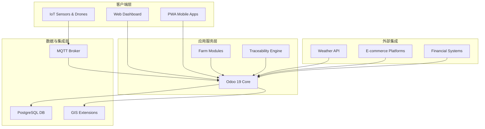

# 智慧农业全链路数字化解决方案：基于 Odoo 19 的“种子到餐桌”实践

## 1. 方案愿景

在数字化转型的浪潮中，传统农业面临着生产过程"黑盒"、管理术语"工业化"以及合规追溯成本高昂等核心挑战。本方案基于 **Odoo 19 社区版**，深度复刻并优化了欧洲领先的农业 ERP（Ekylibre）能力，打造了一套专为中国农业设计的**全链路数字化底座**。我们不仅仅是记录数据，更是通过内置的农业算法与 IoT 感知，实现从地块规划、精准作业、合规加工到消费者营销的闭环管理。

---

## 2. 核心痛点与解决之道

### 痛点 A：ERP 术语与农业习惯的"水土不服"
*   **传统方案**：用户需要理解"制造订单（MO）"、"物料清单（BOM）"等枯燥的工业词汇。
*   **我们的解决之道**：**全站去工业化 UX**。系统自动将工业术语映射为"农事干预"、"生产配方"、"任务产量"。通过智能感知界面，技术员看到的是 N/P/K 养分平衡，而工人看到的是极简的移动端打卡按钮。

### 痛点 B：生产计划与生物生长周期的"脱节"
*   **传统方案**：盲目接单，等到交货时才发现作物还没长熟。
*   **我们的解决之道**：**MTO 生产提前期智能校验**。系统内置作物品种生长模型，在确认销售订单时自动计算"交货剩余天数"是否足以覆盖"作物生长周期"，从源头规避违约风险。

### 痛点 C：养分投入与成本核算的"模糊账"
*   **传统方案**：只知道买了多少肥，不知道每块地到底吃了多少氮磷钾。
*   **我们的解决之道**：**自动化养分平衡算法**。在确认施肥作业时，系统自动根据化肥成分换算为"纯养分"投入量，并实时汇总至地块 GIS。财务端同步实现水电能耗向具体批次的精细化分摊。

---

## 3. 方案亮点

### 🚀 亮点 1：全链路数字孪生溯源
每一颗果实都有它的"履历"。通过我们的溯源引擎，消费者扫描包装二维码，不仅能看到收获日期，还能回溯到它生长的**具体地块、当年的天气曲线、施用的投入品清单**，甚至参与作业的农工资质。这不仅仅是合规，更是强力的营销背书。

### 🌍 亮点 2：GIS 与 IoT 智慧感知
将农场地图化。系统将 **GIS（地理信息系统）** 与 **工业 IoT** 深度集成。地块不仅仅是一个坐标，它是一个活的"生产单元"，实时显示温湿度、土壤墒情，并在环境异常时自动触发预警甚至联动控制灌溉设备。

### 🏭 亮点 3：农产品深加工的一入多出管理
针对农产品加工（如分拣、榨汁、烘焙）的特殊性，系统支持 **Mass Balance（物料平衡）校验**。投入 100kg 原料，产出多少一级果、多少损耗，系统自动平衡并建立批次间的父子继承关系，确保加工环节的追溯不断链。

### 🚨 亮点 4：智能预警与风险管控
Advanced predictive analytics for weather risks, market fluctuations, and operational hazards. System automatically generates early warning notifications and suggests preventive measures. 基于历史数据和实时监测，系统能够预测潜在的风险点，如病虫害爆发、极端天气影响、市场价格波动等，并提前通知管理者采取预防措施。

### 🌐 亮点 5：多业态融合与全行业覆盖
本方案打破了单一行业的限制，通过"农业活动家族"架构，实现了对现代农业全业态的覆盖：

#### 垂直行业支持矩阵
| 行业类型 | 核心功能 | 特色能力 |
|---------|---------|---------|
| **大田作物 (Field Crops)** | 地块管理、播种收割、机械作业 | 机械调度优化、产量预测 |
| **设施农业 (Protected Cultivation)** | 环境控制、水肥一体化、温湿度管理 | 智能温室控制、生长周期追踪 |
| **果树园艺 (Orchard & Horticulture)** | 剪枝记录、花期管理、采摘跟踪 | 年轮周期管理、果树档案 |
| **畜牧养殖 (Livestock)** | 种畜档案、健康记录、配种管理 | 个体识别、生长曲线监控 |
| **水产养殖 (Aquaculture)** | 水质监测、投喂管理、生长跟踪 | 溶氧/pH实时监控、自动投喂 |
| **中药材 (Medicinal Plants)** | GMP合规管理、有效成分追踪 | 合规认证、药用成分记录 |
| **食用菌 (Mushroom)** | 多批次管理、环境控制、收获记录 | 季节性管理、多茬次跟踪 |
| **蜂业 (Apiculture)** | 蜂群管理、蜂箱定位、蜜源追踪 | 迁徙跟踪、蜂群健康监控 |
| **农产品加工 (Agricultural Processing)** | 配方管理、质量检验、包装追踪 | 批次继承、品质溯源 |
| **观光农业 (Agritourism)** | 资源预订、活动管理、会员服务 | 体验项目跟踪、服务评价 |

*   **大田种植与果蔬**：地块 GIS、N/P/K 养分平衡、生产季管理。
*   **畜牧与家禽养殖**：个体耳标跟踪、群组变动记录、生长曲线监控、防疫排期。
*   **水产养殖**：鱼池环境监测（溶氧/pH）、饲喂配方管理。
*   **食品深加工**：支持**烘焙（Baking）、酿酒（Winemaking）、乳制品及各类初/深加工**，内置行业特有参数（如糖度、醒发时间、杀菌温度）。
*   **观光农业与农服融合**：资源预约、亲子研学项目、CSA 订阅、电商直播。

### ☁️ 亮点 6：原生 SAAS 架构与多租户隔离
本方案不仅仅是一个单体 ERP，它原生支持 **SAAS (Software as a Service) 模式部署**，特别适合合作社、集团农场或农业产业园：
*   **多租户数据隔离**：支持多个农场实体在同一系统内独立运行，确保财务与生产数据的绝对安全。
*   **合作社级汇总**：上级管理机构（如合作社理事会）可一键汇总下属所有农场的经营数据，实现统一调度与标准推送。
*   **灵活订阅模式**：支持按功能模块（App）或农场规模进行灵活授权，降低中小农户的数字化入门门槛。

---

## 4. 技术架构

### 系统架构概览

### 核心技术栈
*   **前端**: 响应式 Web 界面 + PWA 移动应用，支持离线操作
*   **后端**: Odoo 19 社区版，深度定制的农业模块
*   **IoT层**: MQTT 协议，支持传感器网络、无人机队列管理
*   **数据层**: PostgreSQL 数据库，集成 GIS 扩展
*   **集成层**: RESTful API，支持第三方系统集成

---

## 5. 实施路线图

### 分阶段实施策略
*   **阶段 1：核心模块部署** (1-2 个月)
    - 种植/养殖管理基础功能
    - 库存与批次管理
    - 基础财务核算

*   **阶段 2：智能化升级** (3-4 个月)
    - IoT 设备集成
    - 溯源体系建立
    - 移动端全面部署

*   **阶段 3：分析与优化** (5-6 个月)
    - 经营驾驶舱
    - 预测分析功能
    - 智能预警系统

*   **阶段 4：生态扩展** (7-8 个月)
    - 第三方集成
    - 供应链协同
    - 市场营销自动化

---

## 6. 集成能力

### 外部系统连接
*   **天气服务**：集成气象局 API，获取精准的天气预报和历史数据
*   **电商平台**：与淘宝、京东、拼多多等主流平台订单同步
*   **财务软件**：与用友、金蝶等财务系统对接
*   **政府系统**：与农业部门监管平台、检验检疫系统联通
*   **物流服务**：与顺丰、京东物流等冷链运输系统集成

### API 接口能力
*   **标准 RESTful API**：支持外部系统数据交互
*   **Webhook 机制**：实时事件通知
*   **批量数据导入/导出**：支持 Excel、CSV 格式
*   **单点登录（SSO）**：与企业现有身份系统集成

---

## 7. 四大业务版块

1.  **种植/养殖管理**：生产季规划、农事作业记录、生物阶段跟踪（出生->生长->收获）、系谱维护。
2.  **供应链与加工**：智能采购建议、多级配方管理、能耗成本核算、冷链物流温控追溯。
3.  **农旅与商业**：采摘预约、资源日历管理、CSA（社区支持农业）会员订阅、直播带货订单同步。
4.  **智慧辅助决策**：经营驾驶舱、养分减量化分析、临期产品自动促销联动。

---

## 8. 价值总结

本方案通过 **40+ 原子化模块** 的灵活组合，为农场主提供了一个**可进化、可扩展、可追溯**的数字化管理环境。我们消除制造业术语带来的认知摩擦，让数字化技术真正服务于田间地头，帮助企业实现从"靠天吃饭"向"靠数据吃饭"的跨越。通过垂直行业的深度支持和智能化的风险预警，系统不仅提升了生产效率，更为农业企业在全球竞争中提供了坚实的技术基础。