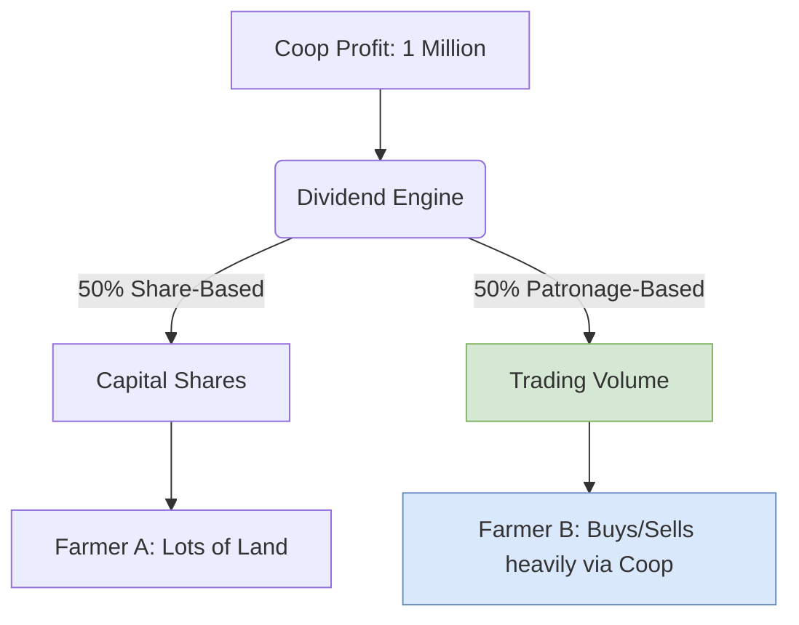
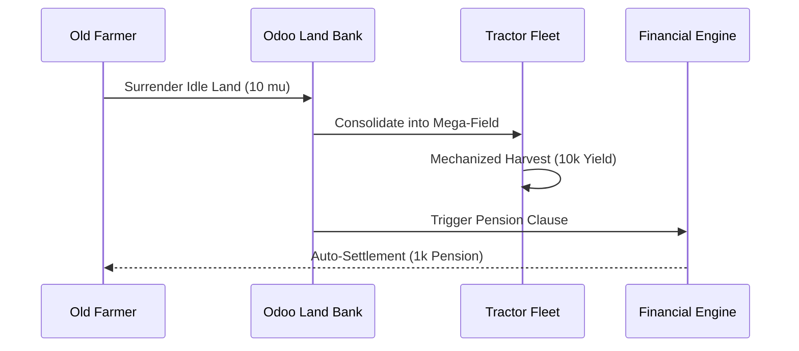

# Odoo Farm & The JA Model: A Master Blueprint
# Odoo Farm 与日本农协 (JA) 模式：中国“超级村集体”的数字化落地指南

> **导读 (Executive Summary)**：
> 日本农协 (Japan Agricultural Cooperatives, 简称 JA) 是全球最成功的农民组织之一。它并非单纯的农业生产合作社，而是一个集**金融 (JA Bank)、保险 (JA Kyosai)、农资与销售 (JA Zen-Noh) 以及医疗养老 (JA Zenkoren)** 为一体的超级商业帝国。
> 在中国“供销社复兴”与“村集体经济”崛起的宏大背景下，如何用数字化手段复刻一个属于中国的“数字 JA”？
> Odoo Farm 19.0 的底层架构，正是为此而生。

---

## 1. Odoo Farm 如何重构 JA 的四大商业支柱 (The 4 Pillars)

### 1.1 农业金融 (JA Bank) -> farm_financial_credit & farm_multi_farm_financial
* **JA 原型**：为农户提供储蓄和低息贷款。
* **Odoo 落地**：抛弃传统的房产抵押。系统直接抓取农户在 Odoo 中的**“数字农事打卡记录”**（如除草、施肥的依从度）转化为 trust_score (信用分)。AI 引擎在一秒内秒批微贷，并在年底分红时自动扣除本息。实现了零风险的农村内循环信贷。

### 1.2 统购统销 (JA Zen-Noh & A-Coop) -> farm_supply_procurement & farm_pos
* **JA 原型**：巨量集采压低农资价格；统一品牌“A-Coop”溢价销售农产品。
* **Odoo 落地**：千家万户在手机端发起买化肥的需求，系统瞬间聚合并向厂家下发万吨级采购单，到货后自动分配进每户的“虚拟微仓储”。农产品收上来后，通过 farm_processing 统一清洗包装，贴上“村集体溯源护照”，利用冷链直供城市生鲜超市，赚取 100% 零售溢价。

### 1.3 互助保险 (JA Kyosai) -> farm_financial_insurance
* **JA 原型**：农户互助共济，抵御天灾。
* **Odoo 落地**：合作社作为主体，为全村一万亩土地购买极低折扣的“统保”险单。当 IoT 气象站检测到局部冰雹，系统根据 GIS 测绘受灾面积，直接从合作社的“互助资金池”中秒级下拨救灾款给受灾农户。

### 1.4 营农指导与福利 (Farming Guidance) -> farm_knowledge & farm_hr
* **JA 原型**：派驻技术员指导种地，解决农村养老医疗。
* **Odoo 落地**：首创**“农村时间银行”**。年轻人帮老人修屋顶、干农活，系统不发工资，而是奖励“工时信用点 (Labor Credits)”。这些信用点存储在去中心化账本上，等年轻人老了，可以兑换全村的免费照料服务。

---

## 2. 进阶篇——深度 JA 模式的三大硬核场景 (Deep JA Scenarios)

为了将 JA 模式的精髓吃透，我们再次深入 Odoo 底层，实现了以下三个最具社会与商业价值的终极场景：

### Scenario 50: Patronage Dividends (按交易量返还分红：打破吃大锅饭的死局)
* **业务痛点**：传统合作社年底分红只看“土地入股多少”，导致农民不愿意把高品质农产品卖给合作社（私下高价卖给贩子）。
* **JA 黑科技**：Odoo 的分红引擎 (dividend.distribution) 引入了 **Patronage（惠顾额）** 算法。年底 100 万利润，50% 按股份分，**另外 50% 严格按照你今年在合作社“买了多少化肥”和“交了多少蔬菜”的交易额 (Trading Volume) 比例分红**。你对合作社越忠诚，分红越暴利！

### Scenario 51: Strict Brand SOP Enforcement (营农指导降维打击：统一品牌护城河)
* **业务痛点**：农户为了图省事，不按合作社的 SOP 打药，导致残留超标，砸了村集体的招牌。
* **JA 黑科技**：如果农户 A 没有在系统规定的 3 天时间窗口内点击完成“有机杀虫”任务，或者 IoT 检测到其超量用药，agri.intervention.mixin 将无情触发拦截。在采收时，这批草莓将被**自动降级**，彻底无缘合作社的“顶级白牌”包装，只能当做廉价统货处理。用极权级的代码捍卫集体品牌。

### Scenario 52: Land Banking and Pension for the Aging (土地银行与撂荒地拯救计划)
* **业务痛点**：80岁老农干不动了，土地面临撂荒（耕作放棄地）。年轻人想种地但没地。
* **JA 黑科技**：老农在系统中将土地所有权“托管”给合作社的 farm_land_mgmt（土地银行）。合作社利用这块地统一引入大型农机进行机械化作业，或者租给年轻人。作为回报，系统每年自动将这块地产出的 10% 利润作为**“农业养老金 (Pension)”**，精准打入老农的 internal.settlement 账户。

---

> 🏆 **总结**：
> 依托于 **3-Tier 数据隔离架构**与这套 **JA 数字化引擎**，Odoo Farm 已经超越了一款 ERP 的范畴。它是一套能够深刻改造农村生产关系、重塑基层金融与治理结构的“国家级数字基础设施”。
