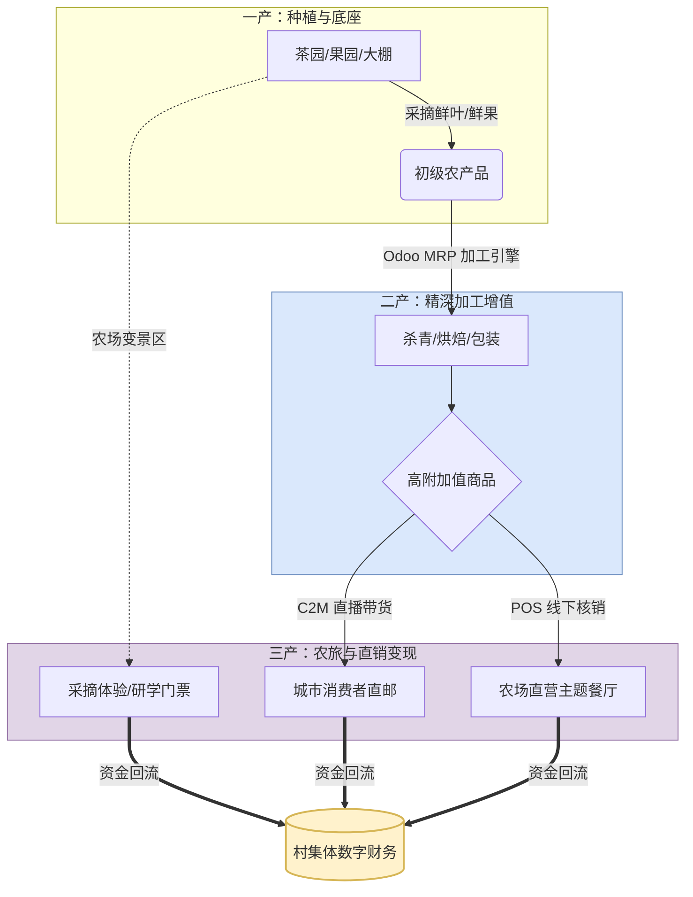

# 留存乡村价值：浙江“安吉农旅模式”的数字化引擎
# Retaining Rural Wealth: The Digital Engine for Zhejiang's Anji Agritourism Model

> **核心哲学 (Core Philosophy)**：
> 农业最大的悲哀在于：农民流了最多的汗，却只赚取了产业链底端微薄的“原料费”。
> 正如浙江安吉（中国最成功的乡村振兴样本）所验证的：**必须提升农产品的附加值，必须斩断冗长的流通环节，才能让真金白银留在农村。**
> 这在经济学上被称为**“一二三产融合”**。Odoo Farm 19.0 是如何用代码来实现这一宏大命题的？

---

## 1. 安吉模式的三大护城河与 Odoo Farm 的技术解法

如果说日本 JA 模式解决的是“农村金融与组织管理”问题，那么浙江安吉模式解决的就是“如何把绿水青山直接变成金山银山”的商业变现问题。

### 1.1 斩断流通环节：从“卖给二道贩子”到“全渠道直面消费者 (C2M)”
* **传统困境**：农户 -> 产地代办 -> 城市批发市场 -> 农贸大市场 -> 社区超市 -> 消费者。经过 5 层剥削，1块钱收购的西红柿，城里卖 8块，利润全部流失在中间环节。
* **Odoo 数字化破局**：
  * **田间直播与秒级库存 (farm_live_streaming)**：直接对接抖音/快手 API。村支书在田间开直播，Odoo 自动同步库存。城里人下单的瞬间，系统直接生成打包单和快递单。
  * **CSA 社区认养 (farm_csa)**：城市中产直接预付一年的买菜钱“认养”一分田。系统按周自动触发发货单。
  * **价值留存**：**100% 的零售溢价**直接沉淀在村集体的 internal.settlement（内部财务）账户中。

### 1.2 提升附加值（二产）：从“卖廉价初级农产品”到“卖高溢价精深加工品”
* **传统困境**：卖一百斤鲜竹笋只能赚几十块钱，且极易腐烂坏掉。
* **Odoo 数字化破局**：
  * **共享初加工中心 (farm_processing & farm_mrp)**：合作社建立统一的加工厂。Odoo 的加工引擎支持极度复杂的 **BOM（物料清单）**。系统指导工人将竹笋剥壳、高温杀青、抽真空包装，甚至提取竹叶黄酮。
  * **品牌白牌化 (farm_quality)**：配合极致的“从种子到真空袋”的全链路二维码溯源，原本 10 块钱的农产品瞬间变成了售价 100 块的高端有机礼盒。价值翻了 10 倍！

### 1.3 引流变现（三产）：从“单纯种地”到“卖风景、卖体验”的农旅融合
* **传统困境**：种茶树一年只赚一季钱，其余时间茶园闲置，毫无收益。
* **Odoo 数字化破局**：
  * **沉浸式农旅与票务 (farm_agritourism & farm_pos)**：我们将果园、茶山定义为可被预约的“服务资产”。游客在微信小程序购买“采茶体验票”。Odoo POS 自动核销门票，并触发茶艺师的接待工单 (project.task)。
  * **生态研学 (farm_training)**：不仅卖茶，还卖“茶文化”。城里的学校组织小学生来村里研学，系统统一管理餐饮、住宿与教学日程。
  * **价值留存**：游客不仅带走了高溢价的农产品，还在村里的民宿、餐厅消费。真正实现了“流量下乡，财富留村”。

---

## 2. 核心总结：Odoo Farm 的“一二三产融合”大飞轮

**为什么只有 Odoo Farm 能做到？**
市面上的软件，要么只能管“种地”（物联网后台），要么只能管“卖货”（电商小程序）。
而 **Odoo Farm** 依托强大的 ERP 基因，**是全球唯一能在同一个数据库里，同时跑通“茶树生长模型”、“茶叶加工 BOM 成本核算”和“农旅 POS 收银系统”的底座。**

它不仅仅是农业软件，它是驱动中国乡村走向**“安吉模式”**、实现共同富裕的终极数字引擎。
