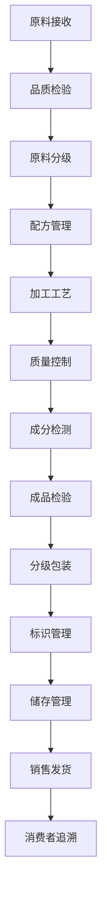

# 农产品加工管理流程文档 (Agricultural Processing Management Process Documentation)

## 流程概述
从原料接收、加工处理、质量检验、配方管理、包装标识到成品销售的完整流程，注重加工工艺控制和食品安全管理，确保产品质量和消费者安全。

## 流程图

## 角色职责
- **工艺工程师**: 加工工艺参数控制，工艺标准制定
- **质量控制员**: 质量检验和成分检测，标准执行
- **配方师**: 产品配方设计和管理，工艺优化
- **加工技师**: 加工设备操作和维护，工艺执行
- **仓储管理员**: 成品储存和发货管理，库存控制

## 业务规则
- 严格控制加工工艺参数和操作时间节点
- 原料接收需进行全面质量验证和批次记录
- 配方变更需经过审批流程和安全评估
- 成品包装需符合标签法规和质量标准
- 全程记录加工数据，确保可追溯性

## 系统交互
- 记录原料批次和质量信息，建立追溯链
- 管理加工工艺参数和流程控制数据
- 追踪成品配方和成分变化记录
- 生成质量追溯报告和合规证明
- 管理产品批次和销售流向信息

## 合规要求
- 食品安全生产标准
- 产品标签法规遵循
- HACCP食品安全体系
- 有机加工认证要求（如适用）
- 食品添加剂使用标准

## 异常场景
- 加工设备故障应急处理和维修
- 质量异常应急处理和产品召回
- 原料供应中断应对和替代方案
- 食品安全事故应急响应

## KPI指标
- 产品质量合格率 > 95%
- 工艺参数执行率 > 98%
- 成品保质期达标率 100%
- 加工损耗率 < 5%
- 食品安全零事故率