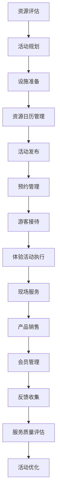

# 观光农业管理流程文档 (Agritourism Management Process Documentation)

## 流程概述
从农旅资源规划到活动设计、游客接待、资源管理、会员服务、体验销售的完整流程，注重农业与旅游业的结合，强调游客安全和体验质量。

## 流程图

## 角色职责
- **农旅经理**: 农旅业务整体规划和管理，活动审批
- **活动策划员**: 活动设计和资源规划，流程优化
- **接待服务人员**: 游客接待和现场服务，安全保障
- **资源管理员**: 农旅资源和日历管理，设施维护
- **会员服务专员**: 会员管理和客户服务，满意度跟踪

## 业务规则
- 农业生产与旅游活动时间协调，避免冲突
- 游客活动区域与生产区域明确分离
- 体验活动需保障游客安全，制定应急预案
- 会员服务需提供个性化体验
- 活动执行需符合安全标准和环保要求

## 系统交互
- 管理农旅资源日历和预约系统
- 记录游客体验和反馈信息
- 追踪会员消费和服务记录
- 生成农旅运营分析报告
- 管理安全风险和应急预案

## 合规要求
- 旅游服务安全标准遵循
- 食品安全法规要求
- 农业用地使用合规
- 文旅经营许可合规
- 环境保护法规遵循

## 异常场景
- 恶劣天气活动调整和应急预案
- 游客安全事故应急处理
- 设施故障应急方案
- 突发公共卫生事件应对

## KPI指标
- 游客满意度 > 90%
- 活动预约完成率 > 85%
- 会员续费率 > 80%
- 农旅收入增长率 > 10%
- 安全事故发生率 < 0.1%