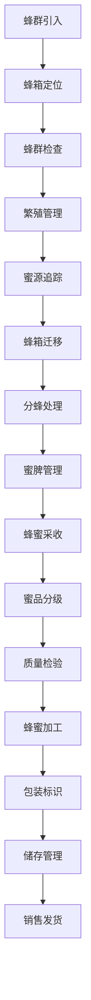

# 蜂业管理流程文档 (Apiculture Management Process Documentation)

## 流程概述
从蜂群引入到蜂箱管理、蜜源追踪、繁殖管理、蜂蜜采收加工、质量控制的完整流程，注重蜂群健康和蜜源管理，确保产品质量和生态安全。

## 流程图

## 角色职责
- **蜂业技术员**: 蜂群管理和技术指导，繁殖计划制定
- **养蜂工人**: 日常蜂箱检查和管理，采收执行
- **蜜源管理员**: 蜜源植物和花期追踪，迁移路径规划
- **加工技师**: 蜂蜜加工和质量控制，设备维护
- **质量检验员**: 蜂产品品质检验，安全标准执行

## 业务规则
- 根据蜜源植物分布和花期规划蜂箱位置
- 定期检查蜂群健康状况，记录检查结果
- 蜂蜜采收需避开农药使用期，确保安全
- 蜂箱管理需考虑季节变化和气候因素
- 繁殖管理需保持蜂群结构合理

## 系统交互
- 记录蜂群个体档案和生命周期信息
- 追踪蜜源植物开花期和分布信息
- 管理蜂群繁殖和分蜂记录
- 生成蜂蜜产量和质量分析报告
- 管理蜂箱迁移路径和时间记录

## 合规要求
- 蜂产品安全标准遵循
- 有机蜂蜜认证要求
- 农药残留检测标准
- 蜂药使用合规管理
- 环境保护法规遵循

## 异常场景
- 蜂群疾病应急处理和治疗方案
- 有毒蜜源植物避让和防护
- 极端天气蜂群保护措施
- 蜂群逃逸应急处理

## KPI指标
- 蜂群存活率 > 85%
- 蜂蜜产量达标率 > 90%
- 产品安全合格率 100%
- 蜂群繁殖成功率 > 80%
- 蜂箱迁移成功率 > 95%