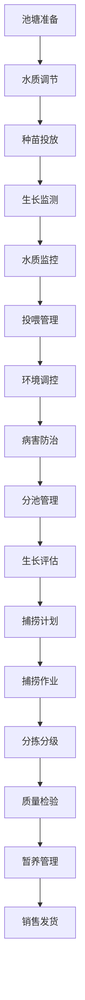

# 水产养殖管理流程文档 (Aquaculture Management Process Documentation)

## 流程概述
从池塘准备到种苗投放、水质管理、投喂养殖、捕捞销售的完整流程，注重水质监控和生长管理，确保水产品质量和环境安全。

## 流程图

## 角色职责
- **水产工程师**: 水质管理和技术指导，系统维护
- **养殖技工**: 日常投喂和水质维护，观察记录
- **水质管理员**: 水质参数监测和调控，数据分析
- **捕捞工人**: 捕捞和分拣作业，分拣分级
- **质量检验员**: 水产品质量检验，安全标准执行

## 业务规则
- 严格控制水质参数（pH、溶氧、氨氮、温度等）
- 投喂量需根据水温、生长阶段和规格调整
- 定期进行水质检测和改善
- 捕捞前需停食观察，确保品质
- 病害防治需遵循安全用药规范

## 系统交互
- 实时监控水质参数变化趋势
- 记录投喂量和饲料类型信息
- 管理种苗投放和生长档案记录
- 生成水质分析和养殖报告
- 追踪产品从种苗到成品的全程

## 合规要求
- 水产养殖环保法规遵循
- 食品安全标准要求
- 抗生素使用合规管理
- 水资源使用合规要求
- 水产养殖许可合规

## 异常场景
- 水质恶化应急处理和调控
- 缺氧急救措施和应急增氧
- 疾病爆发防控和治疗方案
- 极端天气防范和应对

## KPI指标
- 水质参数达标率 > 95%
- 水产成活率 > 85%
- 饲料转化率 > 70%
- 产品安全合格率 100%
- 水产产量达标率 > 90%