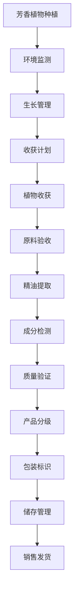

# 香薰加工流程文档 (Aromatherapy Processing Process Documentation)

## 流程概述
从芳香植物种植到精油提取、质量控制、包装销售的完整流程，注重活性成分管理和GMP标准执行，确保精油产品的纯度和功效。

## 流程图

## 角色职责
- **种植技术员**: 芳香植物种植管理，环境因子控制
- **工艺工程师**: 提取工艺参数控制，工艺优化
- **质量控制员**: 成分检测和质量验证，标准执行
- **GMP管理员**: GMP标准执行监督，合规检查
- **仓储管理员**: 原料和成品储存管理，温控管理

## 业务规则
- 严格控制影响精油品质的环境因子（光照、温度、湿度等）
- 提取工艺参数必须符合标准操作程序和GMP要求
- 活性成分含量必须符合标准要求和标注承诺
- 储存条件需严格控制温度和光照，防氧化
- 追踪从原料到成品的全程信息，确保可追溯

## 系统交互
- 监控环境因子对精油成分的影响关系
- 记录提取工艺参数和操作时间节点
- 追踪活性成分含量变化趋势
- 生成GMP合规报告和质量证明
- 管理产品批次和成分分析数据

## 合规要求
- GMP规范遵循
- 食品添加剂/化妆品原料法规
- 有机认证要求（如适用）
- 精油产品安全标准
- 化妆品安全技术规范

## 异常场景
- 环境因子异常应急处理和调整
- 提取工艺参数偏差处理和纠正
- 成分检测不合格处理和召回
- 储存条件异常报警和处置

## KPI指标
- 活性成分达标率 > 95%
- GMP合规率 100%
- 工艺参数执行率 > 98%
- 产品合格率 > 95%
- 成分检测准确率 100%