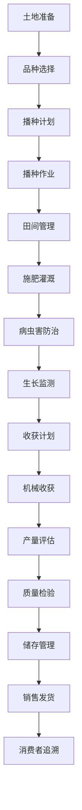

# 大田作物管理流程文档 (Field Crops Management Process Documentation)

## 流程概述
从大田作物种植到收获销售的完整流程，涵盖地块管理、播种收割、机械作业和产量监控，注重规模化管理和成本控制。

## 流程图

## 角色职责
- **农场经理**: 大田作业整体管理决策，资源调配
- **农艺师**: 作物生长管理和技术指导，方案制定
- **农机手**: 播种、收割等机械作业，设备操作
- **植保员**: 病虫害防治管理，防控执行
- **质量管理员**: 产量评估和质量检验，数据记录

## 业务规则
- 不同作物有不同的种植密度和管理要求
- 播种时间需根据气候条件和作物特性调整
- 收获前需进行成熟度检测和品质评估
- 土壤肥力需定期检测和科学补充
- 机械化作业需符合安全和效率标准

## 系统交互
- 记录地块土壤信息和肥力变化趋势
- 管理播种和收获批次的详细数据
- 控制机械化作业参数和效率跟踪
- 生成产量分析和成本效益报告
- 追踪作物从播种到销售的全程信息

## 合规要求
- 农药化肥使用合规要求
- 有机认证要求（如适用）
- 食品安全法规遵循
- 土地使用合规管理
- 农业机械安全操作规范

## 异常场景
- 极端天气应急处理和减灾措施
- 病虫害大规模爆发应对和防控
- 机械故障应急方案和备用措施
- 市场价格波动应对策略

## KPI指标
- 作物出苗率 > 85%
- 机械化作业率 > 90%
- 作物产量达标率 > 90%
- 农药残留合格率 100%
- 成本控制达标率 > 95%