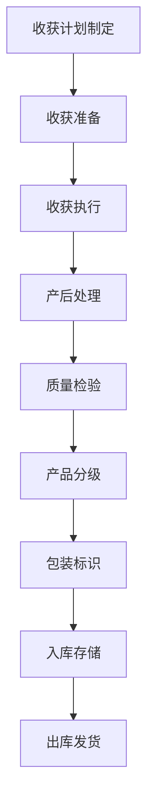

# 收获与加工流程文档 (Harvest and Processing Process Documentation)

## 流程概述
收获计划与执行、产后处理和质量检验、产品分级与包装的全流程管理。

## 流程图

## 角色职责
- **农场经理**: 收获计划审批和资源调度
- **田间主管**: 收获现场管理
- **质检员**: 质量检验和分级
- **包装工**: 产品包装和标识

## 业务规则
- 收获前必须确认休药期已过
- 质量检验不合格产品不得进入下环节
- 包装标识必须包含追溯信息
- 入库前必须完成质量检测

## 系统交互
- 制定和执行收获计划
- 记录收获数量和质量
- 生成质量检验报告
- 管理产品批次信息

## 合规要求
- 食品安全相关法规遵循
- 有机认证收获处理标准
- 产品标识和追溯要求

## 异常场景
- 收获期间天气突变处理
- 质量检验异常处理
- 设备故障应急方案

## KPI指标
- 收获及时率 > 95%
- 产品质量合格率 > 98%
- 产品分级准确率 > 95%
- 追溯信息完整率 100%