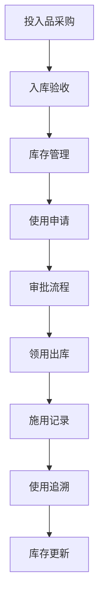

# 投入品管理流程文档 (Inputs Management Process Documentation)

## 流程概述
投入品采购与入库、使用申请与审批、施用记录与追溯的全流程管理。

## 流程图

## 角色职责
- **采购经理**: 投入品采购决策
- **仓库管理员**: 入库验收和库存管理
- **农艺师/兽医**: 使用申请审批
- **田间工人/饲养员**: 投入品领用和施用

## 业务规则
- 所有投入品必须符合准入标准
- 使用前必须完成审批流程
- 施用记录必须准确完整
- 有机认证投入品专用管理

## 系统交互
- 创建投入品采购订单
- 记录入库验收信息
- 管理使用申请和审批
- 追踪投入品使用路径

## 合规要求
- 农药兽药使用法规遵循
- 有机认证投入品标准
- 食品安全相关要求

## 异常场景
- 不合格投入品处置
- 审批异常处理
- 库存预警应急采购

## KPI指标
- 投入品合规率 100%
- 使用记录完整率 > 99%
- 库存周转率达标
- 审批及时率 > 95%