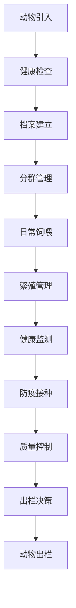

# 畜牧管理流程文档 (Livestock Management Process Documentation)

## 流程概述
从引入到出栏的动物生命周期管理流程，包含繁殖、健康、饲喂等子流程，涉及防疫和质量控制点。

## 流程图

## 角色职责
- **畜牧经理**: 整体畜牧管理决策
- **兽医**: 健康监测和防疫管理
- **饲养员**: 日常饲喂和观察
- **质量管理员**: 质量控制和合规检查

## 业务规则
- 所有动物必须建立个体档案
- 定期健康检查不可遗漏
- 防疫接种必须按时完成
- 休药期管理严格执行

## 系统交互
- 在系统中建立动物档案
- 记录日常饲喂情况
- 跟踪繁殖记录
- 管理防疫接种记录

## 合规要求
- 动物福利相关法规遵循
- 食品安全和防疫要求
- 有机认证畜牧标准

## 异常场景
- 动物疾病应急处理
- 防疫异常报警处理
- 饲料短缺应急方案

## KPI指标
- 动物健康率 > 95%
- 繁殖成功率 > 85%
- 防疫接种完成率 100%
- 饲料转化效率达标率 > 90%