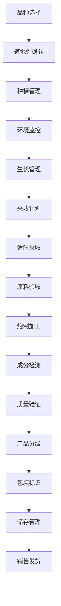

# 中药材加工流程文档 (Medicinal Plants Processing Process Documentation)

## 流程概述
从中草药种植到成品销售的完整加工流程，涵盖品种选择、种植管理、采收加工、质量检验、包装存储等环节，特别关注有效成分管理和GMP标准执行。

## 流程图

## 角色职责
- **中药师**: 中药材种植技术指导和炮制工艺控制
- **GMP管理员**: GMP标准执行监督和合规检查
- **工艺工程师**: 炮制工艺参数控制和优化
- **质量控制员**: 成分检测和质量验证
- **仓储管理员**: 原料和成品储存管理

## 业务规则
- 严格控制影响药效的环境因子
- 炮制工艺参数必须符合标准操作程序
- 有效成分含量必须符合药典要求
- 储存条件需控制温度和湿度
- 道地性要求需在档案中明确记录

## 系统交互
- 监控环境因子对药效成分的影响
- 记录炮制工艺参数和时间
- 追踪有效成分含量变化
- 生成GMP合规报告
- 管理道地性信息和产地证明

## 合规要求
- GMP规范遵循
- 中国药典标准要求
- 中药材生产质量管理规范
- 有机认证要求（如适用）
- 药品生产许可要求

## 异常场景
- 环境因子异常应急处理
- 炮制工艺参数偏差处理
- 成分检测不合格处理
- 储存条件异常报警处理

## KPI指标
- 有效成分达标率 > 95%
- GMP合规率 100%
- 工艺参数执行率 > 98%
- 产品合格率 > 95%
- 道地性标识准确率 100%