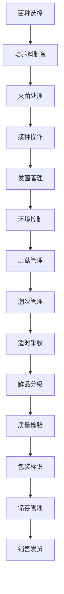

# 食用菌栽培流程文档 (Mushroom Cultivation Process Documentation)

## 流程概述
从菌种制备到培养料制作、接种、发菌、出菇管理、采收销售的完整流程，注重环境控制和批次管理，确保产品质量和安全。

## 流程图

## 角色职责
- **菌种技术员**: 菌种制备和质量控制，技术标准制定
- **培养师**: 培养料制备和灭菌管理，工艺参数控制
- **环境管理员**: 温湿度和通风控制，环境参数监控
- **采收工人**: 分批采收和分级作业，品质把控
- **质量检验员**: 食用菌品质检验，安全标准执行

## 业务规则
- 严格控制培养环境的温湿度、通风、光照
- 多批次轮作管理避免交叉感染
- 采收时机需根据菌类特性确定
- 培养料配比需根据不同菌种调整
- 灭菌工艺需达到无菌标准

## 系统交互
- 记录不同批次的培养参数和历史
- 监控环境条件变化趋势
- 管理潮次采收计划和执行
- 生成产量和质量分析报告
- 追踪产品从菌种到成品的全程

## 合规要求
- 食用菌生产安全标准
- 有机认证要求（如适用）
- 食品安全法规遵循
- 环境保护法规遵循
- 菌种使用许可合规

## 异常场景
- 杂菌污染应急处理和消毒
- 环境控制设备故障应对
- 出菇异常情况处理
- 培养料污染应急处置

## KPI指标
- 菌种成活率 > 90%
- 产量达标率 > 85%
- 产品合格率 > 95%
- 环境参数达标率 > 95%
- 批次管理准确率 100%