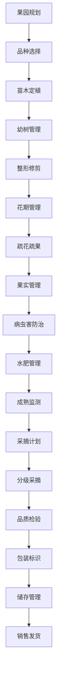

# 果树园艺流程文档 (Orchard & Horticulture Process Documentation)

## 流程概述
从果园规划到果树种植、园艺管理、采摘销售的完整流程，涵盖单株管理、花期管理、果实品质控制等，注重长期管理和品质提升。

## 流程图

## 角色职责
- **果园经理**: 果园整体管理决策，规划制定
- **园艺师**: 果树修剪和园艺技术管理，技术指导
- **植保员**: 果树病虫害防治管理，防控执行
- **采摘工人**: 果实采摘和分级作业，品质把控
- **品质检验员**: 果品质量检验，分级标准执行

## 业务规则
- 根据果树品种特性制定修剪方案和管理计划
- 花期管理需考虑授粉需求和气候条件
- 采摘时间需根据成熟度和品质指标确定
- 果品分级标准严格按品质和外观执行
- 长期跟踪单株果树生长和产量数据

## 系统交互
- 记录单株果树生长信息和历史数据
- 管理果树生命周期档案和修剪记录
- 控制修剪和施肥计划的执行
- 生成产量分析和品质评估报告
- 追踪果品从果树到消费者的全程

## 合规要求
- 果品安全标准遵循
- 有机认证要求（如适用）
- 地理标志保护要求
- 果树种植技术规范
- 农药使用合规管理

## 异常场景
- 极端天气对果树的影响应对和防护
- 病虫害大规模爆发处理和防控
- 意外霜冻应急防护和补救措施
- 果树病害诊断和治疗方案

## KPI指标
- 果树成活率 > 90%
- 果品品质达标率 > 85%
- 单株产量稳定率 > 90%
- 采摘及时率 > 95%
- 果品分级准确率 > 98%