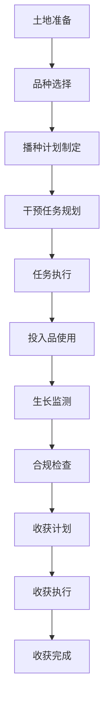

# 种植管理流程文档 (Planting Management Process Documentation)

## 流程概述
从土地准备到收获的完整种植管理流程，包括干预任务规划和执行，涉及投入品使用和合规检查。

## 流程图

## 角色职责
- **农场经理**: 审批种植计划，监督整体进度
- **农艺师**: 制定技术方案，指导田间管理
- **田间工人**: 执行具体干预任务
- **质量管理员**: 负责合规检查和质量控制

## 业务规则
- 必须在播种前完成土壤检测
- 投入品使用必须符合休药期要求
- 重要节点必须拍照存证
- 生长阶段变更需要确认

## 系统交互
- 在系统中创建种植任务
- 记录干预任务执行情况
- 关联投入品使用记录
- 生成生长监测报告

## 合规要求
- 有机认证要求的记录管理
- 食品安全相关法规遵循
- 环保要求的投入品管理

## 异常场景
- 天气异常影响作业
- 投入品短缺或质量问题
- 病虫害爆发应急处理

## KPI指标
- 种植计划完成率 > 95%
- 投入品合规使用率 100%
- 生长监测记录完整率 > 98%