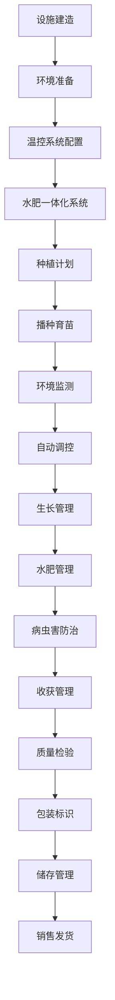

# 设施栽培流程文档 (Protected Cultivation Process Documentation)

## 流程概述
从温室/设施建造到作物种植、环境控制、收获销售的完整流程，注重环境因子监控和精准化管理，实现周年生产和高品质产出。

## 流程图

## 角色职责
- **设施管理员**: 温室设施维护和管理，设备监控
- **环境控制员**: 温室环境监测和调控，参数设置
- **种植技术员**: 作物种植和生长管理，技术执行
- **水肥管理员**: 水肥配比和供应管理，营养液配置
- **质量控制员**: 产品品质检验，标准执行

## 业务规则
- 严格控制温室内温度、湿度、光照、CO2浓度
- 水肥配比需根据作物生长阶段调整
- 定期维护环境控制设备，确保正常运行
- 预防设施内病虫害传播，执行隔离措施
- 精确记录环境参数和作物生长数据

## 系统交互
- 实时监控温室环境参数变化
- 自动调节温湿度、光照、CO2浓度
- 记录水肥使用量和配比数据
- 生成环境调控日志和分析报告
- 管理作物生长数据和产量预测

## 合规要求
- 设施建设安全标准
- 环境保护法规遵循
- 有机认证要求（如适用）
- 设施农业技术规范
- 智能化设备安全标准

## 异常场景
- 设备故障应急处理和维修
- 环境参数异常应急调控
- 设施结构安全应急响应
- 停电等突发情况应急预案

## KPI指标
- 环境参数达标率 > 95%
- 设施利用率 > 80%
- 水肥利用效率 > 90%
- 作物产量稳定率 > 95%
- 设备正常运行率 > 98%