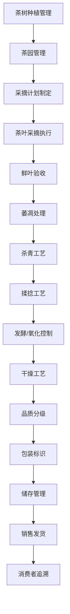

# 茶叶加工流程文档 (Tea Processing Process Documentation)

## 流程概述
从茶树种植到茶叶销售的完整茶叶加工流程，涵盖茶园管理、茶叶采摘、加工制作、质量控制和销售追溯，特别关注不同茶类的加工工艺差异。

## 流程图

## 角色职责
- **茶园经理**: 茶园整体管理决策，采摘计划审批
- **茶艺师**: 茶叶品质控制和加工工艺执行
- **采摘工人**: 茶叶采摘作业，按标准执行
- **加工技师**: 茶叶加工制作，工艺参数控制
- **质量管理员**: 质量检验和等级评定

## 业务规则
- 不同茶类（绿茶、红茶、乌龙茶等）有不同的加工工艺要求
- 采摘时间和部位影响茶叶最终等级
- 茶叶储存条件严格控制，防潮防异味
- 茶园管理需符合有机认证要求
- 加工设备需定期清洁，避免串味

## 系统交互
- 记录茶树个体生长信息和采摘历史
- 管理茶叶采摘批次和时间记录
- 控制茶叶加工工艺参数和时间
- 生成茶叶品质证书和等级证明
- 追溯从茶树到成品的完整路径

## 合规要求
- 有机茶认证要求
- 食品安全法规遵循
- 地理标志保护要求
- 茶叶加工卫生标准
- 产品标签法规遵循

## 异常场景
- 采摘期天气异常影响鲜叶质量
- 加工设备故障应急方案
- 茶叶品质异常处理
- 加工过程中的温度/湿度控制异常

## KPI指标
- 茶叶等级合格率 > 90%
- 采摘及时率 > 95%
- 加工工艺执行率 100%
- 消费者满意度 > 90%
- 有机认证合规率 100%