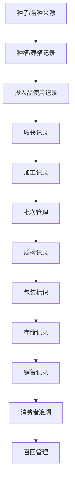

# 质量追溯流程文档 (Traceability Process Documentation)

## 流程概述
从种子到消费者的全程追溯流程，包含批次管理和召回机制，合规证明生成。

## 流程图

## 角色职责
- **追溯管理员**: 整体追溯流程管理
- **各环节操作员**: 执行环节记录录入
- **质管员**: 质量信息验证
- **客服经理**: 消费者追溯服务

## 业务规则
- 所有环节必须记录完整
- 批次信息必须准确关联
- 追溯链条不得中断
- 召回指令必须及时执行

## 系统交互
- 建立追溯基础档案
- 记录各环节操作信息
- 生成追溯二维码
- 支持召回指令下达

## 合规要求
- 食品安全追溯法规遵循
- 有机认证追溯标准
- 监管部门追溯要求

## 异常场景
- 追溯信息缺失应急处理
- 召回执行异常处理
- 消费者投诉追溯查询

## KPI指标
- 追溯信息完整率 100%
- 追溯查询响应时间 < 5秒
- 召回执行及时率 100%
- 消费者追溯满意度 > 95%