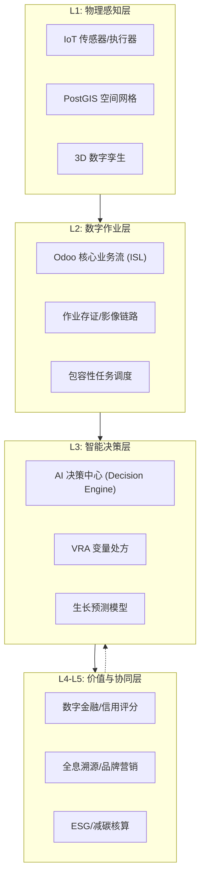

# 数字化农业：产品战略与演进蓝图 (Digital Agriculture Strategy)

## 1. 愿景目标 (The Vision)
构建一个**物理世界与数字世界深度耦合**的农业操作系统。通过数据驱动决策，将传统的“经验农业”升级为“可计算、可预测、可信赖”的现代产业体系。

## 2. 数字化能级模型 (Five Levels of Digital Maturity)

### L1: 数字化感知 (Digital Infrastructure & Perception)
*   **核心能力**：IoT 传感器网络、高精度 GIS 建模、地块网格化、实时遥感接入。
*   **目标**：消除现场“黑盒”，实现农场状态的实时在线。

### L2: 数字化存证 (Digital Operations & Evidence)
*   **核心能力**：农事活动影像存证、区块链哈希指纹、移动端极简录入（包容性 UX）。
*   **目标**：确保每一笔作业真实、可追溯，建立“数字化生产信用”。

### L3: 数字化决策 (Digital Intelligence & Prediction)
*   **核心能力**：AI 农学模型（GDD、ET0）、VRA 变量算法、产量风险建模、市场价格预测。
*   **目标**：变“事后分析”为“事前预警”，提供专家级的作业处方。

### L4: 数字化协同 (Digital Ecosystem & Finance)
*   **核心能力**：智能供应链协同、碳足迹核算（ESG）、数字信用评分、气象指数保险。
*   **目标**：打破产业孤岛，让生产数据直接转化为金融资产与品牌溢价。

### L5: 完全数字化自主 (Autonomous Digital Farm)
*   **核心能力**：AI Agent 自动调度机器人集群、基于孪生仿真的自动化环境闭环、完全去中心化的订单结算。
*   **目标**：实现人机协同的最高形态，生产效率最大化。

---

## 3. 产品架构蓝图 (Conceptual Architecture)

## 4. 核心演进路线
1.  **2026 Q1: 基座加固** (✅ 已完成) - 重点在于 GIS 网格化与移动端存证。
2.  **2026 Q2: 算法驱动** (🚀 进行中) - 重点在于 AI 农学模型与 VRA 处方引擎。
    - ✅ **VRA 精准处方引擎** (基于 NDVI 与空间插值)
    - ✅ **生物数字孪生 (Biological Twin)** (基于 GDD 积温与生理阶段)
    - ⏳ **AI 动态产量预测** (多因子回归分析集成)
3.  **2026 Q3: 价值闭环** (🛠 预研中) - 重点在于金融、保险与 ESG 报告自动化。
    - ✅ **全球出口合规中枢** (以色列/巴西模式)
    - ✅ **产销撮合协同平台** (智利/日本模式)
    - ✅ **G2B 政务治理引擎** (补贴与合规审计)
    - ⏳ **农业碳汇实时核算** (基于作业流的 LCA 模型)

