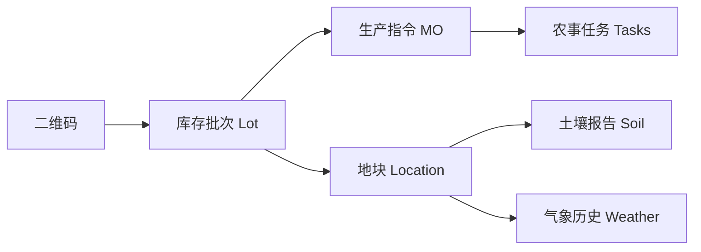

# 方向四：品牌溢价——全息溯源与交互营销技术细节

## 1. 溯源数据聚合引擎 (Data Aggregator)
### 1.1 关联路径 (The Trace Chain)

### 1.2 API 性能优化
- 使用 **Redis 缓存** 聚合后的溯源静态 JSON，确保扫码后的“首屏渲染”时间 < 1.0s。
- 只有在数据发生变更（如完成新任务）时才刷新缓存。

## 2. 交互式 UI 组件 (PWA Components)
### 2.1 动态风土看板 (Terroir Board)
- **组件**：利用 Canvas 绘制 3D 坡度地形模拟图。
- **动态显示**：实时显示当前地块的日照时长累积（相比平均水平的百分比）。
### 2.2 减碳贡献勋章 (ESG Badge)
- 动态生成一张“减碳证书”图片，支持长按保存转发。
- 算法：`节省碳排 = (传统种植排放 - 本批次实际排放)`。

## 3. 媒体资源处理 (Media & Live)
### 3.1 关键节点视频匹配
- **存储**：视频片段存储在 `farm_live_streaming` 关联的云存储（如 OSS/S3）。
- **逻辑**：根据 `task.actual_date` 自动匹配对应摄像头的历史录像片段（剪辑后的 15s 精选）。
- **渲染**：使用 `HLS.js` 实现低延迟流媒体回放。

## 4. 防伪与诚信校验
- **防伪算法**：`SHA-256(Lot_ID + Timestamp + Secret_Salt)` 生成动态防伪码。
- **校验流程**：用户扫码后，系统校验该码的查询次数，若 > 3 次弹出“注意防伪”风险提示。