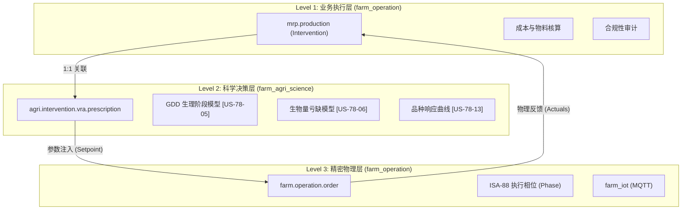

# 🏗️ 架构参考：Odoo 农业干预与精密生产系统规范

> **版本**: V3.0 (2026-02-02)
> **状态**: 工业级标准 [ISA-88] [LOSSLESS]
> **核心概念**: 业务 (L1) -> 科学 (L2) -> 精密 (L3) 纵向闭环

---

## 1. 逻辑层级架构 (Layered Architecture)

系统将“农事干预”解构为三个物理隔离但逻辑嵌套的层级，以实现从“记账”到“变频执行”的完整链路。

---

## 2. 核心模型定义与交互

### 2.1 业务层 (Level 1)
*   **模型**: `mrp.production` (通过 `farm_ux` 映射为 **Intervention**)。
*   **职责**:
    *   生命周期管理 (Confirm -> Start -> Done)。
    *   继承 `farm.agri.science.mixin` 以感知生理数据。
    *   作为 L2/L3 的上下文容器。

### 2.2 科学层 (Level 2)
*   **模型**: `agri.intervention.vra.prescription` (变量处方)。
*   **核心逻辑 [US-78]**:
    *   **生理权重 (Stage Multiplier)**: 基于累计积温 (GDD) 动态调整养分系数。
    *   **亏缺补偿 (Biomass Deficit)**: $\Delta W = W_{theoretical} - W_{actual}$。
    *   **动力学修正 (Kinetics)**: 基于土壤 pH 和温湿度的转化效率修正 $f(T, M, pH)$。
    *   **品种指纹 (Cultivar Response)**: 利用 Mitscherlich 方程计算边际收益拐点。

### 2.3 精密层 (Level 3)
*   **模型**: `farm.operation.order` / `agri.bom.phase`。
*   **核心逻辑 [US-81]**:
    *   **动态设定点 (Dynamic Setpoint)**: `recipe.parameter` 标记为 `is_vra_dynamic`。
    *   **空间反馈环 (Spatial Loop)**: 
        1. 接收 GPS Telemetry。
        2. 匹配 `agri.geospatial.grid.cell`。
        3. 检索 VRA `target_rate`。
        4. 执行 `send_control_point` MQTT 指令。

---

## 3. 关键数据流 (Data Flow Engine)

### 3.1 处方生成算法
处方生成采用多维因子融合算法：
$$Rate_{final} = Rate_{base} \times F_{spatial} \times F_{stage} \times F_{deficit} \times F_{cultivar} \div \eta_{kinetics}$$

*   $F_{spatial}$: NDVI 或土壤养分系数。
*   $F_{stage}$: 生理敏感权重。
*   $F_{deficit}$: 生物量亏缺乘数。
*   $F_{cultivar}$: 品种特异性响应系数。
*   $\eta_{kinetics}$: 土壤转化效率系数。

### 3.2 空间同步闭环 (L2 ↔ L3)
当 IoT 设备在田间移动时，系统执行以下原子动作：
1.  **监听**: `iiot.reading` 捕捉到带有 GPS 的遥测数据。
2.  **定位**: 调用 `action_calculate_spatial_setpoint(lat, lng)`。
3.  **对齐**: 在 `vra.prescription.line` 中通过欧几里得距离寻找最近网格。
4.  **下发**: 自动更新 `agri.bom.parameter` 并通过 MQTT 修改物理设备设定值。

---

## 4. 实施约束 [ISA-88]
- **物理隔离**: 所有的硬件通讯必须归口 `agri_iot`，严禁业务层直接调用 Socket。
- **无损审计**: 所有的自动参数调整必须记录在 `mail.message` 或专用的审计日志中。
- **去工业化**: 所有的 XML 视图必须继承 `agri.view.mixin` 以确保术语的一致性。

---
*文档归档于: docs/architecture/INTERVENTION_SYSTEM_SPEC.md*
