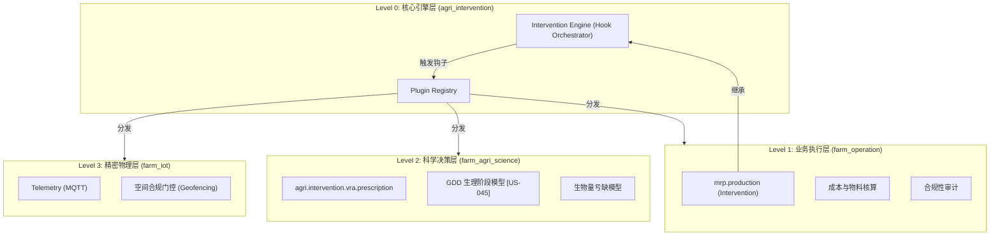

# 🏗️ 架构参考：Odoo 农业干预与精密生产系统规范

> **版本**: V3.0 (2026-02-02)
> **状态**: 工业级标准 [ISA-88] [LOSSLESS]
> **核心概念**: 业务 (L1) -> 科学 (L2) -> 精密 (L3) 纵向闭环

---

## 1. 逻辑层级架构 (Layered Architecture)

系统将“农事干预”解构为四个物理隔离但逻辑嵌套的层级，通过 **桥接钩子模式 (Bridge-based Hook Pattern)** 实现去中心化协作。

---

## 2. 桥接钩子模式 (Bridge-based Hook Pattern)

为了遵循“工具而非树”的去工业化哲学，系统严禁各业务模块直接 import。所有的跨模块联动必须通过 `agri_intervention` 定义的钩子实现：

### 2.1 预定义钩子点 (Standard Hooks)
*   **`_hook_pre_confirm`**: 用于确认前的硬拦截（如气象窗口、有机禁禁令）。
*   **`_hook_post_start`**: 用于开始后的物理激活（如 IoT 高频采集启动）。
*   **`_hook_pre_done`**: 用于完成前的质量审计（如空间合规率、养分平衡校验）。
*   **`_hook_post_done`**: 用于完成后的后置处理（如生理时钟同步、DNA 指纹生成）。

### 2.2 信任 DNA 系统 (Trust DNA Scoring)
每次干预完成后，系统会自动更新产出批次 (Lot) 的 **DNA 诚信分 (DNA Integrity Score)**：
$$Score_{DNA} = 100 - Penalty_{Certification} - Penalty_{Audit} - Penalty_{Heritage}$$
*   **认证罚分**: 非有机投入品扣除 20 分。
*   **审计罚分**: 空间违规或 AI 存证异常扣除 50 分。
*   **继承罚分**: 若种源/父本诚信分过低，按比例传递惩罚。

---

## 3. 核心模型定义与交互

### 3.1 业务层 (Level 1)
*   **模型**: `mrp.production` (通过 `farm_ux` 映射为 **Intervention**)。
*   **职责**:
    *   作为 L0 引擎的宿主，管理生命周期。
    *   通过 `biological_asset_id` 关联活体资产，驱动价值增长。

### 3.2 科学层 (Level 2)
*   **模型**: `agri.physiology.profile` (品种指纹)。
*   **核心逻辑**:
    *   **生理时钟**: 捕获每日温差，驱动 GDD 累加，自动推断生长阶段。
    *   **自动估值**: 生理阶段迁移自动触发财务重估。

---

## 3. 关键数据流 (Data Flow Engine)

### 3.1 处方生成算法
处方生成采用多维因子融合算法：
$$Rate_{final} = Rate_{base} \times F_{spatial} \times F_{stage} \times F_{deficit} \times F_{cultivar} \div \eta_{kinetics}$$

*   $F_{spatial}$: NDVI 或土壤养分系数。
*   $F_{stage}$: 生理敏感权重。
*   $F_{deficit}$: 生物量亏缺乘数。
*   $F_{cultivar}$: 品种特异性响应系数。
*   $\eta_{kinetics}$: 土壤转化效率系数。

### 3.2 空间同步闭环 (L2 ↔ L3)
当 IoT 设备在田间移动时，系统执行以下原子动作：
1.  **监听**: `iiot.reading` 捕捉到带有 GPS 的遥测数据。
2.  **定位**: 调用 `action_calculate_spatial_setpoint(lat, lng)`。
3.  **对齐**: 在 `vra.prescription.line` 中通过欧几里得距离寻找最近网格。
4.  **下发**: 自动更新 `agri.bom.parameter` 并通过 MQTT 修改物理设备设定值。

---

## 4. 实施约束 [ISA-88]
- **物理隔离**: 所有的硬件通讯必须归口 `agri_iot`，严禁业务层直接调用 Socket。
- **无损审计**: 所有的自动参数调整必须记录在 `mail.message` 或专用的审计日志中。
- **去工业化**: 所有的 XML 视图必须继承 `agri.view.mixin` 以确保术语的一致性。

---
*文档归档于: docs/architecture/INTERVENTION_SYSTEM_SPEC.md*
