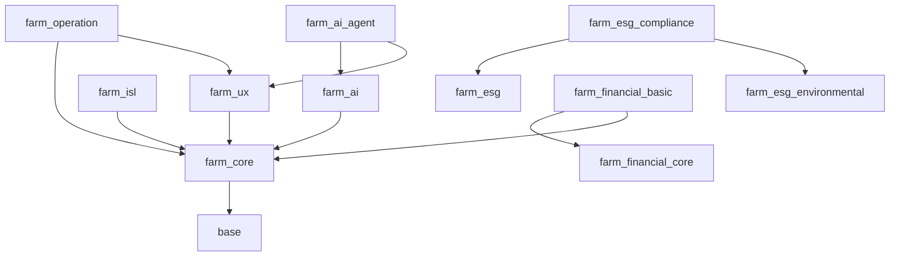

# 🧬 Odoo 农业生态系统：Mixin 架构与基因库汇总 (V1.0)

本文件汇总了系统中所有已实现的 `AbstractModel` (Mixin)，按照功能分层（Level 0 - Level 4）排列，并明确了所在的模块及其依赖关系。

---

## 1. 架构分层汇总

### **Level 0: 语义、表现与治理层 (Semantics & UX)**
| Mixin 名称 | 所在模块 | 模块依赖 | 核心职责 |
| :--- | :--- | :--- | :--- |
| **`AgriViewMixin`** | `farm_ux` | `farm_core`, `base` | 核心“去工业化”引擎，动态拦截 UI 视图，将工业术语（MO/BOM）实时翻译为农业语义。 |
| **`ISLModelRedirector`** | `farm_isl` | `farm_core`, `base` | 实现基础模型到 ISL 行业模型的透明重定向与代理。 |
| **`AgriSustainabilityMixin`** | `farm_esg_compliance` | `farm_esg`, `farm_esg_environmental`, `farm_esg_circular` | **[插件化]** 提供 ESG DNA，支持 TBL（三重底线）评估与插件级开关控制。 |

### **Level 1: 物理、空间与元数据层 (Physical DNA)**
| Mixin 名称 | 所在模块 | 模块依赖 | 核心职责 |
| :--- | :--- | :--- | :--- |
| **`NutrientMixin`** | `farm_core` | `base`, `mail`, `uom` | N/P/K 养分平衡计算、干物质含量评估及生物转换率追踪。 |
| **`GeoSpatialMixin`** | `farm_core` | `base`, `mail` | 基于 PostGIS 的空间索引、邻域发现及地理边界（Geofencing）校验。 |
| **`AgriTaskMixin`** | `farm_core` | `base`, `mail` | 定义农事任务通用接口，集成地块关联与物料分配逻辑。 |
| **`GISCoordinateUtils`** | `farm_core` | `base` | 通用 GIS 工具，提供点在多边形内判定、距离计算等数学工具。 |
| **`AgriGrowthCycleMixin`** | `farm_core` | `base` | 基于 GDD（有效积温）的生理阶段追踪基因，支持自动阶段迁移预测。 |
| **`AgriBiologicalInventoryMixin`** | `farm_core` | `base` | 统一管理活体资产的数量、死亡率及总生物量（Biomass）计算基因。 |
| **`CommonAgriculturalFields`** | `farm_core` | `base` | 定义全行业通用的品种、生长阶段、品质等级等元数据字段。 |
| **`AgriTraceabilityMixin`** | `farm_core` | `base` | 基于 SHA-256 的区块链就绪溯源指纹基因，为每个批次生成唯一的数字 DNA。 |
| **`AgriResourceConsumptionMixin`** | `farm_core` | `base` | 精细化资源消耗计量基因，追踪水电油消耗并计算资源强度。 |

### **Level 2: 审计、存证与决策层 (Audit & Evidence)**
| Mixin 名称 | 所在模块 | 模块依赖 | 核心职责 |
| :--- | :--- | :--- | :--- |
| **`AgriWeatherSensitiveMixin`** | `farm_core` | `base` | 气象敏感性门控基因，在作业确认前强制检查气象窗口安全性。 |
| **`AgriQualityGateMixin`** | `farm_core` | `base` | 质量门控基因，在状态迁移前强制校验 QCP（质量控制点）覆盖情况。 |
| **`AgriCertificationStatusMixin`** | `farm_core` | `base` | 合规认证状态基因，管理有机、绿色等认证的有效期与合法性检查。 |
| **`AgriIncidentAlertMixin`** | `farm_core` | `base` | 标准化异常事件上报基因，支持灾害、病害等事件的 AI 预警。 |
| **`EvidenceAnalyzerMixin`** | `farm_ai` | `farm_core`, `base` | 基于物理存证的双重置信度（Dual Confidence）审计算法。 |
| **`ComplianceMixin`** | `farm_core` | `base`, `mail` | 通用合规性框架，集成安全间隔期（PHI）与行业准入审计。 |
| **`EmbeddingMixin`** | `farm_core` | `base` | 为 RAG 提供语义向量化接口，支持自然语言检索农事记录。 |

### **Level 3: 清算、价值与资产层 (Clearing & Value)**
| Mixin 名称 | 所在模块 | 模块依赖 | 核心职责 |
| :--- | :--- | :--- | :--- |
| **`ClearingEngineMixin`** | `farm_core` | `base`, `mail` | 跨实体的价值清算引擎，支持信用分扣减与社区奖励发放。 |
| **`AgriBiologicalValuationMixin`** | `farm_core` | `base` | 生物资产动态公允价值评估基因，支持基于生长进度与市场挂钩的资产估值（US-58-15）。 |
| **`AgriCostWIPTransfer`** | `farm_financial_basic` | `farm_financial_core`, `farm_core` | 生物资产在制品（WIP）的成本归集、分摊与结转逻辑。 |
| **`AgriMortalityAmortization`**| `farm_financial_basic` | `farm_financial_core`, `farm_core` | 养殖业中的死亡率摊销、资产减值计算与财务计提。 |

### **Level 4: 自主、协作与编排层 (Orchestration & A2A)**
| Mixin 名称 | 所在模块 | 模块依赖 | 核心职责 |
| :--- | :--- | :--- | :--- |
| **`A2AProtocol`** | `farm_ai_agent` | `farm_ai`, `farm_ux`, `mrp` | 定义智能体之间的自主议价、发现与协议撮合接口（七状态机）。 |
| **`AgriAgentInstructionMixin`** | `farm_core` | `base` | 将业务记录转化为结构化指令（JSON）的基因，支持 AI 智能体与农用机器人的指令派发与反馈闭环。 |
| **`AgriAiBaseMixin`** | `farm_ai` | `farm_core`, `base` | AI 服务接入协议，支持多模型（OpenAI, Anthropic, Ollama）统一调用。 |
| **`AgriAiDecisionEngine`** | `farm_ai` | `farm_core`, `base` | 提供决策建议的生成、多源验证与推理路径（Reasoning Path）记录。 |

---

## 2. 核心模块依赖拓扑 (Dependency Graph)

---

## 3. 设计原则：可插拔基因组 (Pluggable Genome)

1.  **静默继承 (Silent Inheritance)**：Mixin 默认通过 `AbstractModel` 定义，子模块通过 `_inherit` 注入功能。
2.  **插件化开关 (Plugin Toggle)**：关键逻辑（如 Level 0 的 `SustainabilityMixin`）受 `res.config.settings` 全局开关控制。
3.  **职责物理隔离**：
    - 物理数据归口 `farm_core`。
    - 行业规则归口 `farm_isl` 或垂直行业模块。
    - 表现层逻辑归口 `farm_ux`。

---
*最后更新：2026-02-01*
