# 农业套件模块依赖拓扑图 (Dependency Visual Map)

> **架构哲学**: 基于有向无环图 (DAG) 的分层设计。底层 (Foundation) 为高内聚原子模块，高层为特定行业解耦应用。

### 架构层级: Layer 0

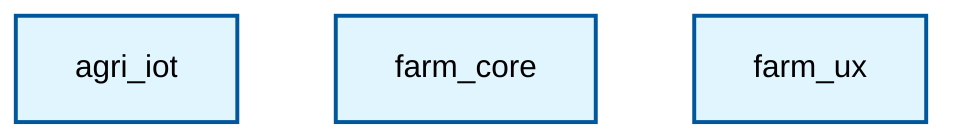

### 架构层级: Layer 1

```mermaid
graph TD
    classDef currentLayer fill:#e1f5fe,stroke:#01579b,stroke-width:2px,color:#000;
    classDef depLayer fill:#fefefe,stroke:#999,stroke-width:1px,color:#666,stroke-dasharray: 5 5;
    farm_agritourism["farm_agritourism"]:::currentLayer
    farm_ai_core["farm_ai_core"]:::currentLayer
    farm_biological_valuation["farm_biological_valuation"]:::currentLayer
    farm_csa["farm_csa"]:::currentLayer
    farm_data_security["farm_data_security"]:::currentLayer
    farm_entity_reg["farm_entity_reg"]:::currentLayer
    farm_esg["farm_esg"]:::currentLayer
    farm_financial_core["farm_financial_core"]:::currentLayer
    farm_iot["farm_iot"]:::currentLayer
    farm_multi_farm_base["farm_multi_farm_base"]:::currentLayer
    farm_pos["farm_pos"]:::currentLayer
    farm_sale_ch["farm_sale_ch"]:::currentLayer
    farm_supply_core["farm_supply_core"]:::currentLayer
    farm_core["farm_core"]:::depLayer
    farm_agritourism --> farm_core
    farm_ai_core --> farm_core
    farm_biological_valuation --> farm_core
    farm_csa --> farm_core
    farm_data_security --> farm_core
    farm_entity_reg --> farm_core
    farm_esg --> farm_core
    farm_financial_core --> farm_core
    agri_iot["agri_iot"]:::depLayer
    farm_iot --> agri_iot
    farm_iot --> farm_core
    farm_multi_farm_base --> farm_core
    farm_pos --> farm_core
    farm_sale_ch --> farm_core
    farm_supply_core --> farm_core
```

### 架构层级: Layer 2

```mermaid
graph TD
    classDef currentLayer fill:#e1f5fe,stroke:#01579b,stroke-width:2px,color:#000;
    classDef depLayer fill:#fefefe,stroke:#999,stroke-width:1px,color:#666,stroke-dasharray: 5 5;
    farm_agri_science["farm_agri_science"]:::currentLayer
    farm_ai_llm_integration["farm_ai_llm_integration"]:::currentLayer
    farm_ecology["farm_ecology"]:::currentLayer
    farm_financial_credit["farm_financial_credit"]:::currentLayer
    farm_financial_insurance["farm_financial_insurance"]:::currentLayer
    farm_financial_valuation["farm_financial_valuation"]:::currentLayer
    farm_multi_farm_equipment["farm_multi_farm_equipment"]:::currentLayer
    farm_multi_farm_financial["farm_multi_farm_financial"]:::currentLayer
    farm_multi_farm_procurement["farm_multi_farm_procurement"]:::currentLayer
    farm_robotics["farm_robotics"]:::currentLayer
    farm_supply_logistics["farm_supply_logistics"]:::currentLayer
    farm_supply_procurement["farm_supply_procurement"]:::currentLayer
    farm_weather["farm_weather"]:::currentLayer
    farm_core["farm_core"]:::depLayer
    farm_agri_science --> farm_core
    farm_iot["farm_iot"]:::depLayer
    farm_agri_science --> farm_iot
    farm_ai_core["farm_ai_core"]:::depLayer
    farm_ai_llm_integration --> farm_ai_core
    farm_ai_llm_integration --> farm_core
    farm_ecology --> farm_core
    farm_esg["farm_esg"]:::depLayer
    farm_ecology --> farm_esg
    farm_financial_credit --> farm_core
    farm_financial_core["farm_financial_core"]:::depLayer
    farm_financial_credit --> farm_financial_core
    farm_financial_insurance --> farm_core
    farm_financial_insurance --> farm_financial_core
    farm_biological_valuation["farm_biological_valuation"]:::depLayer
    farm_financial_valuation --> farm_biological_valuation
    farm_financial_valuation --> farm_core
    farm_financial_valuation --> farm_financial_core
    farm_multi_farm_base["farm_multi_farm_base"]:::depLayer
    farm_multi_farm_equipment --> farm_multi_farm_base
    farm_multi_farm_financial --> farm_multi_farm_base
    farm_multi_farm_procurement --> farm_multi_farm_base
    farm_robotics --> farm_core
    farm_robotics --> farm_iot
    farm_supply_logistics --> farm_core
    farm_supply_core["farm_supply_core"]:::depLayer
    farm_supply_logistics --> farm_supply_core
    farm_supply_procurement --> farm_core
    farm_supply_procurement --> farm_supply_core
    farm_weather --> farm_core
    farm_weather --> farm_iot
```

### 架构层级: Layer 3

```mermaid
graph TD
    classDef currentLayer fill:#e1f5fe,stroke:#01579b,stroke-width:2px,color:#000;
    classDef depLayer fill:#fefefe,stroke:#999,stroke-width:1px,color:#666,stroke-dasharray: 5 5;
    farm_greenhouse["farm_greenhouse"]:::currentLayer
    farm_insurance["farm_insurance"]:::currentLayer
    farm_operation["farm_operation"]:::currentLayer
    farm_supply_quality["farm_supply_quality"]:::currentLayer
    farm_valuation["farm_valuation"]:::currentLayer
    precision_production["precision_production"]:::currentLayer
    farm_agri_science["farm_agri_science"]:::depLayer
    farm_greenhouse --> farm_agri_science
    farm_core["farm_core"]:::depLayer
    farm_greenhouse --> farm_core
    farm_iot["farm_iot"]:::depLayer
    farm_greenhouse --> farm_iot
    farm_insurance --> farm_agri_science
    farm_insurance --> farm_core
    farm_operation --> farm_agri_science
    farm_ai_core["farm_ai_core"]:::depLayer
    farm_operation --> farm_ai_core
    farm_operation --> farm_core
    farm_supply_quality --> farm_core
    farm_supply_core["farm_supply_core"]:::depLayer
    farm_supply_quality --> farm_supply_core
    farm_supply_procurement["farm_supply_procurement"]:::depLayer
    farm_supply_quality --> farm_supply_procurement
    farm_biological_valuation["farm_biological_valuation"]:::depLayer
    farm_valuation --> farm_biological_valuation
    farm_valuation --> farm_core
    farm_financial_core["farm_financial_core"]:::depLayer
    farm_valuation --> farm_financial_core
    farm_financial_valuation["farm_financial_valuation"]:::depLayer
    farm_valuation --> farm_financial_valuation
    precision_production --> farm_agri_science
```

### 架构层级: Layer 4

```mermaid
graph TD
    classDef currentLayer fill:#e1f5fe,stroke:#01579b,stroke-width:2px,color:#000;
    classDef depLayer fill:#fefefe,stroke:#999,stroke-width:1px,color:#666,stroke-dasharray: 5 5;
    agri_precision_core["agri_precision_core"]:::currentLayer
    farm_apiculture["farm_apiculture"]:::currentLayer
    farm_breeding["farm_breeding"]:::currentLayer
    farm_certification["farm_certification"]:::currentLayer
    farm_crop["farm_crop"]:::currentLayer
    farm_dashboard["farm_dashboard"]:::currentLayer
    farm_equipment["farm_equipment"]:::currentLayer
    farm_esg_carbon["farm_esg_carbon"]:::currentLayer
    farm_exchange["farm_exchange"]:::currentLayer
    farm_financial_basic["farm_financial_basic"]:::currentLayer
    farm_hr["farm_hr"]:::currentLayer
    farm_land_mgmt["farm_land_mgmt"]:::currentLayer
    farm_mobile["farm_mobile"]:::currentLayer
    farm_mushroom["farm_mushroom"]:::currentLayer
    farm_orchard_horticulture["farm_orchard_horticulture"]:::currentLayer
    farm_protected_cultivation["farm_protected_cultivation"]:::currentLayer
    farm_quality["farm_quality"]:::currentLayer
    farm_safety["farm_safety"]:::currentLayer
    farm_training["farm_training"]:::currentLayer
    precision_production_iot["precision_production_iot"]:::currentLayer
    agri_iot["agri_iot"]:::depLayer
    agri_precision_core --> agri_iot
    precision_production["precision_production"]:::depLayer
    agri_precision_core --> precision_production
    farm_core["farm_core"]:::depLayer
    farm_apiculture --> farm_core
    farm_operation["farm_operation"]:::depLayer
    farm_apiculture --> farm_operation
    farm_breeding --> farm_core
    farm_breeding --> farm_operation
    farm_certification --> farm_core
    farm_certification --> farm_operation
    farm_crop --> farm_core
    farm_crop --> farm_operation
    farm_financial_core["farm_financial_core"]:::depLayer
    farm_dashboard --> farm_financial_core
    farm_iot["farm_iot"]:::depLayer
    farm_dashboard --> farm_iot
    farm_dashboard --> farm_operation
    farm_weather["farm_weather"]:::depLayer
    farm_dashboard --> farm_weather
    farm_equipment --> farm_operation
    farm_esg_carbon --> farm_core
    farm_esg["farm_esg"]:::depLayer
    farm_esg_carbon --> farm_esg
    farm_esg_carbon --> farm_operation
    farm_exchange --> farm_operation
    farm_financial_basic --> farm_core
    farm_financial_basic --> farm_financial_core
    farm_financial_basic --> farm_operation
    farm_hr --> farm_operation
    farm_land_mgmt --> farm_core
    farm_land_mgmt --> farm_operation
    farm_mobile --> farm_core
    farm_mobile --> farm_operation
    farm_mushroom --> farm_core
    farm_mushroom --> farm_operation
    farm_orchard_horticulture --> farm_core
    farm_orchard_horticulture --> farm_operation
    farm_protected_cultivation --> farm_core
    farm_protected_cultivation --> farm_iot
    farm_protected_cultivation --> farm_operation
    farm_quality --> farm_core
    farm_quality --> farm_operation
    farm_safety --> farm_core
    farm_safety --> farm_operation
    farm_training --> farm_core
    farm_training --> farm_operation
    precision_production_iot --> agri_iot
    farm_agri_science["farm_agri_science"]:::depLayer
    precision_production_iot --> farm_agri_science
    precision_production_iot --> precision_production
```

### 架构层级: Layer 5

```mermaid
graph TD
    classDef currentLayer fill:#e1f5fe,stroke:#01579b,stroke-width:2px,color:#000;
    classDef depLayer fill:#fefefe,stroke:#999,stroke-width:1px,color:#666,stroke-dasharray: 5 5;
    farm_crisis["farm_crisis"]:::currentLayer
    farm_esg_fair_trade["farm_esg_fair_trade"]:::currentLayer
    farm_esg_report["farm_esg_report"]:::currentLayer
    farm_esg_risk["farm_esg_risk"]:::currentLayer
    farm_esg_social["farm_esg_social"]:::currentLayer
    farm_financial_government["farm_financial_government"]:::currentLayer
    farm_isl["farm_isl"]:::currentLayer
    farm_machinery_ch["farm_machinery_ch"]:::currentLayer
    farm_marketing["farm_marketing"]:::currentLayer
    farm_medicinal_plants["farm_medicinal_plants"]:::currentLayer
    farm_multi_farm_quality["farm_multi_farm_quality"]:::currentLayer
    farm_planning["farm_planning"]:::currentLayer
    farm_subsidy["farm_subsidy"]:::currentLayer
    farm_core["farm_core"]:::depLayer
    farm_crisis --> farm_core
    farm_safety["farm_safety"]:::depLayer
    farm_crisis --> farm_safety
    farm_esg_fair_trade --> farm_core
    farm_esg["farm_esg"]:::depLayer
    farm_esg_fair_trade --> farm_esg
    farm_hr["farm_hr"]:::depLayer
    farm_esg_fair_trade --> farm_hr
    farm_esg_report --> farm_core
    farm_esg_report --> farm_esg
    farm_esg_report --> farm_hr
    farm_esg_risk --> farm_core
    farm_esg_risk --> farm_esg
    farm_esg_risk --> farm_hr
    farm_esg_social --> farm_core
    farm_esg_social --> farm_esg
    farm_esg_social --> farm_hr
    farm_financial_government --> farm_core
    farm_financial_basic["farm_financial_basic"]:::depLayer
    farm_financial_government --> farm_financial_basic
    farm_financial_core["farm_financial_core"]:::depLayer
    farm_financial_government --> farm_financial_core
    farm_isl --> farm_core
    farm_quality["farm_quality"]:::depLayer
    farm_isl --> farm_quality
    farm_machinery_ch --> farm_core
    farm_equipment["farm_equipment"]:::depLayer
    farm_machinery_ch --> farm_equipment
    farm_marketing --> farm_core
    farm_operation["farm_operation"]:::depLayer
    farm_marketing --> farm_operation
    farm_marketing --> farm_quality
    farm_medicinal_plants --> farm_core
    farm_medicinal_plants --> farm_operation
    farm_medicinal_plants --> farm_quality
    farm_multi_farm_base["farm_multi_farm_base"]:::depLayer
    farm_multi_farm_quality --> farm_multi_farm_base
    farm_multi_farm_quality --> farm_quality
    farm_planning --> farm_hr
    farm_planning --> farm_operation
    farm_subsidy --> farm_core
    farm_mobile["farm_mobile"]:::depLayer
    farm_subsidy --> farm_mobile
```

### 架构层级: Layer 6

```mermaid
graph TD
    classDef currentLayer fill:#e1f5fe,stroke:#01579b,stroke-width:2px,color:#000;
    classDef depLayer fill:#fefefe,stroke:#999,stroke-width:1px,color:#666,stroke-dasharray: 5 5;
    farm_cert_ch["farm_cert_ch"]:::currentLayer
    farm_disaster_risk["farm_disaster_risk"]:::currentLayer
    farm_finance_gov["farm_finance_gov"]:::currentLayer
    farm_floriculture["farm_floriculture"]:::currentLayer
    farm_knowledge["farm_knowledge"]:::currentLayer
    farm_label["farm_label"]:::currentLayer
    farm_mrp["farm_mrp"]:::currentLayer
    farm_multi_farm["farm_multi_farm"]:::currentLayer
    farm_subsidy_ch["farm_subsidy_ch"]:::currentLayer
    farm_core["farm_core"]:::depLayer
    farm_cert_ch --> farm_core
    farm_marketing["farm_marketing"]:::depLayer
    farm_cert_ch --> farm_marketing
    farm_disaster_risk --> farm_core
    farm_crisis["farm_crisis"]:::depLayer
    farm_disaster_risk --> farm_crisis
    farm_operation["farm_operation"]:::depLayer
    farm_disaster_risk --> farm_operation
    farm_weather["farm_weather"]:::depLayer
    farm_disaster_risk --> farm_weather
    farm_financial_government["farm_financial_government"]:::depLayer
    farm_finance_gov --> farm_financial_government
    farm_floriculture --> farm_core
    farm_isl["farm_isl"]:::depLayer
    farm_floriculture --> farm_isl
    farm_floriculture --> farm_operation
    farm_planning["farm_planning"]:::depLayer
    farm_knowledge --> farm_planning
    farm_label --> farm_core
    farm_label --> farm_marketing
    farm_mrp --> farm_core
    farm_mrp --> farm_isl
    farm_agri_science["farm_agri_science"]:::depLayer
    farm_multi_farm --> farm_agri_science
    farm_multi_farm --> farm_core
    farm_equipment["farm_equipment"]:::depLayer
    farm_multi_farm --> farm_equipment
    farm_financial_core["farm_financial_core"]:::depLayer
    farm_multi_farm --> farm_financial_core
    farm_hr["farm_hr"]:::depLayer
    farm_multi_farm --> farm_hr
    farm_multi_farm --> farm_marketing
    farm_multi_farm_base["farm_multi_farm_base"]:::depLayer
    farm_multi_farm --> farm_multi_farm_base
    farm_multi_farm_financial["farm_multi_farm_financial"]:::depLayer
    farm_multi_farm --> farm_multi_farm_financial
    farm_multi_farm_procurement["farm_multi_farm_procurement"]:::depLayer
    farm_multi_farm --> farm_multi_farm_procurement
    farm_subsidy_ch --> farm_core
    farm_subsidy_ch --> farm_operation
    farm_subsidy["farm_subsidy"]:::depLayer
    farm_subsidy_ch --> farm_subsidy
```

### 架构层级: Layer 7

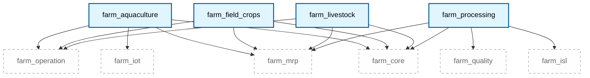

### 架构层级: Layer 8

```mermaid
graph TD
    classDef currentLayer fill:#e1f5fe,stroke:#01579b,stroke-width:2px,color:#000;
    classDef depLayer fill:#fefefe,stroke:#999,stroke-width:1px,color:#666,stroke-dasharray: 5 5;
    farm_agricultural_processing["farm_agricultural_processing"]:::currentLayer
    farm_ai_vision["farm_ai_vision"]:::currentLayer
    farm_fermentation["farm_fermentation"]:::currentLayer
    farm_symbiosis["farm_symbiosis"]:::currentLayer
    farm_waste_mgmt["farm_waste_mgmt"]:::currentLayer
    farm_processing["farm_processing"]:::depLayer
    farm_agricultural_processing --> farm_processing
    farm_agri_science["farm_agri_science"]:::depLayer
    farm_ai_vision --> farm_agri_science
    farm_ai_core["farm_ai_core"]:::depLayer
    farm_ai_vision --> farm_ai_core
    farm_ai_vision --> farm_ai_core
    farm_ai_llm_integration["farm_ai_llm_integration"]:::depLayer
    farm_ai_vision --> farm_ai_llm_integration
    farm_core["farm_core"]:::depLayer
    farm_ai_vision --> farm_core
    farm_livestock["farm_livestock"]:::depLayer
    farm_ai_vision --> farm_livestock
    farm_operation["farm_operation"]:::depLayer
    farm_ai_vision --> farm_operation
    farm_quality["farm_quality"]:::depLayer
    farm_ai_vision --> farm_quality
    farm_fermentation --> farm_core
    farm_isl["farm_isl"]:::depLayer
    farm_fermentation --> farm_isl
    farm_fermentation --> farm_processing
    farm_aquaculture["farm_aquaculture"]:::depLayer
    farm_symbiosis --> farm_aquaculture
    farm_symbiosis --> farm_core
    farm_symbiosis --> farm_isl
    farm_symbiosis --> farm_operation
    farm_waste_mgmt --> farm_core
    farm_waste_mgmt --> farm_livestock
    farm_waste_mgmt --> farm_quality
```

### 架构层级: Layer 9

```mermaid
graph TD
    classDef currentLayer fill:#e1f5fe,stroke:#01579b,stroke-width:2px,color:#000;
    classDef depLayer fill:#fefefe,stroke:#999,stroke-width:1px,color:#666,stroke-dasharray: 5 5;
    farm_ai_decision["farm_ai_decision"]:::currentLayer
    farm_seed_industry["farm_seed_industry"]:::currentLayer
    farm_viticulture["farm_viticulture"]:::currentLayer
    farm_agri_science["farm_agri_science"]:::depLayer
    farm_ai_decision --> farm_agri_science
    farm_ai_decision --> farm_agri_science
    farm_ai_core["farm_ai_core"]:::depLayer
    farm_ai_decision --> farm_ai_core
    farm_ai_decision --> farm_ai_core
    farm_ai_llm_integration["farm_ai_llm_integration"]:::depLayer
    farm_ai_decision --> farm_ai_llm_integration
    farm_ai_vision["farm_ai_vision"]:::depLayer
    farm_ai_decision --> farm_ai_vision
    farm_core["farm_core"]:::depLayer
    farm_ai_decision --> farm_core
    farm_operation["farm_operation"]:::depLayer
    farm_ai_decision --> farm_operation
    farm_agricultural_processing["farm_agricultural_processing"]:::depLayer
    farm_seed_industry --> farm_agricultural_processing
    farm_breeding["farm_breeding"]:::depLayer
    farm_seed_industry --> farm_breeding
    farm_seed_industry --> farm_core
    farm_isl["farm_isl"]:::depLayer
    farm_seed_industry --> farm_isl
    farm_viticulture --> farm_agricultural_processing
    farm_viticulture --> farm_core
    farm_viticulture --> farm_isl
    farm_viticulture --> farm_operation
```

### 架构层级: Layer 10

```mermaid
graph TD
    classDef currentLayer fill:#e1f5fe,stroke:#01579b,stroke-width:2px,color:#000;
    classDef depLayer fill:#fefefe,stroke:#999,stroke-width:1px,color:#666,stroke-dasharray: 5 5;
    farm_ai_agent["farm_ai_agent"]:::currentLayer
    farm_esg_environmental["farm_esg_environmental"]:::currentLayer
    farm_supply_analytics["farm_supply_analytics"]:::currentLayer
    farm_winery["farm_winery"]:::currentLayer
    farm_agri_science["farm_agri_science"]:::depLayer
    farm_ai_agent --> farm_agri_science
    farm_ai_core["farm_ai_core"]:::depLayer
    farm_ai_agent --> farm_ai_core
    farm_ai_decision["farm_ai_decision"]:::depLayer
    farm_ai_agent --> farm_ai_decision
    farm_ai_llm_integration["farm_ai_llm_integration"]:::depLayer
    farm_ai_agent --> farm_ai_llm_integration
    farm_ai_vision["farm_ai_vision"]:::depLayer
    farm_ai_agent --> farm_ai_vision
    farm_core["farm_core"]:::depLayer
    farm_ai_agent --> farm_core
    farm_financial_insurance["farm_financial_insurance"]:::depLayer
    farm_ai_agent --> farm_financial_insurance
    farm_operation["farm_operation"]:::depLayer
    farm_ai_agent --> farm_operation
    farm_robotics["farm_robotics"]:::depLayer
    farm_ai_agent --> farm_robotics
    farm_esg_environmental --> farm_agri_science
    farm_esg_environmental --> farm_ai_decision
    farm_esg_environmental --> farm_core
    farm_ecology["farm_ecology"]:::depLayer
    farm_esg_environmental --> farm_ecology
    farm_esg["farm_esg"]:::depLayer
    farm_esg_environmental --> farm_esg
    farm_iot["farm_iot"]:::depLayer
    farm_esg_environmental --> farm_iot
    farm_esg_environmental --> farm_operation
    farm_supply_analytics --> farm_ai_decision
    farm_supply_analytics --> farm_core
    farm_supply_core["farm_supply_core"]:::depLayer
    farm_supply_analytics --> farm_supply_core
    farm_winery --> farm_core
    farm_isl["farm_isl"]:::depLayer
    farm_winery --> farm_isl
    farm_processing["farm_processing"]:::depLayer
    farm_winery --> farm_processing
    farm_viticulture["farm_viticulture"]:::depLayer
    farm_winery --> farm_viticulture
```

### 架构层级: Layer 11

```mermaid
graph TD
    classDef currentLayer fill:#e1f5fe,stroke:#01579b,stroke-width:2px,color:#000;
    classDef depLayer fill:#fefefe,stroke:#999,stroke-width:1px,color:#666,stroke-dasharray: 5 5;
    farm_ai_robotics_bridge["farm_ai_robotics_bridge"]:::currentLayer
    farm_esg_circular["farm_esg_circular"]:::currentLayer
    farm_supply["farm_supply"]:::currentLayer
    farm_ai_agent["farm_ai_agent"]:::depLayer
    farm_ai_robotics_bridge --> farm_ai_agent
    farm_robotics["farm_robotics"]:::depLayer
    farm_ai_robotics_bridge --> farm_robotics
    farm_ai_robotics_bridge --> farm_robotics
    farm_core["farm_core"]:::depLayer
    farm_esg_circular --> farm_core
    farm_equipment["farm_equipment"]:::depLayer
    farm_esg_circular --> farm_equipment
    farm_esg["farm_esg"]:::depLayer
    farm_esg_circular --> farm_esg
    farm_esg_environmental["farm_esg_environmental"]:::depLayer
    farm_esg_circular --> farm_esg_environmental
    farm_operation["farm_operation"]:::depLayer
    farm_esg_circular --> farm_operation
    farm_supply --> farm_core
    farm_supply_analytics["farm_supply_analytics"]:::depLayer
    farm_supply --> farm_supply_analytics
    farm_supply_core["farm_supply_core"]:::depLayer
    farm_supply --> farm_supply_core
    farm_supply_procurement["farm_supply_procurement"]:::depLayer
    farm_supply --> farm_supply_procurement
    farm_supply_quality["farm_supply_quality"]:::depLayer
    farm_supply --> farm_supply_quality
```

### 架构层级: Layer 12

```mermaid
graph TD
    classDef currentLayer fill:#e1f5fe,stroke:#01579b,stroke-width:2px,color:#000;
    classDef depLayer fill:#fefefe,stroke:#999,stroke-width:1px,color:#666,stroke-dasharray: 5 5;
    farm_esg_compliance["farm_esg_compliance"]:::currentLayer
    farm_esg_sustainability["farm_esg_sustainability"]:::currentLayer
    farm_green_monitor["farm_green_monitor"]:::currentLayer
    farm_input_reg["farm_input_reg"]:::currentLayer
    farm_live_streaming["farm_live_streaming"]:::currentLayer
    farm_agri_science["farm_agri_science"]:::depLayer
    farm_esg_compliance --> farm_agri_science
    farm_ai_decision["farm_ai_decision"]:::depLayer
    farm_esg_compliance --> farm_ai_decision
    farm_esg["farm_esg"]:::depLayer
    farm_esg_compliance --> farm_esg
    farm_esg_circular["farm_esg_circular"]:::depLayer
    farm_esg_compliance --> farm_esg_circular
    farm_esg_environmental["farm_esg_environmental"]:::depLayer
    farm_esg_compliance --> farm_esg_environmental
    farm_esg_risk["farm_esg_risk"]:::depLayer
    farm_esg_compliance --> farm_esg_risk
    farm_financial_core["farm_financial_core"]:::depLayer
    farm_esg_compliance --> farm_financial_core
    farm_supply_analytics["farm_supply_analytics"]:::depLayer
    farm_esg_compliance --> farm_supply_analytics
    farm_supply_logistics["farm_supply_logistics"]:::depLayer
    farm_esg_compliance --> farm_supply_logistics
    farm_core["farm_core"]:::depLayer
    farm_esg_sustainability --> farm_core
    farm_esg_sustainability --> farm_esg
    farm_esg_carbon["farm_esg_carbon"]:::depLayer
    farm_esg_sustainability --> farm_esg_carbon
    farm_esg_sustainability --> farm_esg_circular
    farm_esg_sustainability --> farm_esg_environmental
    farm_esg_sustainability --> farm_financial_core
    farm_operation["farm_operation"]:::depLayer
    farm_esg_sustainability --> farm_operation
    farm_green_monitor --> farm_core
    farm_green_monitor --> farm_esg
    farm_esg_report["farm_esg_report"]:::depLayer
    farm_green_monitor --> farm_esg_report
    farm_green_monitor --> farm_operation
    farm_supply["farm_supply"]:::depLayer
    farm_green_monitor --> farm_supply
    farm_input_reg --> farm_operation
    farm_input_reg --> farm_supply
    farm_marketing["farm_marketing"]:::depLayer
    farm_live_streaming --> farm_marketing
    farm_live_streaming --> farm_supply
```

