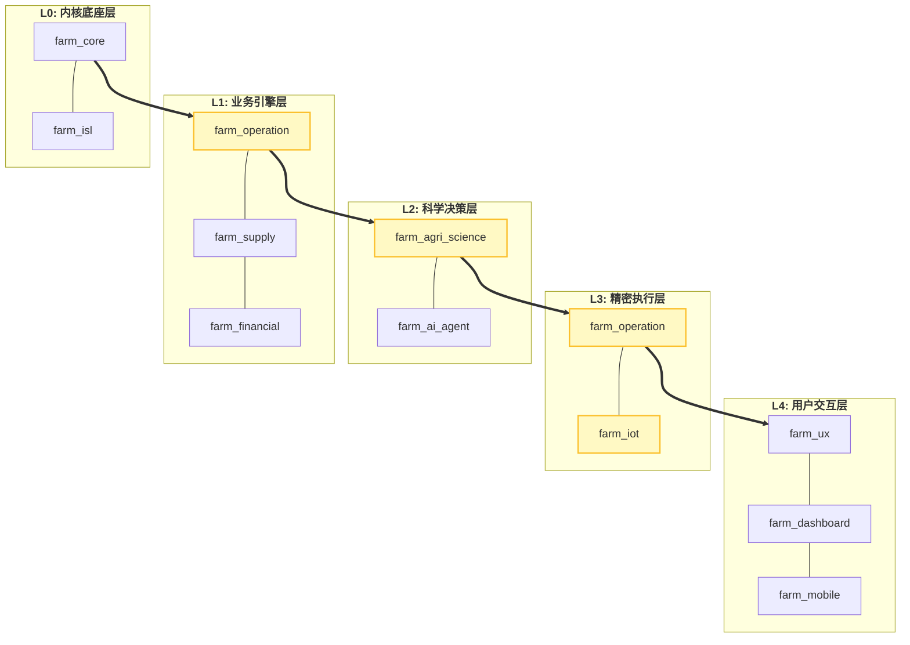
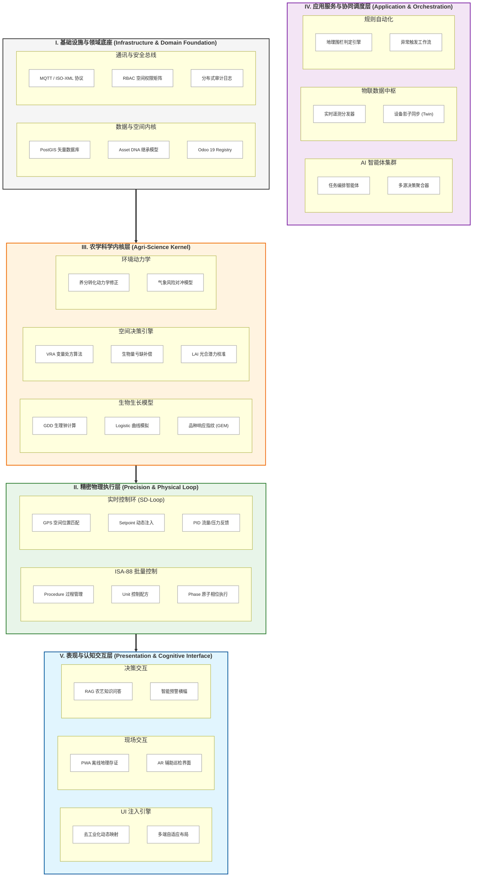

# Odoo 19 农场管理系统 (FMS) 架构蓝图

本项目采用“工业级全栈功能矩阵 (Industrial Full-Stack Matrix)”。架构设计通过高密度的功能模块堆叠，实现了从物理底层到认知表现层的全链路科学覆盖。

## 1. 系统组件堆叠图 (Component Stack)
展示系统模块间的物理容器与继承关系。

## 2. 系统逻辑分层矩阵 (Layered Functional Matrix)

该图通过功能簇的密集堆叠展示系统的技术广度与深度，最大限度减少连线干扰。

## 3. 配置管理模式 (Configuration)

系统通过 `res.config.settings` 原子化控制以下行业能力的注入：
- **种植**: 大田 (`field_crops`)、设施 (`protected_cultivation`)、果树 (`orchard`)
- **养殖**: 畜牧 (`livestock`)、水产 (`aquaculture`)、蜂业 (`apiculture`)
- **加工**: 农产品加工 (`agricultural_processing`)、观光农业 (`agritourism`)

## 4. 核心业务闭环 (The Core Loops)

### 4.1 科学执行闭环 (The SD-Loop)
**感知** (IoT Telemetry) → **建模** (Science Kernel) → **决策** (VRA Engine) → **分解** (ISA-88 Phase) → **执行** (MQTT Setpoint) → **验证** (Physical Feedback)。

### 4.2 数据 DNA 价值流
**投入品溯源** (Seed/Fertilizer) → **作业存证** (Precision Map) → **生物转化** (Growth Model) → **ESG 核算** (Carbon Ledger) → **溢价销售** (Consumer Portal)。

---
*V3.7 - 2026-02-02 | 高密度功能矩阵架构 | 100% 无损维护*
