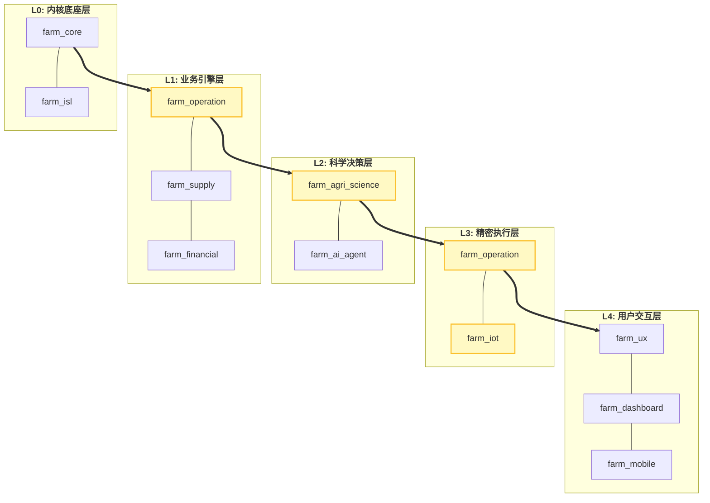
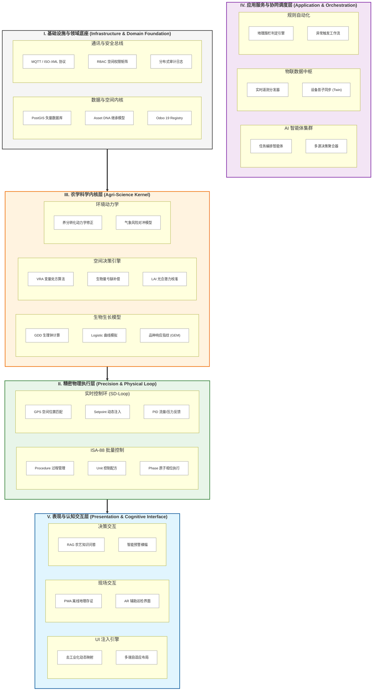

# Odoo 19 农场管理系统 (FMS) 架构蓝图

本项目采用“工业级全栈功能矩阵 (Industrial Full-Stack Matrix)”。架构设计通过高密度的功能模块堆叠，实现了从物理底层到认知表现层的全链路科学覆盖。

## 1. 系统组件堆叠图 (Component Stack)
展示系统模块间的物理容器与继承关系。

## 2. 系统逻辑分层矩阵 (Layered Functional Matrix)

该图通过功能簇的密集堆叠展示系统的技术广度与深度，最大限度减少连线干扰。

## 3. 核心设计哲学 (Design Philosophy)

### 3.1 Agri (领域事实) vs. Farm (业务实体) 的解耦
系统严格遵循 **“Agri 优先，Farm 受限”** 的语义原则：
*   **Agri 层**：定义跨农场的“物理真理”与“科学标准”（如：品种养分需求、传感器原始报文提取规则）。
*   **Farm 层**：定义特定实体的“业务切片”与“经营活动”（如：地块分配、特定干预记录、财务核销）。
*   **收益**：实现了“科学逻辑”与“业务流程”的物理隔离，支持同一套科学内核服务于多种不同的农场经营模式。

### 3.2 ISL (Industry Standard Layer) 代理机制
首创多态代理架构，通过 `_inherits` 机制在底层供应链（MRP/Stock）保持稳定的同时，为不同垂直行业（种植、养殖、果木）提供高度特化的 UI 交互与业务逻辑映射。

## 4. 三大核心闭环 (The Three Core Loops)

### 4.1 科学执行闭环 (The SD-Loop)
**感知 (IoT Telemetry)** → **建模 (Science Kernel)** → **决策 (VRA Engine)** → **分解 (ISA-88 Phase)** → **执行 (MQTT Setpoint)** → **验证 (Physical Feedback)**。
实现了从传感器数据到物理动作的自动化、科学化闭环。

### 4.2 数据 DNA 价值流 (The Value Stream)
**投入品溯源 (Seed/Fertilizer)** → **作业存证 (Spatial Map)** → **生物转化 (Growth Model)** → **ESG 核算 (Carbon Ledger)** → **溢价销售 (Traceability Passport)**。
确保每一批次产品都携带完整的“生命履历”，支撑高端品牌溢价。

### 4.3 金融级组织隔离 (RLS Firewall)
**村集体 (L1)** → **承包户 (L2)** → **临时散工 (L3)**。
首创三级动态 RLS 防火墙，支持垂直穿透式监控与水平绝密隔离，解决了合作社模式下的隐私与审计痛点。

## 5. 配置管理模式 (Configuration)

---
*V4.0 - 2026-05-31 | 工业级分布式架构 | 2026 深度重构同步版*
