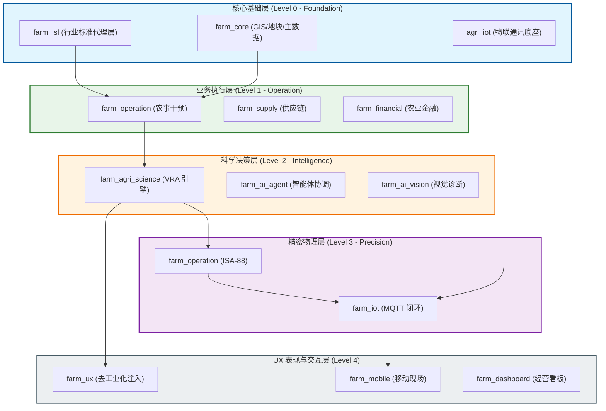
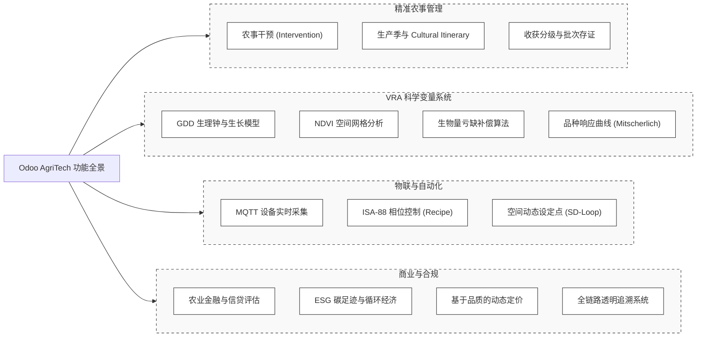

# 🌐 Odoo 农业生态系统：全景架构与功能规格书

> **版本**: V3.0 (2026-02-02)
> **状态**: 工业级标准 [ISA-88] [L0-L4]
> **核心哲学**: 去工业化、科学驱动、空间闭环

---

## 1. 系统架构图 (System Architecture)
展示了从底层物联网通讯到高层 UI 注入的五层解耦架构，体现了系统的纵向深度与模块化依赖。

---

## 2. 功能结构图 (Functional Structure)
展示了系统面向终端用户的核心业务能力矩阵。

---

## 3. 架构核心亮点 (Architectural Highlights)

### 3.1 语义隔离与去工业化 (De-industrialization)
系统通过 `farm_ux` 模块实现“动态视图拦截”，将 Odoo 原生的工业术语（MO, BOM, Work Center）实时重映射为农业语境（Intervention, Recipe, Facility）。这保证了系统既拥有强大的制造内核，又具备贴合农民直觉的用户体验。

### 3.2 纵向闭环控制 (Vertical Closed-loop)
系统打通了从 **规划 -> 科学 -> 执行** 的纵向链路：
- **Level 1 (Operation)**: 解决“合规”与“成本”。
- **Level 2 (Science)**: 解决“变量”与“效率”。
- **Level 3 (Precision)**: 解决“执行”与“反馈”。

### 3.3 空间动态设定点驱动 (SD-Loop)
通过 VRA 处方图与 IoT 遥测数据的实时空间匹配（GPS -> Grid Map），系统能够根据设备所处的物理位置自动下发 MQTT 指令修改执行参数（Setpoint），实现了真正的自动化变量作业。

### 3.4 科学底座化 (Science as a Mixin)
所有的生长模型、生理指标和积温计算均封装在核心 Mixin 中，确保了从简易记录到精密自动控制的所有模块都基于同一套科学逻辑，消除了数据烟囱。

---
*文档归档于: docs/architecture/SYSTEM_FULL_LANDSCAPE.md*
