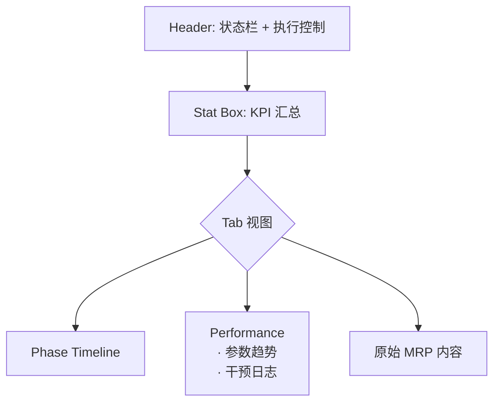
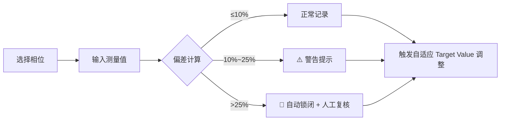
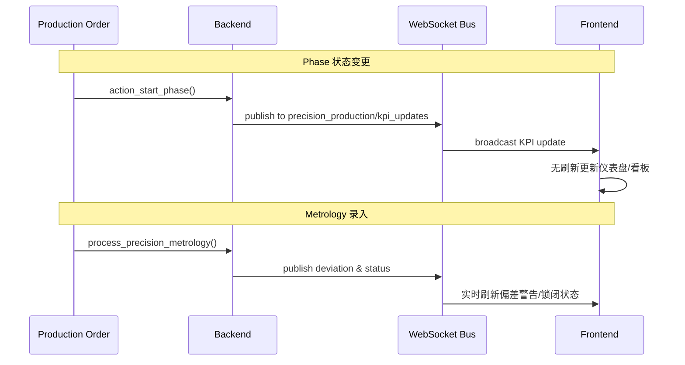

# 配方执行 UX 实现标准  
## *Recipe Execution UX Standards*  

---

## 1. 概述与设计哲学  

本文档定义精密生产的用户体验实现规范，遵循 **“去工业化 (De-industrialized)”** 原则，将传统数据表格界面升级为 **“驾驶舱 (Cockpit)”** 模式。  

**核心目标**：使操作员在处理具物理不确定性的生产过程（生物培养、精密化工、农业等）时，始终清晰掌握：  
- ✅ 当前在做什么？  
- ✅ 环境是否稳定？  
- ✅ 系统做了哪些自动调整？  

---

## 2. 优化后的 ISA-88 模型映射  

| 模型 (Model)               | 角色 (Role)         | UX 表现形式                              |
|---------------------------|---------------------|------------------------------------------|
| `mrp.bom`                 | Master Recipe       | 静态模板编辑器，基于 Batch Size 定义      |
| `mrp.production`          | Execution Cockpit   | 顶层看板，展示全局 KPI（良率信心、效率、稳定性） |
| `precision.recipe.phase`  | Autonomous Phase    | **执行单元**，具备独立计时和并行操作能力    |
| `precision.recipe.parameter` | Adaptive DNA     | 动态参数，支持 Target Value 自适应缩放     |
| `precision.recipe.material` | Atomic Inventory | 相位物料，相位完成时触发原子化库存核销      |

---

## 3. 核心 UX 模式实现  

### 3.1 驾驶舱布局 (Cockpit Layout)  

#### Dashboard 卡片设计  
- **现代卡片**：Bootstrap 风格 + 阴影层次  
- **KPI 仪表盘**：良率信心 (Yield Confidence)、效率指数 (Efficiency Index)、质量得分 (Quality Score)  
- **实时进度**：活跃相位 + 整体进度百分比  
- **状态徽章**：颜色编码（稳定 / 漂移 / 失控）  
- **快速操作**：`[Next Phase]` / `[Record Metrology]`  

```plaintext
┌──────────────────────────────────────────────┐
│ Order Name                          [Stable] │
├──────────────────────────────────────────────┤
│ Active Phase: Incubation (1/3)               │
│ [████████░░░░░░░░░░░░░░░░░░░░] 40%          │
│                                              │
│   [95%]   [1.2]   [85]   [🛡️]              │
│   Yield   Eff     Qual   Stable             │
├──────────────────────────────────────────────┤
│ [Next Phase]          [Record Metrology]    │
└──────────────────────────────────────────────┘
```

#### 增强表单视图结构  


---

### 3.2 独立相位与并行执行  

#### 相位看板 (Phase Kanban)  
- 按 `Master Phase` / `Equipment` / `Production` 分组  
- 卡片式设计：进度条 + 状态徽章 + 操作按钮  
- 支持 **“一机多批”**：跨 MO 批量选择相同相位执行 `Batch Start` / `Batch Metrology`  

```plaintext
┌──────────────────────────────────────────────────┐
│ Master Phase: Incubation                         │
├──────────────────────────────────────────────────┤
│ ┌──────────────────────────────────────────────┐ │
│ │ P001 · Incubator A        [In Progress]      │ │
│ │ [████████░░░░░░░░░░░░░░░░░░] 40% (2/5 hrs)  │ │
│ │ [Start]                [Finish]              │ │
│ └──────────────────────────────────────────────┘ │
│ ┌──────────────────────────────────────────────┐ │
│ │ P002 · Incubator A        [Pending]          │ │
│ │                                              │ │
│ │                      [Start]                 │ │
│ └──────────────────────────────────────────────┘ │
└──────────────────────────────────────────────────┘
```

#### 状态感知规则  
| 状态     | 视觉表现               | 交互行为               |
|----------|------------------------|------------------------|
| Pending  | 灰色徽章 + 空进度条     | 仅显示 `[Start]`       |
| Progress | 蓝色徽章 + 动态进度条   | `[Start]` 禁用 + `[Finish]` 可用 |
| Done     | 绿色徽章 + 100% 进度条  | 按钮全禁用             |

---

### 3.3 实时更新机制  

| 组件                | 通道                          | 更新内容                     |
|---------------------|-------------------------------|------------------------------|
| `bus_service`       | `precision_production/kpi_updates` | 良率/效率/稳定性/进度        |
| 前端订阅            | 自动连接                      | 无刷新 UI 同步               |
| 触发点              | Phase 状态变更 / Metrology 录入 | 全客户端实时广播             |

---

### 3.4 测量录入与自适应反馈  

#### Metrology Wizard 流程  


#### 智能预警阈值  
| 偏差范围   | 视觉反馈       | 系统行为               |
|------------|----------------|------------------------|
| ≤10%       | 绿色确认       | 正常记录               |
| 10%~25%    | 黄色警告图标   | 提示操作员复核         |
| >25%       | 红色锁闭图标   | 自动触发 `Execution Hold` |

#### 自适应视觉提示  
- 参数被系统修改时：**浅蓝色背景 + `Δ` 标记**  
- 审计日志中：高亮显示 `Intervention Type: Active`  

---

## 4. 行业场景适配  

| 行业                | 关键特性                          | UX 适配点                     |
|---------------------|-----------------------------------|-------------------------------|
| **精密生物**        | 多项目并行 + 特异性纠偏           | 独立偏差记录 + 差异化补偿计算 |
| **精密农业**        | 动态缩放灌溉/饲喂时长             | 土壤湿度 → 时长自动缩放       |
| **半导体/化工**     | SPC 锁闭 (OOC)                    | 物理按钮禁用 + 强制人工复核   |

---

## 5. 开发者速查  

### 核心组件  
| 类型       | 组件名                          | 功能描述                     |
|------------|---------------------------------|------------------------------|
| 前端       | `precision_execution_dashboard` | 主仪表盘 + WebSocket 集成    |
| 前端       | `precision_phase_kanban`        | 相位看板 + 实时状态          |
| 后端       | `mrp.production`                | KPI 管理 + 状态机            |
| 后端       | `precision.metrology.wizard`    | 偏差计算 + 自适应触发        |

### 关键方法  
```python
# 启动全局执行
action_start_recipe()

# 批量测量录入
action_open_batch_metrology()

# 核心分析引擎（触发自适应/锁闭）
process_precision_metrology()

# WebSocket 通知
notify_kpi_update(channel="precision_production/kpi_updates")
```

### UI 装饰器  
```xml
<field name="state" 
       decoration-info="state == 'progress'"
       decoration-danger="duration_actual > duration_planned * 1.2"
       decoration-bf="intervention_type == 'active'" />
```

---

## 6. 实时通信流程  



---

> **V2.0 · WebSocket-Enhanced UX Framework**  
> *最后更新：2026-02-01 | 遵循简洁、去工业化、驾驶舱化设计原则*