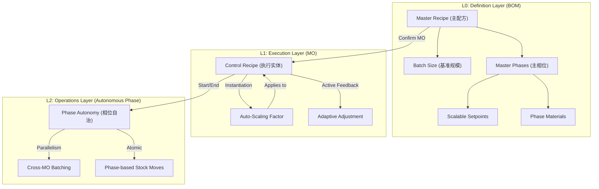

# 精密生产 (Precision Production) - 开发者指南 & 架构宪法

## 1. 核心哲学 (The ISA-88 Digital Twin)
本项目不仅是 Odoo MRP 的增强，它是 **ISA-88 (S88) 标准** 在 Odoo 中的原生实现。其核心是将"静态物料清单"进化为"动态执行配方"，适用于生物制药、精密化工、半导体、精密农业等高不确定性行业。

---

## 2. 逻辑架构 (Three-Layer Architecture)

---

## 3. 核心技术律令 (Development Mandates)

### 3.1 无损修改 (Lossless Mode)
*   **严禁自主删除**：除非逻辑订正，否则必须保留所有现有的代码注释（特别是 ISA-88 术语）和业务逻辑。
*   **注释即资产**：代码中的 `# [ISA-88]` 或 `# [LOSSLESS]` 标记是架构锚点，不可移除。

### 3.2 批次缩放逻辑 (Batch Scaling)
*   **基准锚点**：所有 Master Recipe 均基于 `recipe_batch_size` 定义。
*   **缩放因子**：`Factor = MO.product_qty / BOM.recipe_batch_size`。
*   **参数智能**：只有标记为 `is_scalable` 的参数随因子缩放，温度等物理常量保持恒定。

### 3.3 相位自治与并行 (Phase Autonomy)
*   **解耦推进**：相位不再由 MO 强行线性驱动。每个相位拥有独立的计时器和生命周期。
*   **跨批次聚合**：支持在 `Phase Execution Board` 中按 `Master Phase` 聚合不同 MO，实现“一机多批”的并行处理。

---

## 4. 过程控制与绩效 (SPC & KPIs)

### 4.1 SPC 稳定性监控 (Process Control)
*   **自动锁闭 (Hold)**：偏差 > 25% 时系统自动锁定执行，禁止后续动作。
*   **三级状态**：`Stable` (正常), `Drifting` (漂移), `Out of Control` (失控)。

### 4.2 绩效量化 (Performance Index)
*   **时效指数 (Efficiency)**：`Planned Duration / Actual Duration` 的移动平均值。
*   **质量得分 (Quality)**：基于 `precision.graded.output` (Native By-product) 产出的加权分。

---

## 5. 开发者速查表 (Model Registry)

| 模型 | 角色 | 关键特性 |
| :--- | :--- | :--- |
| `mrp.bom` | Master Recipe | 承载基准 Batch Size 和主步序。 |
| `mrp.production` | Cockpit | 实例化引擎、SPC 监控、全局 KPI 中心。 |
| `precision.recipe.phase` | Independent Actor | 存储独立计时、相位物料、执行状态。 |
| `precision.recipe.parameter` | Adaptive DNA | 支持自适应调整的动态设定点。 |
| `precision.mixin` | Core DNA | 干预日志、ACE 指令、绩效计算器。 |

---
## 6. IoT 集成架构 (Industrial IoT Integration)

### 6.1 模块结构 (Module Architecture)
*   **precision.iot.device** (`precision.iot.device`): 精密生产物联网设备模型，与 `iiot.device` (Industrial IoT) 模块集成
*   **precision.iot.sensor** (`precision.iot.sensor`): 精密生产物联网传感器模型，用于处理各种传感器类型
*   **precision.iot.reading** (`precision.iot.reading`): 精密生产物联网读数模型，自动记录传感器测量值
*   **precision.iot.command.log** (`precision.iot.command.log`): 精密生产物联网命令日志模型，跟踪所有发送到设备的控制命令

### 6.2 IoT 集成设计 (IoT Integration Design)
*   **农业物联网桥接**: 使用 `agri_iot` (IIoT) 模块作为底层通信层，提供 MQTT、HTTP 等协议支持
*   **遥测数据处理**: 自动处理从 IIoT 设备传入的遥测数据，并转换为精密生产参数
*   **控制命令发送**: 支持向 IIoT 设备发送控制命令，实现远程设备控制
*   **自动校准**: 支持自动校准命令发送到设备以确保测量精度

### 6.3 实时监控与控制 (Real-time Monitoring & Control)
*   **自动读数**: 通过 IIoT 模块自动获取传感器读数并更新精密生产 KPIs
*   **偏差检测**: 自动检测测量值与目标值的偏差并触发干预措施
*   **设备控制**: 支持发送控制命令到设备，如设置控制点、启动/停止相位、紧急停止等
*   **命令日志**: 跟踪所有设备命令的发送状态和结果

### 6.4 系统集成 (System Integration)
*   **遥测集成**: `precision.recipe.parameter` 与 IoT 读数的实时关联
*   **干预触发**: 基于 IoT 读数的自动干预系统
*   **生产锁定**: 基于 IoT 数据的关键偏差自动锁定生产流程

---
## 7. 农业精准制造桥接架构 (Agri-Precision Bridge Architecture)

### 7.1 桥接模块 (Bridge Module)
*   **agri_precision_core**: 提供标准 Odoo 应用与农业/半导体精密制造逻辑之间的桥梁

### 7.2 核心抽象层 (Core Abstraction Layer)
*   **agri.precision.mixin** (`agri.precision.mixin`): 提供不确定性处理、分级管理、干预机制和 IoT 集成功能的抽象模型
*   **不确定性处理**: 动态产量跟踪 (`expected_yield_accuracy`, `last_metrology_date`)
*   **分级管理**: 产品分级 (`quality_grade` - Premium/Standard/Substandard)
*   **干预机制**: 技能钩子 (`intervention_count`, `is_critical_status`)
*   **IoT 集成**: 传感器设备关联 (`iot_device_ids`, `iot_status`)

### 7.3 标准应用扩展 (Standard App Extensions)
*   **MRP 扩展**: `mrp.production` 继承了精准制造属性和干预功能
*   **Stock 扩展**: `stock.lot` 继承了分级功能
*   **Phase 扩展**: `precision.recipe.phase` 继承了相位级干预逻辑

### 7.4 用户界面集成 (UI Integration)
*   **表单继承**: 在标准表单中注入精准制造字段和操作
*   **状态指示**: IoT 状态和干预计数的可视化
*   **干预按钮**: 快速干预和校准功能的便捷访问
*   **监控页面**: IoT 监控相关的专用界面组件

### 7.5 依赖关系 (Dependencies)
*   **agri_iot**: 作为底层物联网通信模块，提供设备管理、遥测数据处理和指令下发功能
*   **precision_production**: 核心精密生产功能模块
*   **precision_production_iot**: IoT 数据集成与处理模块

---
*V3.0 - Bridge-Enhanced Architecture | 2026-02-01*